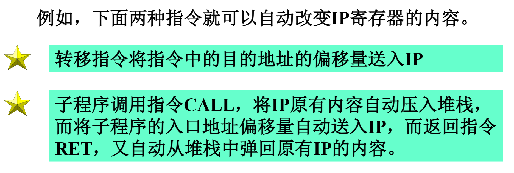

    
1. 通用寄存器
    1. 数据寄存器
        * 数据寄存器:它包括`AX`,`BX`,`CX`和`DX`四个寄存器.它们中的每一个既可以是16位寄存器,也可以分成两个8位寄存器使用
            * 可以当作8个独立的8位寄存器使用
        * 数据寄存器既可以用来存放参加运算的操作数,也可以存放运算的结果
            * 一般地,使用这些寄存器时必须在指令中明确指示    
        * 在有些指令中,不需要明确指出使用的寄存器名,即隐含使用了某寄存器,称为隐含使用    
        * 个别指令对寄存器有特定的使用,并且又必须在指令中指明它的名字,这类寄存器的使用称为特定使用    
    2. 指针寄存器
        * 指针寄存器有堆栈指针`SP`和基址指针`BP`
            * 它们一般被用来存放16位地址,在形成20位的物理地址时常作为偏移量使用
        * `SP`指针:在进行堆栈操作时,被隐含使用,被用来指向栈顶部单元
        * `BP`指针:被用来指向堆栈段内某一存储单元.`BP`除用作地址指针外也可以像数据寄存器一样,存放参加运算的操作数和运算的结果
    3. 变址寄存器
        * 有两个变址寄存器`SI`和`DI`,一般用来做地址指针
            * `SI`:源变址寄存器
            * `DI`:目的变址寄存器
            * 同`BP`寄存器一样,`SI`和`DI`可以存放操作数和运算结果
2. 段寄存器
    * 每个存储段用一个段寄存器来指明该段的起始位置(也叫段基址)    
    * CPU在访问存储器必须指明两个内容:
        * 所访问的存储单元属于哪个段,即指明 使用的段寄存器
        * 该存储单元与段起始地址(段基址)的相距多少,即偏移量
        
3. 指令指针`IP`
    * CPU在从存储器取指令时,以段寄存器`CS`作为代码段的基址指针,以`IP`的内容作为偏移量,共同形成一条指令的存放地址
    * 当CPU从内存中取出一条指令后,`IP`内容自动修改为指向下一条指令    
    * `IP`的内容不能直接访问,不能用指令获取`IP`的值,不能用指令修改`IP`的值.但可通过某些指令的执行而自动修改`IP`的内容    
4. 标志寄存器
    * 标志寄存器是用来反映CPU在程序运行时的某些状态,如是否进位,奇偶性,结果的符号,结果是否为零等等    
        
    1.进位标志位`CF`
        * 在进行算术运算时,若最高位(对字操作是第15位,字节操作是第7位)产生进位或借位时`CF`被自动置1,否则置0
        * 在移位类指令中,`CF`也被用来存放从最高位(左移时)或最低位(右移时)移出的数值(0或1)
    2. 奇偶标志位`PF`
        * 当指令操作结果的低8位中含有1的个数为偶数时,则`PF`被置1,否则0
    3. 辅助进位标志位`AF`
        * 在进行算术运算时,若低字节的低4位向高4位产生进位或借位,即第3位产生进位或进位或借位时,`AF`位被置1,否则0.`AF`标志位用于十进制运算的调整
    4. 零值运算符`ZF`
        * 若运算结果各位全为0,则`ZF`被置1,否则0
    5. 符号标志位`SF`
        * 将运算结果视为带符号数,当运算结果为负数时`SF`被置1,为正数时置0
        * 由于第7位是字节操作数的符号位,而第15位是字操作数的符号位,故`SF`位与运算结果的最高位(第7位或第15位)相同
    6. 溢出标志位`OF`
        * 当运算结果超过机器用补码所能表示数的范围时,`OF`置1,否则0    
    7. 单步标志位`TF`
        * 单步标志位也叫跟踪位,该标志为控制标志位,单步标志位供调试程序使用
        * `TF`被设置为1时,每执行一条命令后,CPU暂停运行,即产生单步中断
    8. 中断允许标志位`IF`
        * 该标志位为控制标志位.当`IF`设置为1时,CPU可以响应可屏蔽中断,否则不允许响应可屏蔽中断
    9. 方向标志位`DF`
        * `DF`为控制标志位,它被用来规定串指令的增减方向
        * 当`DF`=0时,串操作指令自动使变址寄存器(`SI`和`DI`)的内容递增,否则递减
