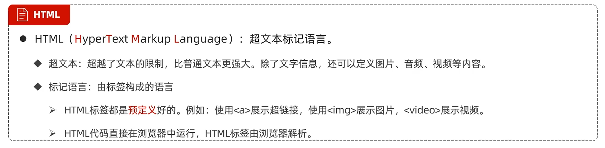

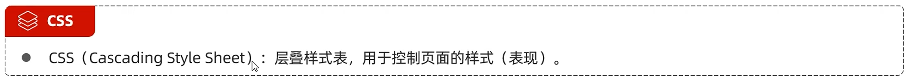

[HTML一个简单尝试](https://github.com/D5error/D5error.github.io/tree/main/docs/md/HTML/test1.html)

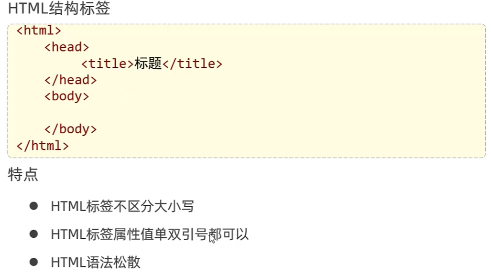

# 基础标签和样式

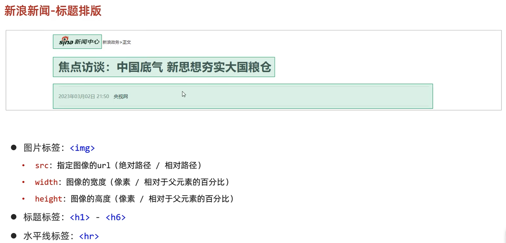

[标题排版](https://github.com/D5error/D5error.github.io/tree/main/docs/md/HTML/标题排版.html)

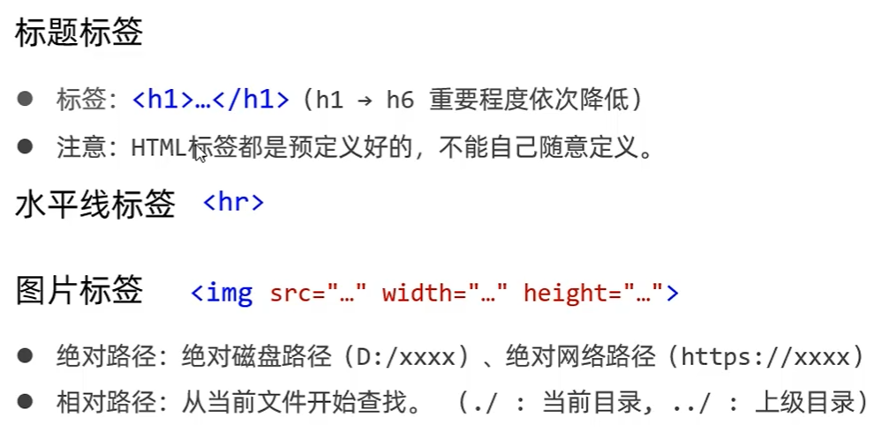

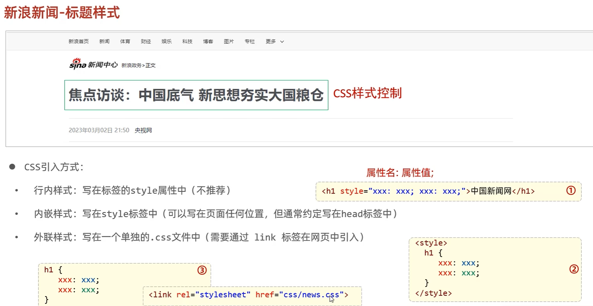

[标题排版2](https://github.com/D5error/D5error.github.io/tree/main/docs/md/HTML/标题排版2.html)

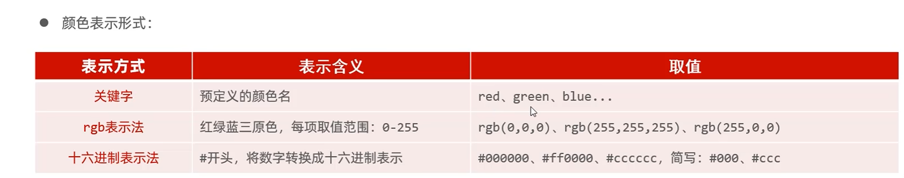

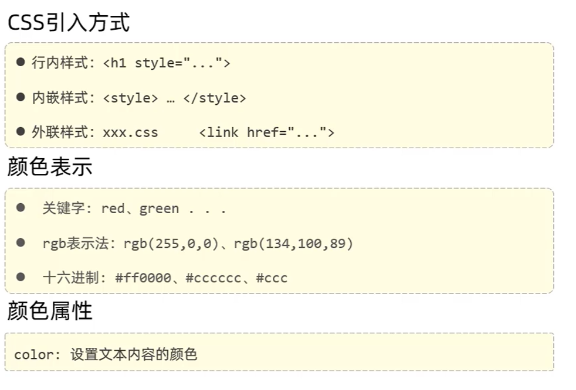

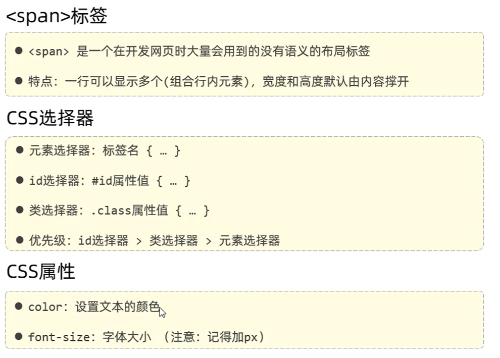

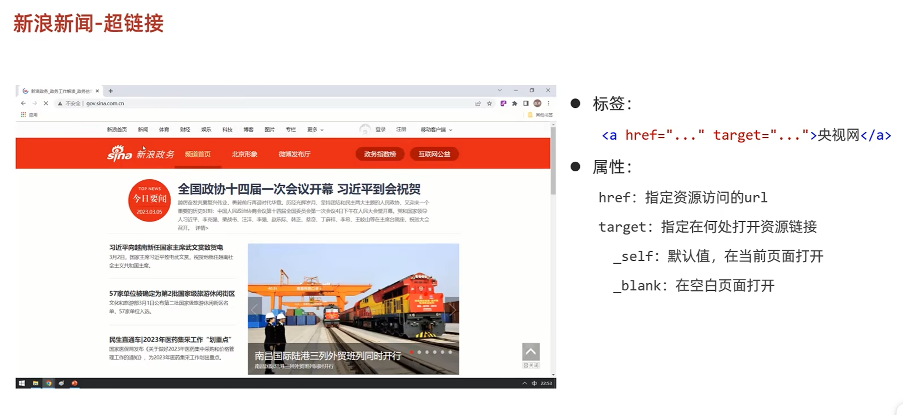

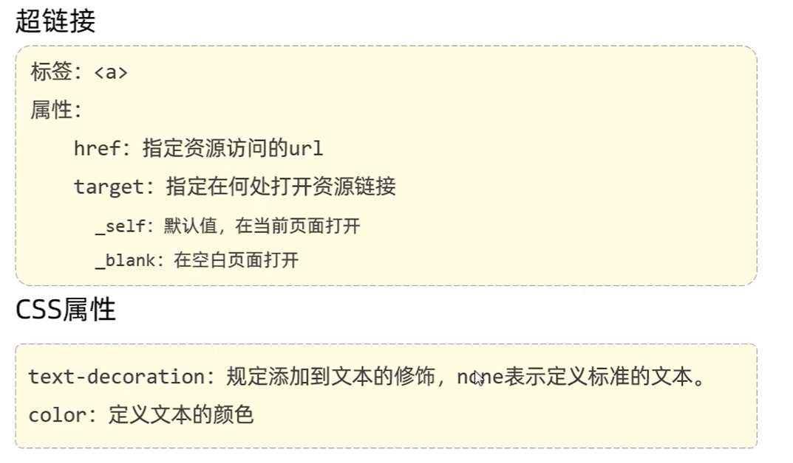

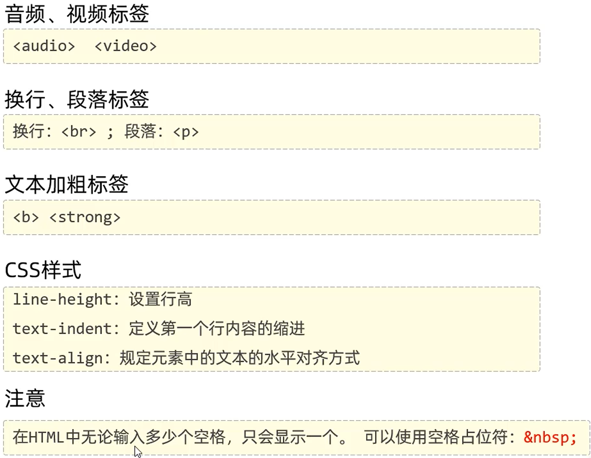

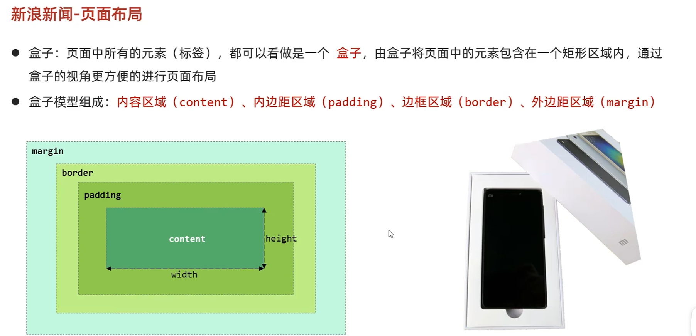

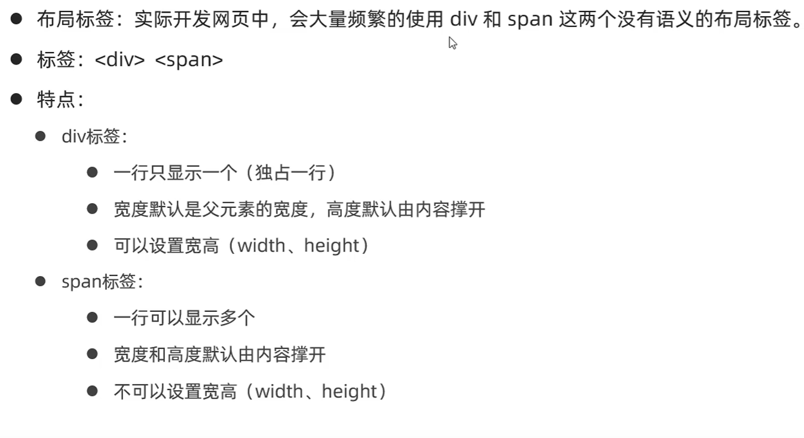

[盒子模型](https://github.com/D5error/D5error.github.io/tree/main/docs/md/HTML/盒子模型.html)

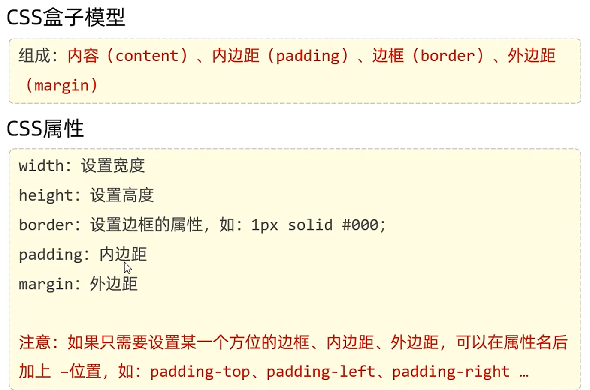

# 表格和表单标签

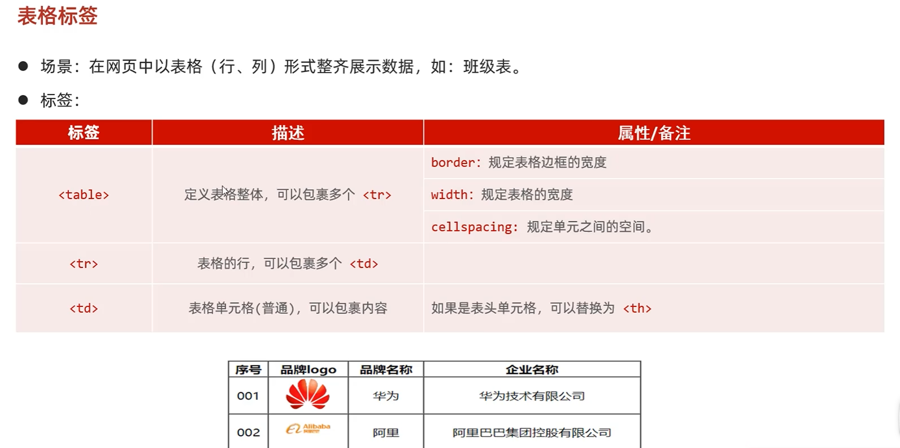

[表格](https://github.com/D5error/D5error.github.io/tree/main/docs/md/HTML/表格.html)

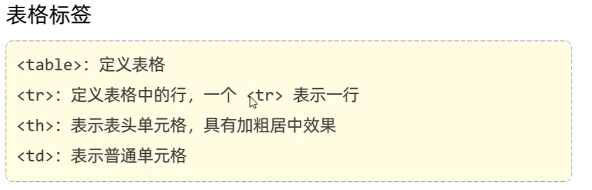

[表单](https://github.com/D5error/D5error.github.io/tree/main/docs/md/HTML/表单.html)

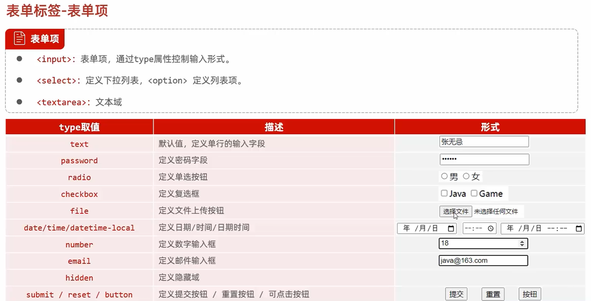

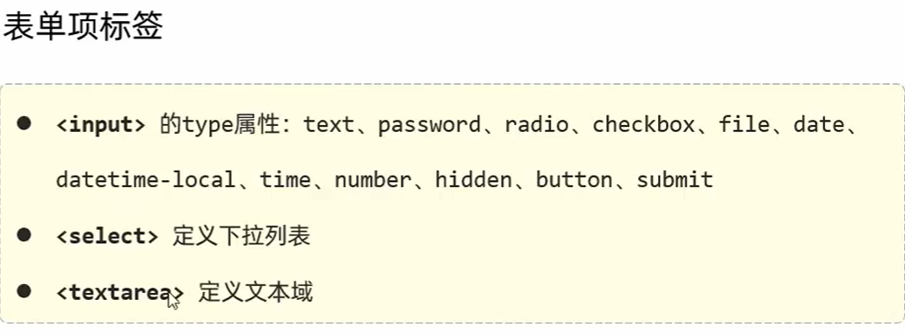
