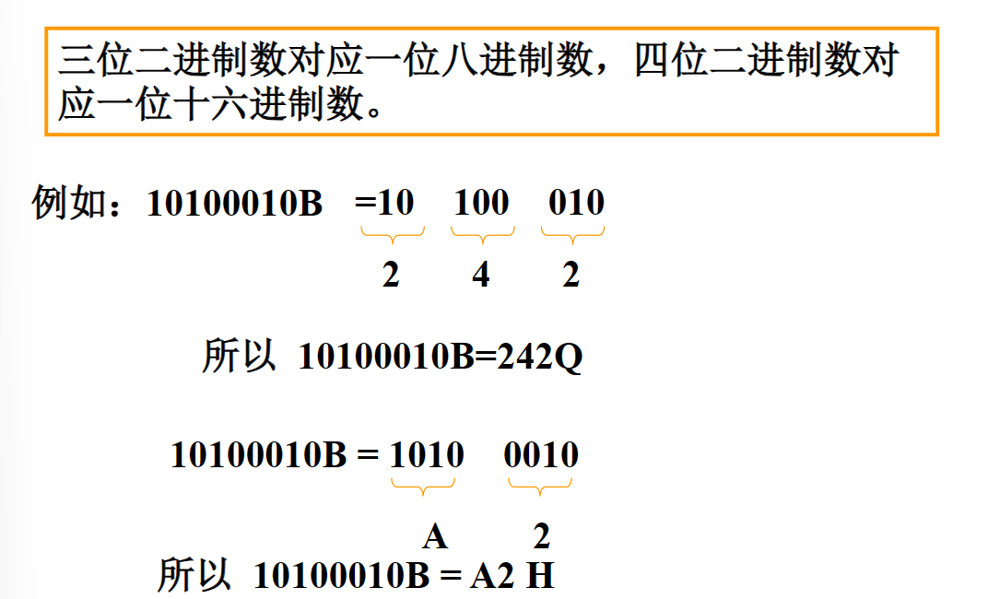

* STL中的基本概念
    * 容器：容纳各种数据类型的通用数据结构，是`类模板`
    * 迭代器：可用于依次存取容器中元素，类似于`指针`
    * 算法：用来操作容器中的元素的`函数模板`
        * `sort()`来对一个vector中的数据进行排序
        * `find()`来搜索一个list中的对象
        * 算法本身与数据类型无关，因此算法可以在从简单数组到高度复杂容器的任何数据结构上使用
        
    