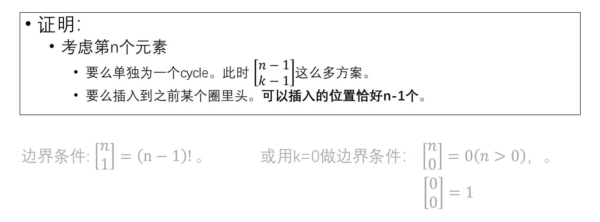
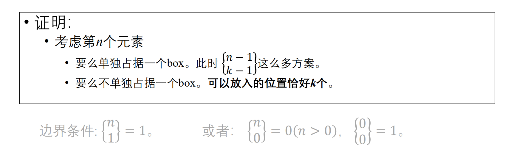

# 第一类Stirling数
* 圆排列
    * (2,4,7,8)= (4,7,8,2)=(7,8,2,4)=(8,2,4,7) 是同⼀个圆排列

* 第一类Stirling数
    * 将$1 \sim n$分成恰好$k$个圆排列的⽅案总数，记作$[_k ^n]$

* 递归公式
    * $[^n _k] = (n - 1) [^{n - 1}_k]+ [^{n - 1}_{k - 1}]$

    

# 第二类Stirling数
* 定义
    * n个物品放入k个不区分的盒子中，每个非空，方案数记作$\{^n_k\}$

* 递推公式
    * $\{^n_k\}= k \{ ^{n - 1}_k\} + \{^{n - 1} _{k - 1}\}$

    

# 阶乘幂和普通次幂的转换

# 下阶乘幂的求和和普通数幂求和