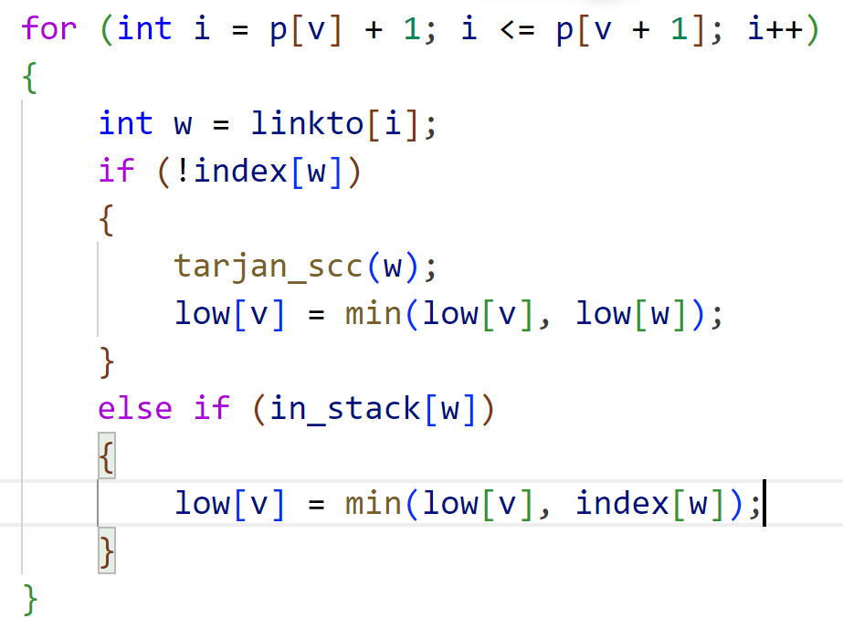

# Tarjan强连通分量算法
* 连通：**无向图中**，从任意点$i$可到达任意点$j$

* 强连通：**有向图中**，从任意点$i$可到达任意点$j$

* 弱连通：**把有向图看作无向图时**，从任意点$i$可到达任意点$j$

<https://www.bilibili.com/video/BV19J411J7AZ?p=4&spm_id_from=pageDriver&vd_source=c65196c22fdd3605640aeccf1b3b4a0e>

* 主要步骤
    1. 初始化：对每个结点进行标记，初始标记为未访问状态，同时设置一个全局的访问计时器`count`和一个空栈

    2. 对每个未访问的结点`u`，执行步骤3

    3. 深度优先搜索：从结点`u`开始进行深度优先搜索，首先将结点`u`标记为已访问，并将其加入栈中。然后遍历`u`的所有邻接结点`v`，如果`v`未被访问，则递归执行步骤3，将`v`加入栈中

    4. 回溯处理：当结点`u`的所有邻接结点都被访问过后，检查是否存在一个结点`v`，满足`v`是`u`的祖先结点，并且`v`的访问顺序小于等于`u`的访问顺序。如果存在这样的结点`v`，说明`u `和`v`之间存在一个强连通分量。此时从栈中连续弹出结点，直到结点`v`被弹出为止，并将这些结点组成一个强连通分量。将每个弹出的结点标记为已访问状态，并记录它们属于哪个强连通分量

    5. 重复步骤3和步骤4，直到图中的所有结点都被访问过

    > 当节点w未被访问过时，我们使用节点w所在强连通分量中的最小访问顺序low[w]作为参考值来更新节点v的low值。而当节点w已经被访问过时，我们使用节点w的访问顺序index[w]（如果w在栈中）或者节点w所在强连通分量中的最小访问顺序low[w]（如果w不在栈中）作为参考值来更新节点v的low值。
    


# Tarjan强连通分量算法的实现

```c
void tarjan_scc(int v)
{
	index[v] = low[v] = count++;
	stack[top++] = v;
	on_stack[v] = 1;
	for (int i = p[v] + 1; i <= p[v + 1]; i++)
	{
		int w = linkto[i];
		if(!index[w])
		{
			tarjan_scc(w);
			low[v] = min(low[v], low[w]);
		}
		else if(on_stack[w])
		{
			low[v] = min(low[v], low[w]);
		}
	}
	if (index[v] == low[v])	
	{
		int j;
		do
		{
			j = stack[--top];
			on_stack[j] = 0;
			size[tComponent]++;
		} while (j != v);
		tComponent++;
	}
}
```
