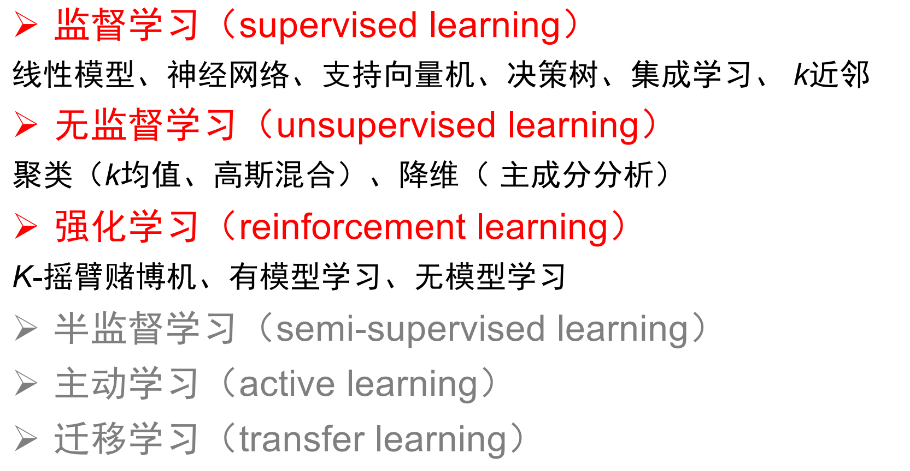

# 机器学习一般分类
    
1. 监督学习:从标注数据中学习预测模型的机器学习问题
    * 标注数据表示输入输出的对应关系,预测模型对给定的输入产生相应的输出
2. 无监督学习:从无标注数据中学习分析模型的机器学习问题
3. 强化学习:智能系统在与**环境的连续互动中**学习最优行为策略的机器学习问题
        
    * 系统以长期奖励的最大化为目的,不断试错,从所有可能策略中**学得最优策略**