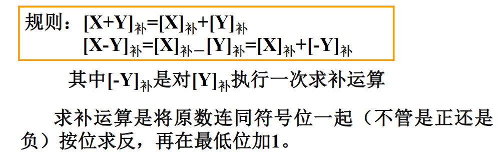
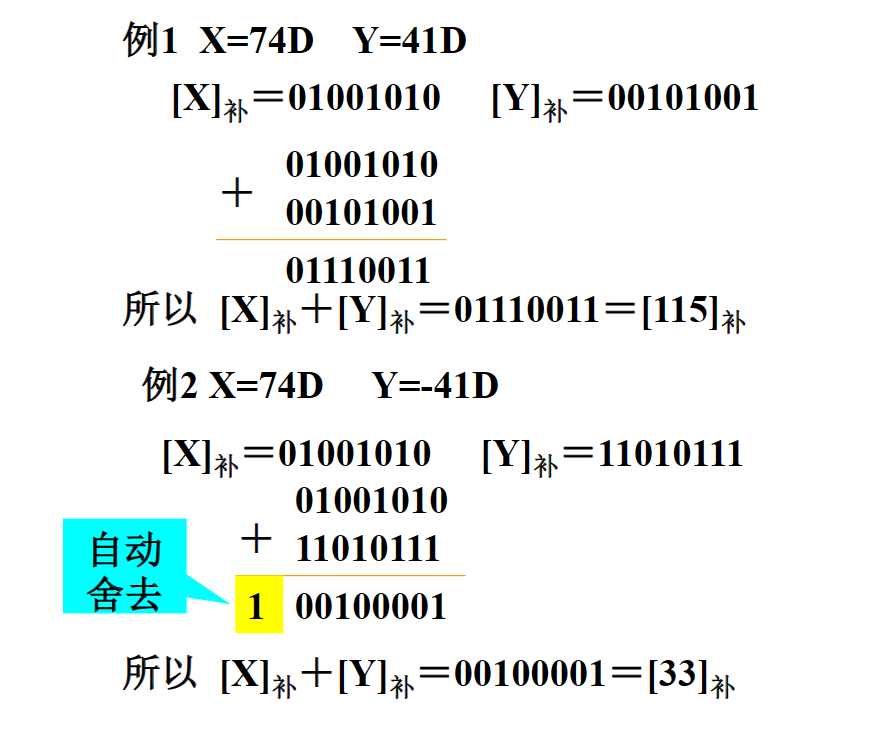

# 关联容器
* set,multiset,map,multimap
* 内部元素有序排列，新元素插入的位置取决于它的值，查找速度很快
* 除了各容器都有的函数外，还支持以下成员函数：
    * find:查找等于某个值的元素（x小于y和y小于x同时不成立
    * lower_bound:查找某个下界
    * upper_bound:查找某个上界
    * equal_range:同时查找上界和下界
    * count:计算等于某个值的元素个数（x小于y和y小于x同时不成立即为相等）
    * insert:用以插入一个元素或一个区间
# pair模板
```c++
template<class _T1,class _T2>
struct pair
{
    typedef _T1 first_type;
    typedef _T2 second_type;
    _T1 first;
    _T2 second;
    pair():first(),second(){}
    pair(const _T1& __a,const _T2& __b):first(__a),secend(__b){}
    template<class _U1,class _U2>
    pair(const pair<_U1,U2>& __p):first(__p.first),second(__p.second){}
}; 
```    
* map/multimap容器里放着的都是pair模板类的对象，且按first从小到大排序
* 第三个构造函数用法示例：
```c++
pair<int,int> p(pair<double,double>(5.5,4,6));    //p.first=5,p.second=4
```    
# multiset
```c++
template<class Key,class Pred=less<Key>,class A=allocator<Key>>
class multiset{......};
```    
* Pred类型的变量决定了multiset中的元素，“一个比另一个小”是怎么定义的。multiset运行过程中，比较两个元素x、y的大小的做法，就是生成一个Pred类型的变量，假定为op，若表达式op(x,y)返回值为true，则x比y小
* Pred的缺省类型是less<Key>
* less模板的定义：
```c++
template<class T>
struct less:public binary_function<T,T,bool>
{
    bool operator()(const T& x,const T& y)const    //less模板是靠<来比较大小的
    {
        return x<y;
    }
};
```    
     
     
