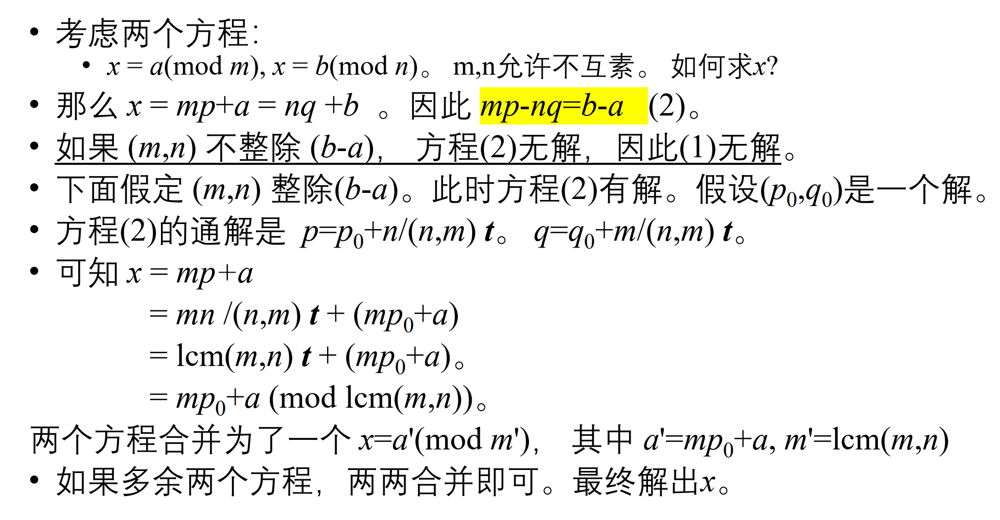

* 一般性问题：求$N$（非负整数）满足如下方程组：
    $$
    \begin{cases}
    N=a_1 (mod~m_1)\\
    .\\
    .\\
    N = a_k (mod ~ m_k )
    \end{cases}
    (其中a_1\sim a_k , m_1 \sim m_k 已知 , 0 \leq a_i < m_i )
    $$

* $m_1 \sim m_k $两两互素的情况：
    * 令$s_i = (m_1 * ... * m_k ) / m_i $

    * 找到$s_i $在模$m_i$意义下的逆元$r_i$。即$s_i r_i = 1(mod ~ m_i )$

    * 则有定理：$N = \sum _{i = 1}^ {k} a_i s_i r_i $是方程的一个解

    * 方程的通解为：$N_0 + iM$（$i$为任意整数）（$M=m_1 * ... * m_k $）（$N_0 = \sum ^k _{i = 1}a_i s_i r_i ~ mod ~ M$）

* $m_1 \sim m_k $不是两两互素的情况：
    
    
