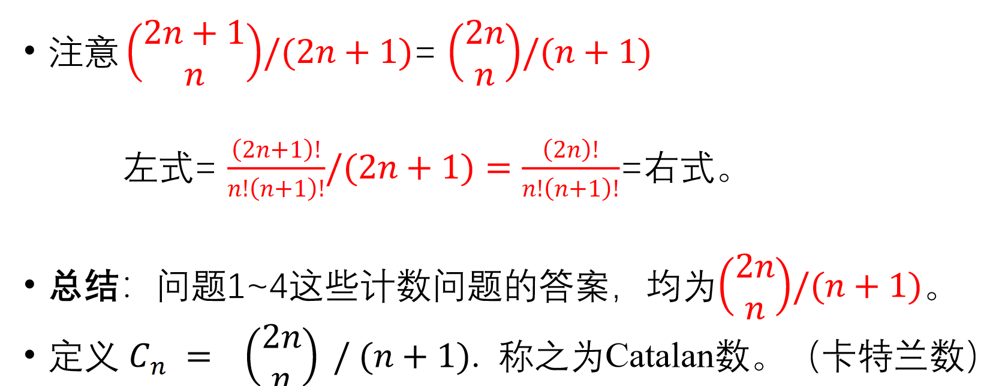

# 中国剩余定理
<https://www.bilibili.com/video/BV1gf4y1S7LR/?spm_id_from=333.337.search-card.all.click&vd_source=c65196c22fdd3605640aeccf1b3b4a0e>

## 定理内容（仅考虑$m_i$为互素的情况）

# Catalan数

## 等价问题

## Raney引理求解

* 使用Raney定理解问题3

* Raney引理证明

## 折线法求解

## 总结

## 重要递推公式

