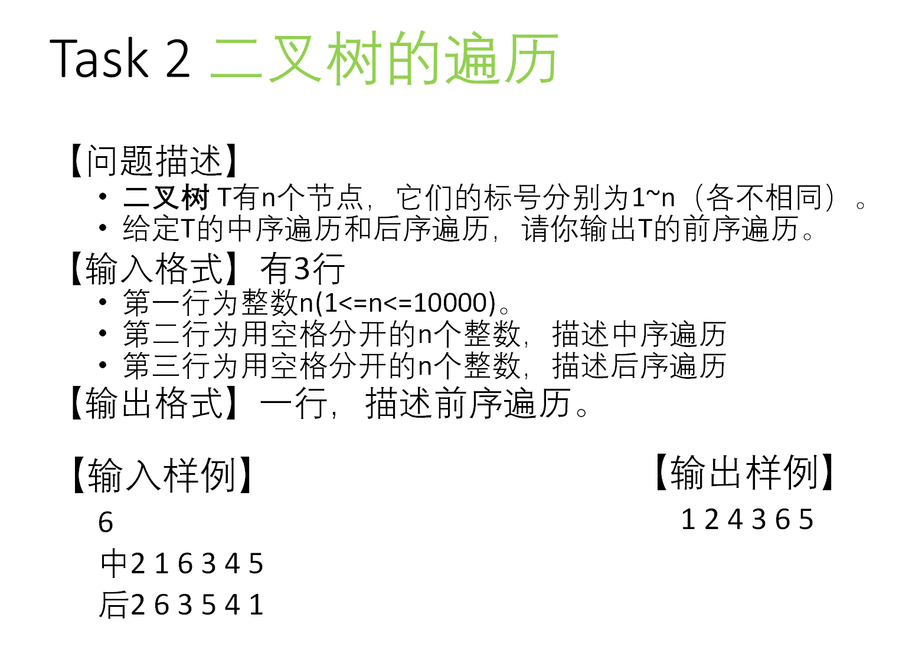

# 已知二叉树的前序遍历和中序遍历，求它的后序遍历
<https://www.luogu.com.cn/problem/P1827>

* 思路
    * 前序遍历是先遍历根结点，再遍历根结点的左右子树，那么前序序列的第一个结点一定是根结点。

    * 找到根结点，再确定根结点在中序序列中的位置，就可以**分出左右子树**

```cpp
# include <iostream>
using namespace std;

void tree(string middle, string front)
{
    if(front.size() < 1) // 树为空，停止递归
    {
        return;
    }
    int m = middle.find(front[0]); // 找根结点在中序序列上的位置
    
    // 拆分成左右子树递归调用tree()函数
    tree(middle.substr(0, m), front.substr(1, m)); 
    tree(middle.substr(m + 1, middle.size() - m - 1), front.substr(m + 1, middle.size() - m - 1));
    
    // 由于要求输出后序遍历，故先进行左右子树的访问，再输出根结点
    cout << front[0];
}

int main()
{
    string front, middle;
    cin >> middle >> front;
    tree(middle, front);
    return 0;
}
```

# 已知二叉树的中序遍历和后序遍历，求它的前序遍历



```cpp

```