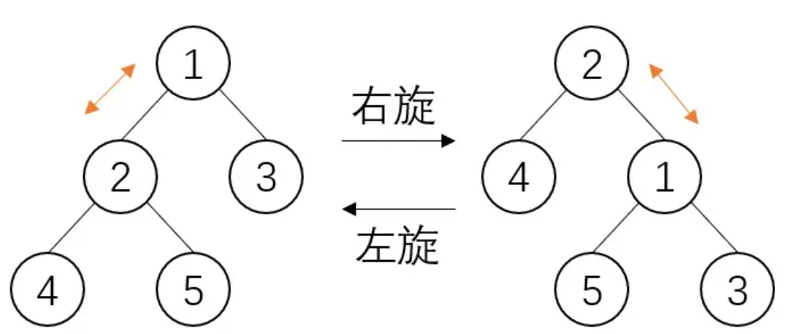
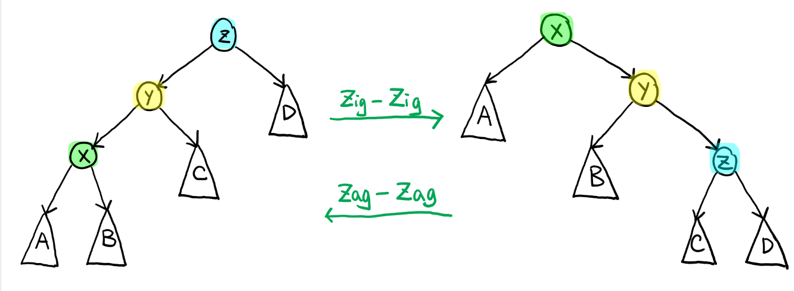
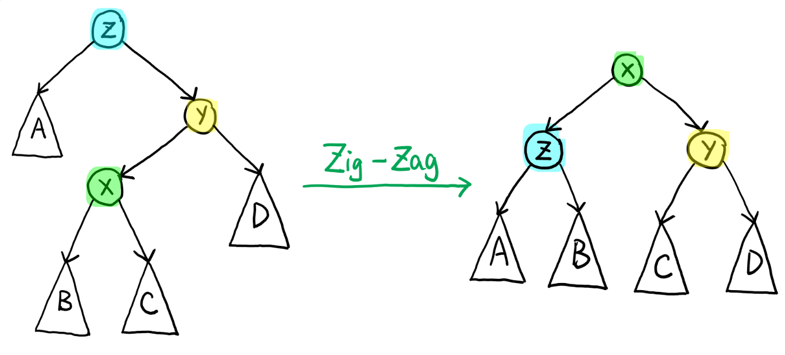

# 伸展树
<https://zhuanlan.zhihu.com/p/346741421>

* Splay树不关心二叉排序树是否时刻平衡，而是通过在每次操作时进行微调来使得树趋于平衡

* 每当对二叉排序树进行一次操作（查询、插入、删除等）时，将操作的结点通过**旋转**操作挪到根节点上，并且使得整棵树依旧满足二叉排序树的性质，这一系列过程**为splay操作**

* splay操作不单单是将操作节点挪到根节点，还将从原根节点到操作节点路径上的所有节点都进行了一次优化，使得其深度缩减，通过这一方法来使得二叉排序树不至于退化为链

