# 冲激函数

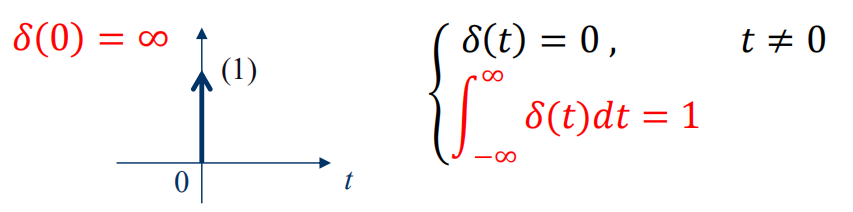

# 冲激函数的性质
1. 求导性

    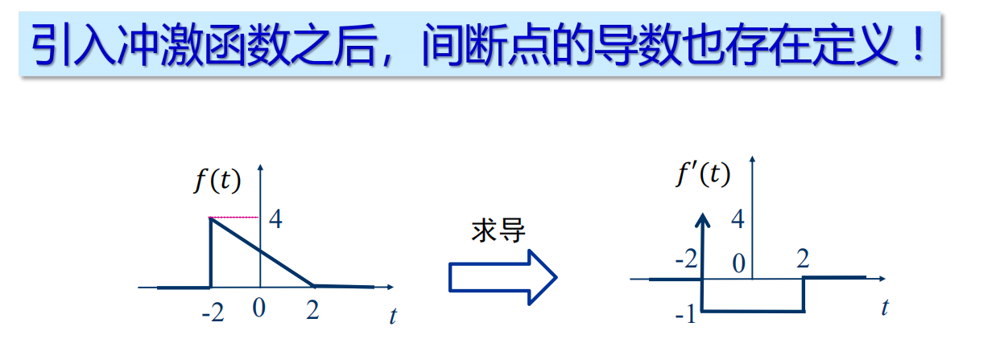

2. 抽样性

    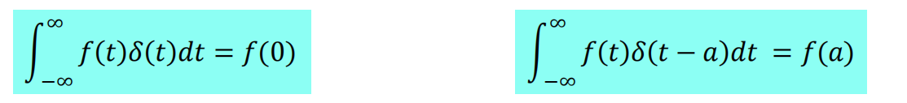

# 冲激序列与阶跃序列

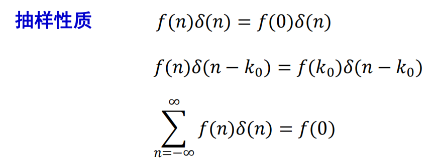

# 冲激函数的基本特性
1. 尺度变换特性

    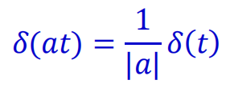

2. 偶函数性

    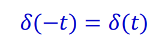

# 冲激偶信号

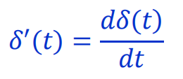

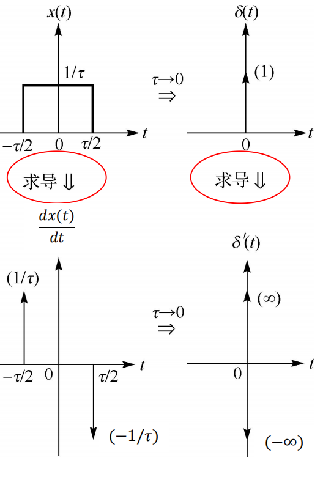

1. 冲激偶的积分

    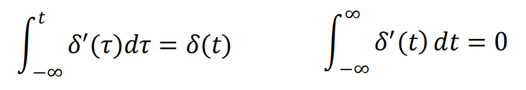

2. 尺度变换

    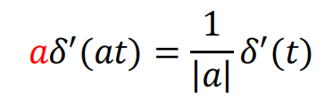

    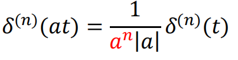

3. 奇函数性

    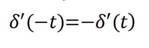

4. 抽样性

    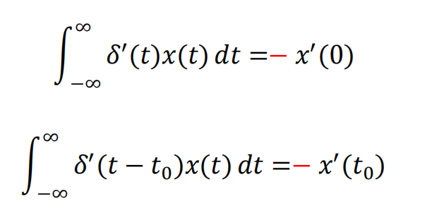

5. 微分特性

    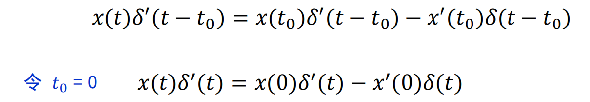
