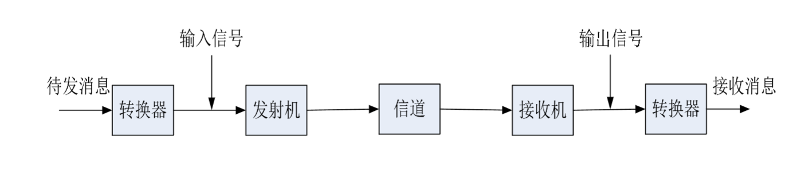

* 信息的传输任务:
    * 信息的传输任务,就是将带有信息的信号,通过某种系统由发送者传送给接收者
    * 要完成这样的任务,必然要将带有信息的信号,通过某种系统,进行适当的处理和变换
    * 客观存在(时间)->信息->消息(约定的符号)->便于传输的信号

* 通讯系统的组成:
    * 原始的信息(例如语言),经过某种特定的转换器(例如麦克风),转换为便于处理的电信号
    * 原始信息直接转换成的信号,可能未必适于直接传播,必须通过发射机,转换成为适合于传输的大功率射频信号(例如广播电台发射的中波信号)
    * 发射信号通过信道,进行长距离的传输,到达接收端
    * 接收端通过接收机,接收到发射机发射信号,然后转换为电信号
    * 通过某种转换器(例如扬声器),将电信号转换为原始的消息(语言信号),传达到接收者

