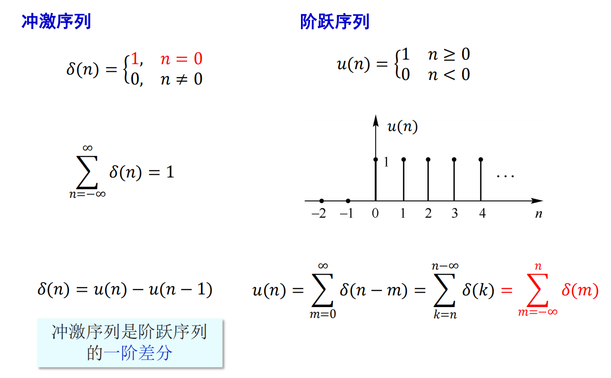

# 直流与交流分量
* 信号=信号的直流分量+信号的交流分量：$x(t)=x_D+x_A(t)$

* 信号的平均功率=直流功率+交流功率：$P=\frac{1}{T}\int_{-T/2}^{T/2}x^2(t)dt=x_D^2+\frac1T\int_{-T/2}^{T/2}x_A^2(t)dt$

# 偶分量与奇分量
* 任意信号分解为奇偶分量之和：
$$
x(t)=x_e(t)+x_o(t)\begin{cases}
x_e(t)=x_e(-t)~~~~e:even~~偶分量\\
x_o(t)=-x_o(-t)~~~~o:odd~~奇分量\\
\end{cases}
$$

$$
x_e(t)=\frac12[x(t)+x(-t)]\\
x_o(t)=\frac12[x(t)-x(-t)]
$$

* 信号的平均功率=偶分量功率+奇分量功率

# 脉冲分量
* 任意信号分解为冲激信号之和：$x(\tau)[u(t-\tau)-u(t-\tau-\Delta \tau)]$，此表达式式表示了一个$\Delta\tau$上的面积，其中脉宽用**阶跃函数**表示

    

* 不同时刻的不同强度的冲激函数的和
$$
x(t)\cong \Sigma_{k=-\infty}^{\infty}x(k\Delta\tau)[u(t-k\Delta\tau)-u(t-k\Delta\tau-\Delta\tau)]\\
=\Sigma_{k=-\infty}^{\infty}x(k\Delta\tau)\frac{[u(t-k\Delta\tau)-u(t-k\Delta\tau-\Delta\tau)]}{\Delta\tau}*\Delta\tau\\
\stackrel{\Delta\tau\to0}{\implies}x(t)=\int_{-\infty}^{\infty}x(\tau)\delta(t-\tau)d\tau
$$

# 正交函数分量
* 信号的正交分解：设$n$个函数$\phi_n(t)$在区间$(t_1,t_2)$上构成一个**正交**函数集合，将任一函数$f(t)$用这$n$个函数的**线性组合来近似**：
    $f(t)\approx c_1\phi_1(t)+c_2\phi_2(t)+...+c_n\phi_n(t)=\Sigma_{i=1}^{n}c_i\phi_i(t)$

* 均方误差：$\bar{e}^2=\frac{1}{\Delta t}\int_{\Delta t}[f(t)-\Sigma_{i=1}^{n}c_i\phi_i(t)]^2dt$，$\Delta t$表示一个积分区间

* 最小均方误差：求解最优系数（导数为0时取得最优系数）
    $$\frac{\partial}{\partial c_j}\bar{e}^2=\frac{1}{\Delta t}\int_{\Delta t}\frac{\partial}{\partial c_j}[f(t)-\Sigma_{i=1}^{n}c_i\phi_i(t)]^2dt=0\\
    \implies-\frac{1}{\Delta t}\int_{\Delta t}[f(t)-\Sigma_{i=1}^{n}c_i\phi_i(t)]\phi_j(t)dt=0
    $$

* 正交函数集：
    * 正交性质：$\int_{\Delta t}\phi_i(t)\phi_j(t)dt=0$
    
    * 归一化性质：$\int_{\Delta t}\phi_j(t)\phi_j(t)dt=K_j$