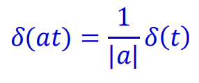
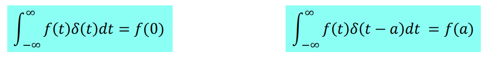

# 信号的尺度变换

* 平移：$f(t+t_0)$相当于$f(t)$波形在$t$轴上的整体移动
    * 当$t_0>0$时，波形左移

    * 当$t_0<0$时，波形右移

* 反褶：$f(-t)$相当于将$f(t)$以$t=0$为轴反褶过来，此运算也称时间轴反转

* 尺度：信号波形$f(at)$将是$f(t)$波形的压缩($a>1$)或扩展($0<a<1$)，此运算称为时间轴的尺度倍乘或尺度变换

* 对于离散时间信号，进行尺度变换时可能使**部分信号丢失**

# 信号的时域运算

    

# 信号的卷积运算
* 卷积运算：$f_1(t)*f_2(t)=\int_{-∞}^{∞}f_1(τ)*f_2(t-τ)dτ$

* 计算步骤：
    1. 首先将$f_1(t)$和$f_2(t)$的自变量$t$改为$τ$：$f_1(t)\to f_1(τ)，f_2(t)\to f_2(τ)$

    2. 反褶：$f_2(τ)\to f_2(-τ)$

    3. 平移：$f_2(-τ)\to f_2(t-τ)=f_2(-(τ-t))$

    4. 相乘：$f_1(τ)f_2(t-τ)$

    5. 积分：$f_1(t)*f_2(t)=\int_{-∞}^{∞}f_1(τ)f_2(t-τ)dτ$

* 标黄部分表示了冲激信号的抽样特性，代替了分段取值

# 卷积的性质

* 交换律：$f_1(t)*f_2(t)=f_2(t)*f_1(t)$

* 分配律：$f_1(t)*[f_2(t)+f_3(t)]=f_1(t)*f_2(t)+f_1(t)*f_3(t)$

* 结合律：$[f_1(t)*f_2(t)]*f_3(t)=f_1(t)*[f_2(t)*f_3(t)]$

* 微分性质：$\frac{d}{dt}[f_1(t)*f_2(t)]=f_1(t)*\frac{df_2(t)}{dt}=\frac{f_1(t)}{dt}*f_2(t)$

* 积分性质：$\int_{-\infty}^{t}[f_1(\lambda)*f_2(\lambda)]d\lambda=f_1(t)*\int_{-\infty}^{t}f_2(\lambda)d\lambda=f_2(t)*\int_{-\infty}^{t}f_1(\lambda)d\lambda$

* 微分与积分性质：
    * 若：$s(t)=f_1(t)*f_2(t)$
    
    * 则：$s(t)=f_1(t)*f_2(t)=\frac{df_1(t)}{dt}*\int_{-\infty}^{t}f_2(\lambda)d\lambda \\
    s(t)=f_1(t)*f_2(t)=f_1^{(1)}(t)*f_2^{(-1)}(t)\\
    s^{(i)}(t)=(f_1(t)*f_2(t))^{(i)}=f_1^{(j)}*f_2^{(i-j)}(t)
    $ 
    
    * 当$i，j$取正整数时为导数的阶次，取负整数时为重积分的次数

    * 注：$f_1(-\infty)=f_2(-\infty)=0$，否则不能应用上述性质

    

* 冲激函数卷积
$$
f(t)*\delta (t)=\int_{-\infty}^{\infty}f(\tau)\delta(t-\tau)d\tau=f(t)\int_{-\infty}^{\infty}\delta(t-\tau)d\tau=f(t)\\
f(t)*\delta'(t)=f'(t)*\delta(t)=(f(t)*\delta(t))'=f'(t)\\
f(t)*u(t)=f^{(-1)}(t)*u^{(1)}(t)=f^{(-1)}(t)*\delta(t)=\int_{-\infty}^{t}f(\lambda)d\lambda\\
f(t)*\delta(t-t_0)=f(t-t_0)
$$

* 时移特性：$f(t)*\delta(t-t_0)=f(t-t_0)$
$$
\delta(t-t_2)*\delta(t-t_1)=\delta(t-t_1)*\delta(t-t_2)=\delta(t-t_1-t_2)\\
f(t-t_2)*\delta(t-t_1)=f(t-t_1-t_2)=f(t-t_1)*\delta(t-t_2)
$$

# 离散序列卷积和
* 已知定义在区间$(-\infty,\infty)$上的两个序列$f1(n)$和$f2(n)$，则定义：$f(n)=\Sigma_{m=-\infty}^{\infty}f_1(m)f_2(n-m)=f_1(n)*f_2(n)$为$f_1(n)$和$f_2(n)$的卷积和

* 卷积和有着和上面卷积一样的性质，只是自变量不同