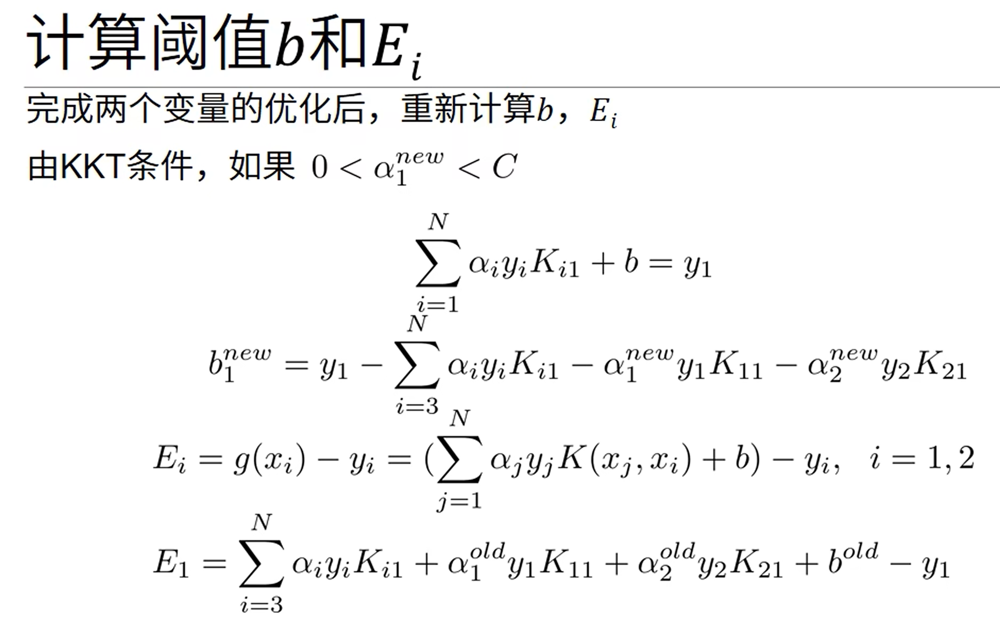

# 两信号相加或相乘

    

# 尺度变换：平移、反褶、尺度
* 平移：f(t)的自变量t更换为(t+t0)，则f(t+t0)相当于f(t)波形在t轴上的整体移动
    * 当t0>0时，波形左移

    * 当t0<0时，波形右移

* 反褶：将f(t)的自变量t更换为-t，此时f(-t)相当于将f(t)以t=0为轴反褶过来，此运算也称时间轴反转

* 尺度：将信号f(t)的自变量t乘以正实系数a，则信号波形f(at)将是f(t)波形的压缩(a>1)或扩展(a<1)，此运算称为时间轴的尺度倍乘或尺度变换

* 对于离散时间信号，进行尺度变换时可能使部分信号丢失

# 信号的卷积运算
* 卷积运算：$f1(t)*f2(t)=Sum[-∞,∞]f1(τ)f2(t-τ)dτ$

* 计算步骤：
    1. 首先将$f1(t)$和$f2(t)$的自变量$t$改为$τ$：$f1(t)->f1(τ),f2(t)->f2(τ)$

    2. 反褶：$f2(τ)->f2(-τ)$

    3. 平移：$f2(-τ)->f2(t-τ)=f2(-(τ-t))$

    4. 相乘：$f1(τ)f2(t-τ)$

    5. 积分：$f1(t)*f2(t)=Sum[-∞,∞]f1(τ)f2(t-τ)dτ$

# 卷积的性质

