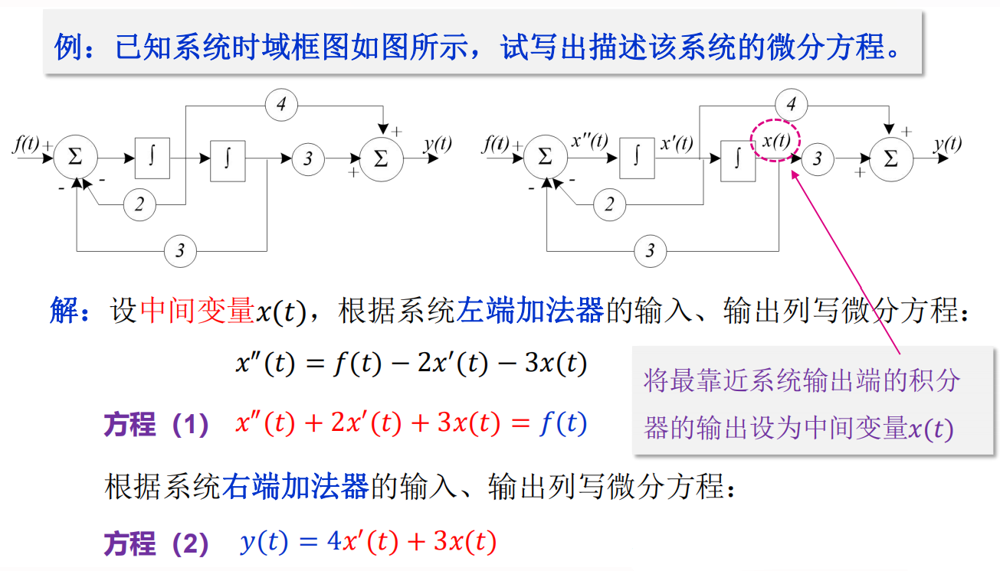
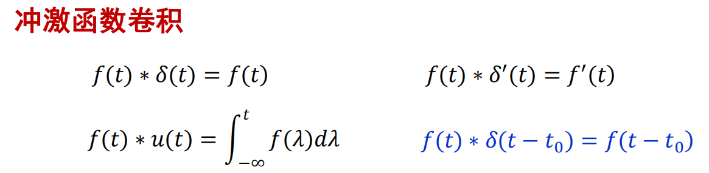

# 信号的分类
1. 确定性信号与随机信号
    * 确定的时刻有确定的数值称为确定信号

    * 不可预知的信号称为随机信号

2. 连续时间信号与离散时间信号
    * 连续时间信号在连续时间内有定义且有确定的函数值，**值可连续或离散**

    * 离散时间信号在给定的离散时间给出函数值

3. 模拟信号和数字信号
    * 模拟信号：时间和幅值均为连续的信号

    * 数字信号：时间和幅值均为离散的信号

    * 抽样信号：时间离散但幅值连续的信号

    

3. 周期信号与非周期信号
    * 连续周期信号$x(t)$满足：$x(t)=x(t+mT),m=0,±1,±2,...$

    * 离散周期信号$x(n)$满足：$x(n)=x(n+mN),m=0,±1,±2,...$

    * 满足以上关系的最小$T$（或非零整数$N$）称为该信号的周期

    

    * 连续正弦信号一定是周期信号，而正弦序列不一定是周期序列

    * 连续周期信号之和不一定是周期信号，如周期$π$加周期$1$不是周期信号，**不能找到最小公倍数**

    * 周期序列之和一定是周期序列，因为**必能找到最小公倍数**（有理数）

4. 能量信号与功率信号

    * 信号的能量：$\lim \limits_{T \to \infty} \int_{-T/2}^{T/2} |x(t)|^2\,{\rm d}t=\int_{-\infty}^{\infty} |x(t)|^2\,{\rm d}t$
    
    * 信号的功率：$P=\lim \limits_{T \to \infty} \frac1T \int_{-T/2}^{T/2} |x(t)|^2 \,{\rm d}t$

    * 能量信号：若$x(t)$的能量为**非零有限值**，即$E<\infty$，此时$P=0$（因为$T$无限，所以被除为$0$）

    * 功率信号：若$x(t)$的功率为**非零有限值**，即$P<\infty$，此时$E\to \infty$（因为$E$太大，所以才除不完）

    * 周期信号为功率信号，能量信号为**非周期信号**

    * 正弦信号**能量无限而功率有限**，为功率信号

    * 既不是能量信号，也不是功率信号举例：$x(t)=t$（能量和功率给都是无限），$x(t)=3e^{-2t}$（能量和功率都是无限）
    
5. 一维信号与多维信号

# 典型的连续时间信号

## 正弦信号
* 正弦信号与余弦信号仅在相位上差$\fracπ2$，统称为正弦信号

* $f(t)=K sin(\omega t+\theta)$

     

* $K$为振幅，$\omega$为角频率，$\theta$为初相位

* 周期$T$与频率满足：$T=\frac{2π}ω=\frac1f$

### 指数衰减的正弦信号

* 此正弦振荡的幅度按指数规律衰减

$$
f(x)=\begin{cases}
    0, & t<0 \\
    Ke^{-\alpha t}sin(\omega t), & t>=0
\end{cases}
$$

       

## 指数信号    

* $f(t)=Ke^{\alpha t}$

    

* $a>0$，信号随时间增长

* $a<0$，信号随时间衰减

* $a=0$，信号成为直流信号

* 常数$K$表示指数信号在$t=0$的初始值

* $|a|$越大，增长或衰减的速率越大

* 把$|a|$的倒数称为指数信号的时间常数$\tau$，$\tau=\frac{1}{|a|}$，τ越大，指数信号**增长或衰减的速率越小**

## 复指数信号
* $f(t)=Ke^{st}$，$s=\sigma+j\omega$，其中$\sigma$为复数$s$的实部，$\omega$是虚部

* 借助欧拉公式展开：$Ke^{st}=Ke^{(\sigma +j\omega)t}=Ke^{\sigma t}\cos(\omega t)+jKe^{\sigma t}sin(\omega t)$

* 一个复指数信号可分解为实部（余弦信号）和虚部（正弦信号）
* 指数因子的实部$\sigma$表明了正弦与余弦函数**振幅**随时间变化的情况，虚部$\omega$表明了正弦与余弦函数的**角频率**

* 特殊情况:
    1. $\sigma =0,\omega=0$，直流

    2. $\sigma >0,\omega=0$，升指数信号

    3. $\sigma <0,\omega=0$，衰减指数信号

    4. $\sigma =0,\omega!=0$，等幅振荡

    5. $\sigma >0,\omega!=0$，增幅振荡

    6. $\sigma <0,\omega!=0$，衰减振荡

## $Sa(t)$信号（抽样信号）
* $Sa(t)$信号是指：$Sa(t)=\frac{\sin(t)}{t}$

    

* 性质
    1. 偶函数，在$t$的正、负两方向**幅值**都逐渐递减

    2. 当$t=±π，±2π，...，±nπ$使函数值等于零
    
    3. $\lim_{t \to 0}Sa(t)=1$，$\lim_{t \to \pm \infty}Sa(t)=0$

    4. 积分

        * $\int_{0}^{\infty}Sa(t)dx=\frac{\pi}{2}$

        * $\int_{-\infty}^{\infty}Sa(t)dt=\pi$ 
