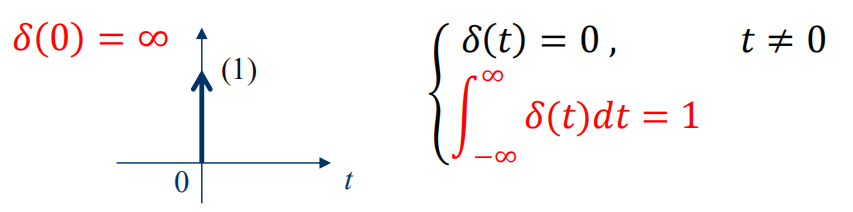

# 信号与消息
* 信号是消息的物理**传输载体**
    * 模拟信号：信号参量取值连续

    * 数字信号:信号参量取值离散

* 消息是信息的物理**表现形式**
    * 连续消息：语音、温度、图像...

    * 离散消息：数据、文字、符号...

# 信号的分类
1. 确定性信号与随机信号
    * 确定的时刻有确定的数值对应，称为确定信号

    * 不可预知的信号称为随机信号

2. 连续时间信号与离散时间信号
    * 连续时间信号在连续时间内有定义且有确定的函数值，**值域可连续或离散**

    * 离散时间信号在规定的离散时间给出函数值

3. 模拟信号和数字信号
    * 模拟信号将数据表示为一连串连续的值

    * 数字信号将数据表示为一连串离散的值

    * 抽样信号由**连续时间信号**抽样得到

    

3. 周期信号与非周期信号
    * 连续周期信号$x(t)$满足：$x(t)=x(t+mT),m=0,±1,±2,...$

    * 离散周期信号$x(n)$满足：$x(n)=x(n+mN),m=0,±1,±2,...$

    * 满足以上关系的最小$T$（或非零整数$N$）称为该信号的周期

    

    * 连续正弦信号一定是周期信号，而正弦序列不一定是周期序列

    * 连续周期信号之和不一定是周期信号，如周期$π$加周期$1$不是周期信号，**不能找到最小公倍数**

    * 周期序列之和一定是周期序列，因为**必能找到最小公倍数**

4. 能量信号与功率信号

    * 信号的能量：$\lim_{T \to \infty} \int_{-T/2}^{T/2} |x(t)|^2\,{\rm d}t=\int_{-\infty}^{\infty} |x(t)|^2\,{\rm d}t$
    
    * 信号的功率：$P=\lim_{T \to \infty} \frac1T \int_{-T/2}^{T/2} |x(t)|^2 \,{\rm d}t$

    * 能量信号：若$x(t)$的能量为**非零有限值**，即$E<\infty$，此时$P=0$（因为$T$无限，所以被除为$0$）

    * 功率信号：若$x(t)$的功率为**非零有限值**，即$P<\infty$，此时$E\to \infty$（因为$E$太大，所以才除不完）

    * 周期信号为功率信号，能量信号为**非周期信号**

    * 正弦信号**能量无限而功率有限**，为功率信号

    * 既不是能量信号，也不是功率信号举例：$x(t)=t$（能量和功率给都是无限），$x(t)=3e^{-2t}$（能量和功率都是无限）
5. 一维信号与多维信号

# 典型的连续时间信号
1. 正弦信号
    * 正弦信号与余弦信号仅在相位上差$\fracπ2$，经常统称为正弦信号

    * $f(t)=K sin(\omega t+\theta)$

         

    * $K$为振幅，$\omega$为角频率，$\theta$为初相位

    * 周期$T$与频率满足：$T=\frac{2π}ω=\frac1f$

    * 指数衰减的正弦信号

        * 此正弦振荡的幅度按指数规律衰减

        $$
        f(x)=\begin{cases}
            0, & t<0 \\
            Ke^{-\alpha t}sin(\omega t), & x>0
        \end{cases}
        $$

               

2. 指数信号    

    * $f(t)=Ke^{\alpha t}$

        

    * $a>0$，信号随时间增长

    * $a<0$，信号随时间衰减

    * $a=0$，信号成为直流信号

    * 常数$K$表示指数信号在$t=0$的初始值

    * $|a|$越大，增长或衰减的速率越大

    * 把$|a|$的倒数称为指数信号的时间常数，记作$\tau$，即$\tau=\frac{1}{|a|}$，τ越大，指数信号增长或衰减的速率越小

3. 复指数信号
    * 若指数信号的指数因子为复数，故称之为复指数信号
    
    * $f(t)=Ke^{st}$，$s=\sigma+j\omega$，其中$\sigma$为复数s的实部，$\omega$是虚部
    
    * 借助欧拉公式展开可得：$Ke^{st}=Ke^{(\sigma +j\omega)t}=Ke^{\sigma t}\cos(\omega t)+jKe^{\sigma t}sin(\omega t)$
    
    * 一个复指数信号可分解为实部（余弦信号）和虚部（正弦信号）
        * 指数因子的实部$\sigma$表明了正弦与余弦函数振幅随时间变化的情况，虚部$\omega$表明了正弦与余弦函数的角频率

    * 特殊情况:
        1. 当$σ=0$时，即$s$为虚数，则正弦、余弦函数是**等幅振荡**
       
        2. 当$ω=0$时，即$s$是实数，则复指数信号成为**一般的指数信号**
       
        3. 当$σ=0$且$ω=0$时，即$s$等于零，则复指数信号的实部和虚部都与时间无关，**成为直流信号**

4. $Sa(t)$信号（抽样信号）
    * $Sa(t)$信号是指$sin(t)$与$t$之比的构成的函数：$Sa(t)=\frac{\sin(t)}{t}$

        

    * $Sa(t)$函数具有以下性质
        1. 偶函数，在$t$的正、负两方向**幅值**都逐渐递减

        2. 当$t=±π，±2π，...，±nπ$使函数值等于零；$t$趋于$0$时$Sa(t)=1$，t趋于无穷时$Sa(t)=0$

        3. 积分

            * $\int_{0}^{\infty}Sa(t)dx=\frac{\pi}{2}$

            * $\int_{-\infty}^{\infty}Sa(t)dt=\pi$ 
