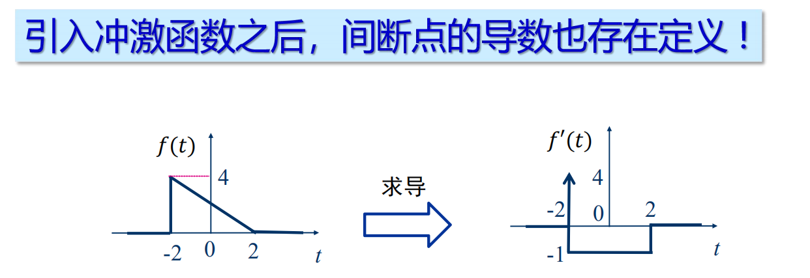
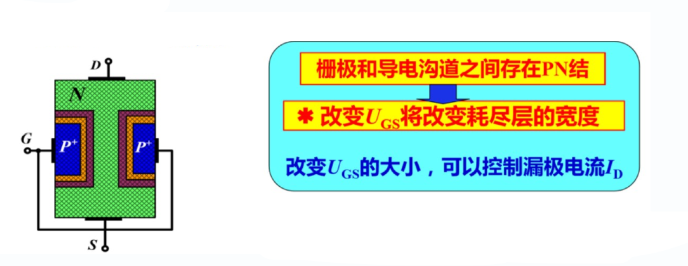

# 信号的描述
* 信号是消息的物理传输载体
    * 模拟信号:信号参量取值连续
    * 数字信号:信号参量取值离散
* 消息是信息的物理表现形式
    * 连续消息:语音/温度/图像...
    * 离散消息:数据/文字/符号...
# 信号的分类
* 确定性信号与随机信号
* 周期信号与非周期信号
* 连续时间信号与离散时间信号
* 一维信号与多维信号
* 还有其它划分方式...
# 典型的连续时间信号
1. 指数信号    
        
        
    * a>0,信号随时间增长
    * a<0,信号随时间衰减
    * a=0,信号成为直流信号
    * 常数K表示指数信号在`t=0`的初始值
    * |a|越大,增长或衰减的速率越大
    * 把|a|的倒数称为指数信号的时间常数,记作`τ`,即`τ=1/|a|`
    * τ越大,指数信号增长或衰减的速率越小
2. 正弦信号
    * 正弦信号与余弦信号仅在相位上差`π/2`,经常统称为正弦信号
        
         
    * K为振幅
    * ω为角频率
    * θ为初相位
    * 周期T与频率满足:`T=2π/ω=1/f`
    * 指数衰减的正弦信号
            
            
        * 衰减的正弦信号,此正弦振荡的幅度按指数规律衰减    
3. 复指数信号
    * 若指数信号的指数因子为一复数,则称之为复指数信号
        
        
    * 其中`σ`为复数s的实部,`ω`是虚部
    * 借助欧拉公式展开可得
            
    * 结果表明,一个复指数信号可分解为实部(余弦信号)和虚部(正弦信号)
        * 指数因子的实部σ表明了正弦与余弦函数振幅随时间变化的情况
        * 指数因子的虚部ω表明了正弦与余弦函数的角频率
    * 特殊情况:
        1. 当σ=0时,即s为虚数,则正弦/余弦函数是等幅振荡
        2. 当ω=0时,即s是实数,则复指数信号成为一般的指数信号 
        3. 当σ=0且ω=0时,即s等于零,则复指数信号的实部和虚部都与时间无关,成为直流信号
4. Sa(t)信号(抽样信号)
    * Sa(t)信号是指sint与t之比的构成的函数
        
        
    * Sa(t)函数具有以下性质:
        1. 是一个偶函数,在t的正/负两方向都逐渐递减
        2. 当t=±π,±2π,...,±nπ使,函数值等于零
        3. 积分
                
        4. 与Sa(t)函数类似的sinc(t)函数
                
5. 钟形信号(高斯函数)
        
        
    * 令`t=τ/2`代入函数求得
            
        * 表明参数τ是当f(t)由最大值`E`下降为`0.78E`时,所占据的时间宽度(花费的时间)