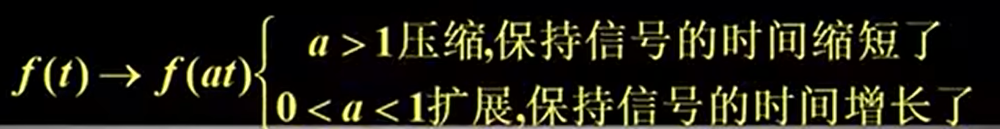
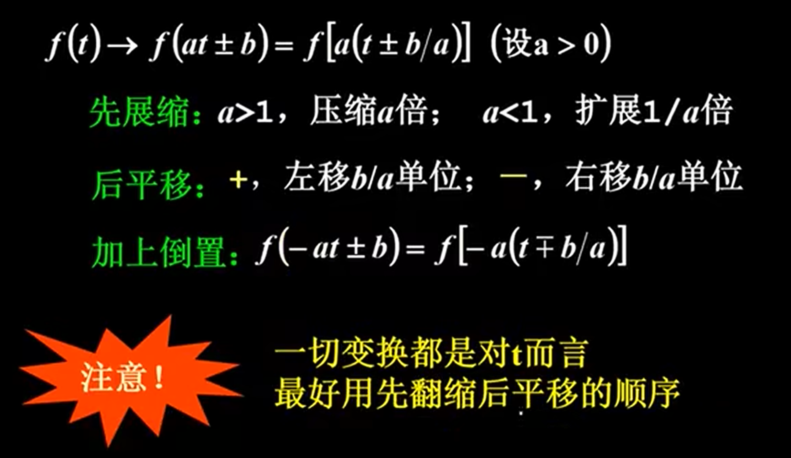
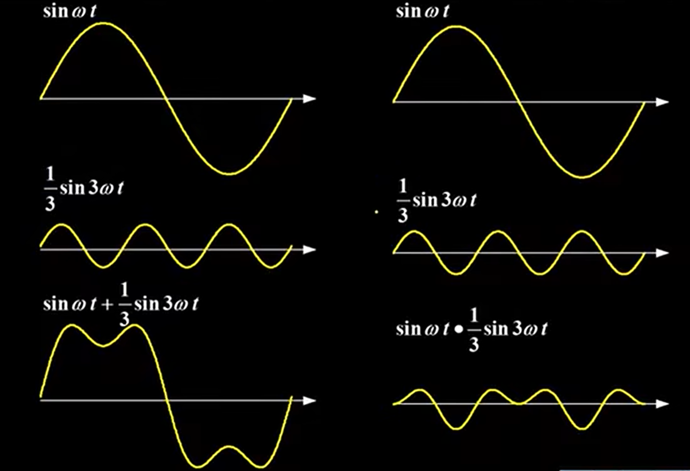
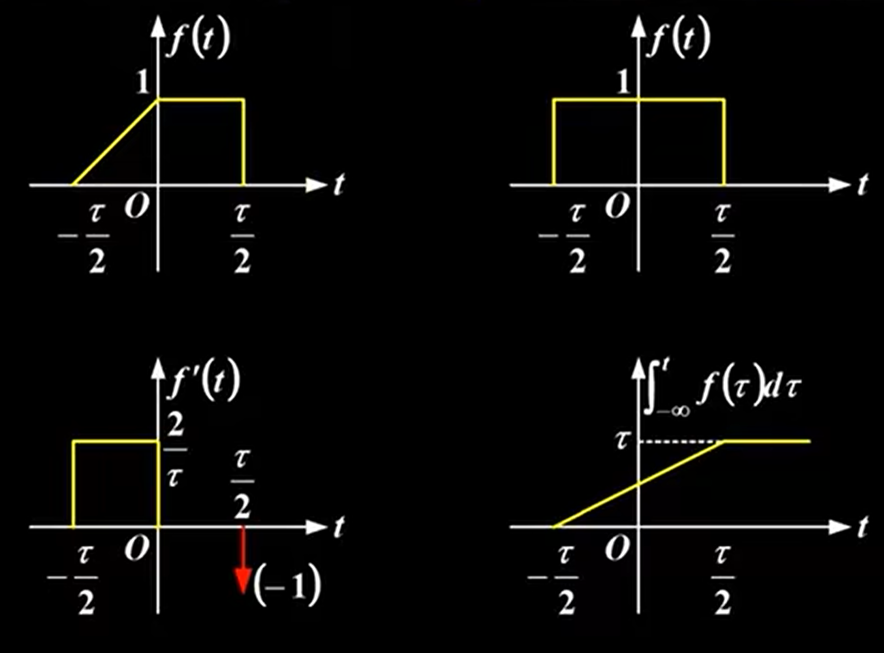

# 信号的自变量的变换（波形变换）
1. 信号的平移

    

2. 倒置（翻转）

    

3. 信号的展缩：$f(t) -> f(a t)$ 标度变换

    

    

    

    

4. 一般情况

    

# 信号的时域运算
1. 相加和相乘：同一瞬时两信号对应值的相加（相乘）

    

2. 微分和积分：$f'(t) = \frac{df(t)}{dt}$，$\int ^t_{-\infty}f(\tau)d\tau$

    
