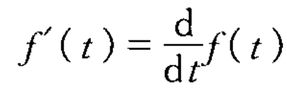
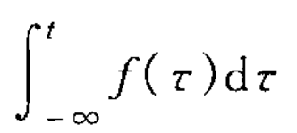

# 移位/反褶/尺度
* 移位:若f(t)表达式的自变量t更换为(t+t0)(t0为正或负实数),则f(t+t0)相当于f(t)波形在t轴上的整体移动
    * 当t0>0时,波形左移
    * 当t0<0时,波形右移
* 反褶:将f(t)的自变量t更换为-t,此时f(-t)的波形相当于将f(t)以t=0为轴反褶过来,此运算也称时间轴反转
* 尺度:将信号f(t)的自变量t乘以正实系数a,则信号波形f(at)将是f(t)波形的压缩(a>1)或扩展(a<1),此运算称为时间轴的尺度倍乘或尺度变换
# 微分/积分
* 信号f(t)的微分运算是指f(t)对t取导数
        
* 信号f(t)的积分运算是指f(τ)在(-∞,t)区间内的定积分
        
# 两信号相加或相乘
    