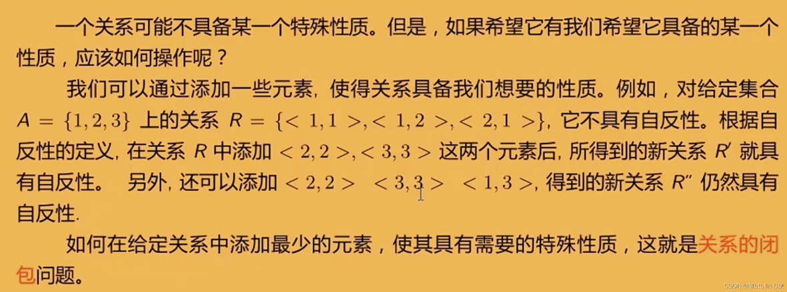

# 关系的定义

## 有序对
* 有序对：两个元素x、y按照一定顺序组成的二元称为有序对，记作`<x,y>`

* 有序对的性质：
    * 有序性：当`x≠y`时，`<x,y>≠<y,x>`

    * `<x,y>`与`<u,v>`相等的充分必要条件是`<x,y> = <u,v>⟺x=u ∧ y=v`

## 笛卡儿积
* 笛卡儿积：设A、B为**集合**，A与B的笛卡儿积记作`A×B`
    * `A×B={<x,y>|x∈A∧y∈B}`

* 笛卡尔积的性质：
    1. 不适合交换律：`A×B≠B×A(A≠B,A≠∅,B≠∅)`

    2. 不适合结合律：`(A×B)×C≠A×(B×C)(A≠∅,B≠∅,C≠∅)`

    3. 对于并或交运算满足分配律：
        * `A×(B∪C) = (A×B)∪(A×C)`，`(B∪C)×A = (B×A)∪(C×A)`

        * `A×(B∩C) = (A×B)∩(A×C)`，`(B∩C)×A = (B×A)∩(C×A)`

    4. 若A或B中有一个为空集，则 A×B 就是空集：`A×∅=∅×B=∅`

    5. 若 `|A|=m`，`|B|= n`，则`|A×B|=mn`，取模运算表示集合中的元素个数 

## 有序n元组和n阶笛卡尔积
    * 有序n元组：由n个元素x1，x2，...，xn按照一定顺序排列构成，记作`<x1,x2,...xn>`

    * n阶笛卡尔积：设A1，A2，...，An为集合，称`A1×A2×...×An={<x1,x2,...,xn>|xi∈Ai,i=1,2,...,n}`

## 二元关系的定义
* 二元关系：集合**A到B的二元关系R**定义为笛卡尔积A×B的子集，即`R⊆A×B`
    * 当A=B时，称`R⊆A×A`为**集合A上的二元关系**

    * 如`<x,y>∈R`，可记作`xRy`，如`1R2`

# 关系

## A上关系的实例
* 设A为任意集合，∅是A上的关系，称为**空关系**

* 定义：EA、IA分别称为**全域关系**与**恒等关系**，其中
    * `EA={<x,y>|x∈A ∧ y∈A}=A×A`
    
    * `IA={<x,x>|x∈A}`

## 关系的表示
* 关系矩阵：若A={x1,x2,...,xn}，B={y1,y2,...,yn}，R是从A到B的关系，R的关系矩阵是布尔矩阵`MR=[rij]m×n`，其中`rij=1⟺<xi,yj>∈R`

* 关系图：若A={x1,x2,...,xm}，R是在A上的关系，R的关系图是GR=`<A,R>`，其中A为结点集，R为边集；如果`<xi,xj>`属于关系R，在图中就有一条从xi到xj的有向边

   

# 关系的基本运算

## 定义域、值域、域、逆、合成
* 定义
    * 定义域：`domR={x|∀y(<x,y> ∈ R)}`
    
    * 值域：`ranR={y|∀x(<x,y> ∈ R)}`
    
    * 域：`fldR=domR∪ranR`

    * R的逆：`R^(-1)={<y,x>|<x,y> ∈ R}`

    * R与S的合成（复合）：`R∘S={<x,z>|∃y(<x,y> ∈ R ∧ <y,z> ∈ S)}`

## 关系矩阵计算关系
* 关系矩阵是01矩阵，使用**逻辑运算**可给出**关系运算**的结果

* 使用矩阵对应元素的**逻辑或**运算可给出**关系并**的结果，**逻辑与**可给出**关系交**的结果

* 关系矩阵的转置（行与列对换）给出关系逆的运算结果

* 关系矩阵的逻辑积给出关系复合的运算结果
    * 关系矩阵的逻辑积⊙与矩阵乘法相同，其中元素的乘法用逻辑与、加法用逻辑或代替

* 设F是任意的关系，则
    1. `(F^(-1))^(-1)=F`

    2. `dom(F^(-1))=ranF`，`ran(F^(-1))=domF`

* 设R为A上的关系，则`R∘IA=IA∘R=R`

# 关系的幂运算
* 设R为A上的关系，n为自然数，则R的n次幂是
    1. `R^0={<x,x>|x∈A}=IA`    
        * 对于A上的任何关系R1和R2都有`R1^0=R2^0=IA`

        * 对于A上的任何关系R都有R^1=R

    2. `R^(n+1)=R^n∘R`

* 设R是A上的关系，m、n∈N，则
    1. R^m∘R^n=R^(m+n)

    2.(R^m)^n=R^(mn)

# 关系的性质

## 自反性和反自反性
* 定义：设R为A上的关系
    1. 若`∀x(x∈A → <x,x>∈R)`，则R在A上是**自反**的
    
    2. 若`∀x(x∈A → <x,x>∉R)`，则R在A上是**反自反**的

||自反性|反自反性|
|:-|:-|:-|
|表达式|IA⊆R|R⋂IA=∅|
|关系矩阵|主对角线元素都是1|主对角线元素全是0|
|关系图|每个顶点都有环|每个顶点都没有环|

## 对称性和反对称性
* 定义：设R为A上的关系
    1. 若`∀x∀y(x,y∈A∧<x,y>∈R  → <y,x>∈R)`，则称R为A上**对称**的关系

    2. 若`∀x∀y(x,y∈A∧<x,y>∈R∧<y,x>∈R→x=y)`，则称R为A上**反对称**的关系

||对称性|反对称性|
|:-|:-|:-|
|表达式|R=R^(-1)|R⋂R^(-1)⊆IA|
|关系矩阵|矩阵是对称矩阵|若rij=1，且i≠j，则rij=0|
|关系图|如果两个顶点之间有边，一定是一对反向相反的边（无单边）|如果两点之间有边，一定是一条有向边（无双向边）|

## 传递性
* 定义：设R为A上的关系，若`∀x∀y∀z(x,y,z∈A ∧ <x,y>∈R ∧ <y,z>∈R → <x,z>∈R)`，则称R是A上的**传递**关系

||传递性|
|:-|:-|
|表达式|R∘R⊆r|
|关系矩阵|对M^2中1所在位置，M中位置都是1|
|关系图|如果顶点xi到xj有边，xj到xk有边，则从xi到xk也有边|

## 关系上的计数
* 设A、B为集合，A×B的任何子集所定义的二元关系叫做从A到B的二元关系，当A=B时则叫做A上的二元关系
    * `|A|=n,|B|=m,|A×B|=nm`

    * A×B的子集有2^(nm)个，所以从A到B有2^(mn)个不同的二元关系

    * |A|=n，A上有2^(n^2)个不同的二元关系

## 等价关系和偏序关系
* 设R为非空集合上的关系，如果R是自反的、对称的和传递的，则称R为A上的**等价关系**
    * 设R是一个等价关系，若`<x,y>∈R`，称x等价于y，记作`x~y`

* 非空集合A上的自反、反对称和传递的关系，记作`⪯`，设`⪯`为偏序关系，如果`<x,y>∈⪯`，则记作`x⪯y`，读作x小于或等于y

## 关系的闭包

* 设R是非空集合A上的关系，R的自反（对称或传递）闭包是A上的关系R'，使得R'满足以下条件：
    1. R'是自反的（对称的或传递的）
    
    2. R⊆R'
    
    3. 对A上任何包含R的自反（对称或传递）关系R"有R'⊆R"

* 即，能使得R满足自反（对称或传递）性质的最小的关系集合

* R的自反闭包记作`r(R)`，对称闭包记作`s(R)`，传递闭包记作`t(R)`

* 定理：R为A上的关系，则有：
    1. 关系是自反的当且仅当它包含恒等关系
        * 将**恒等关系**中的有序对添加到关系可得**自反闭包**
        
        * `r(R)=R⋃IA`
    
    2. 关系是对称的当且仅当它等于它的逆
        * 将**逆关系**的有序对添加到关系可得**对称闭包**

        * `s(R)=R⋃R^(-1)`

    3. 关系的传递闭包是包含这个关系的最小传递关系
        * `t(R)=R⋃R^2⋃R^3⋃...⋃R^n`
