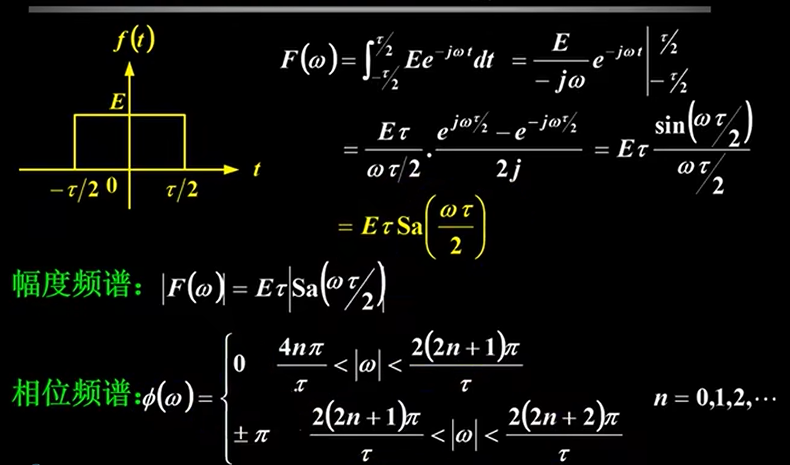
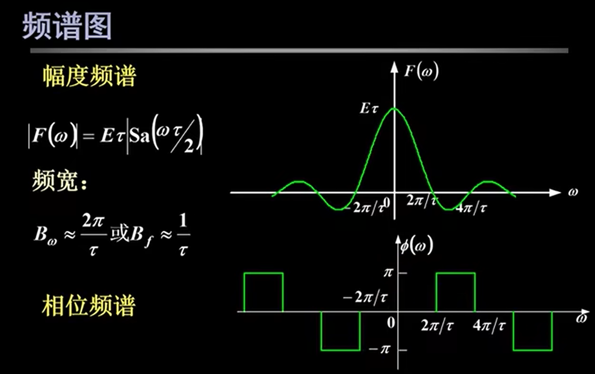
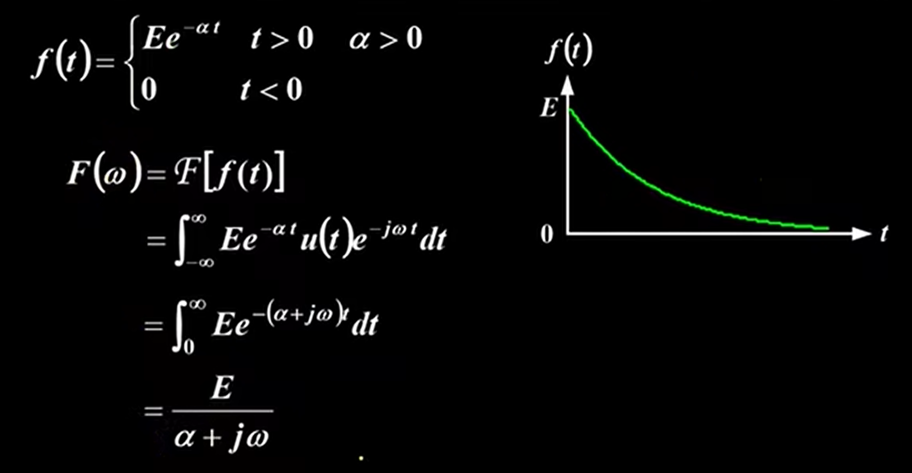
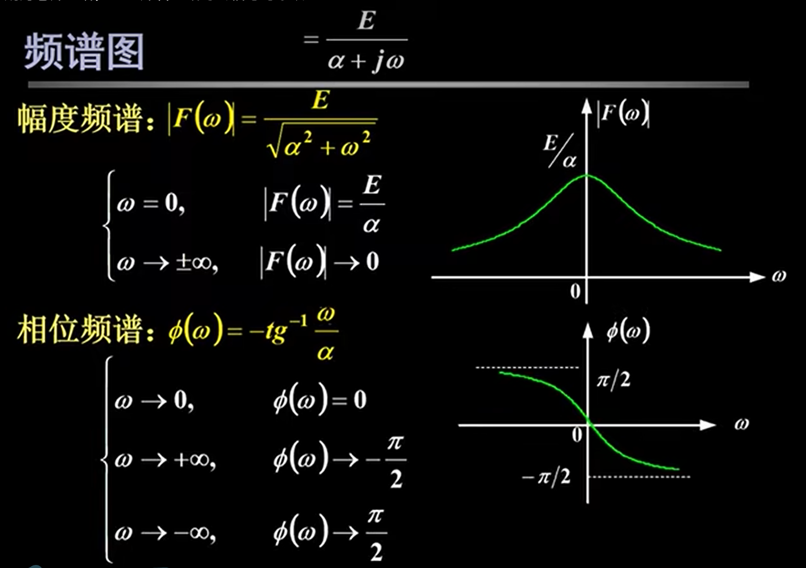
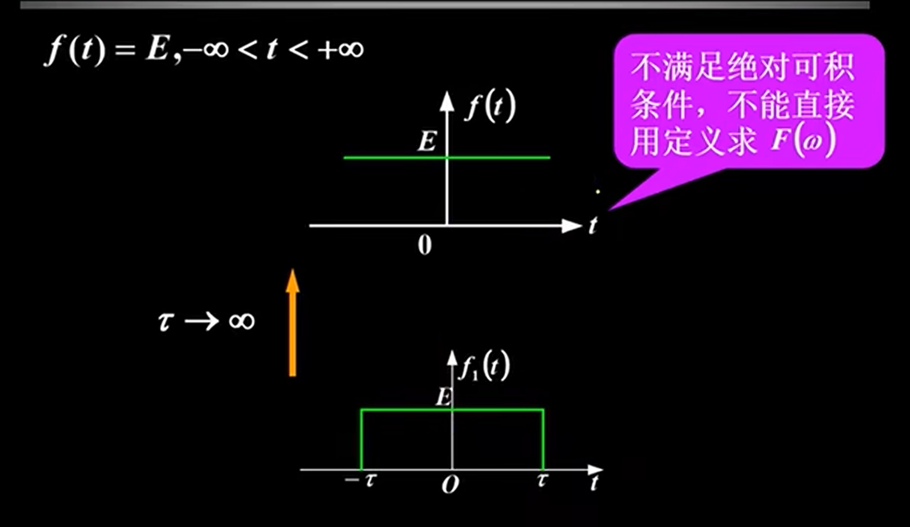
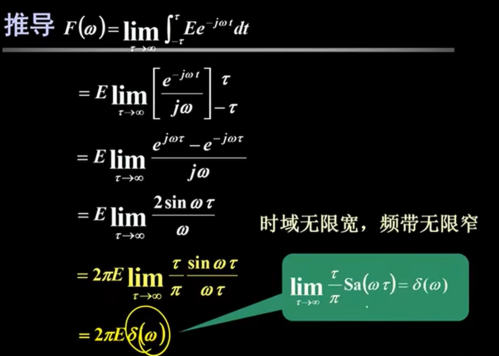
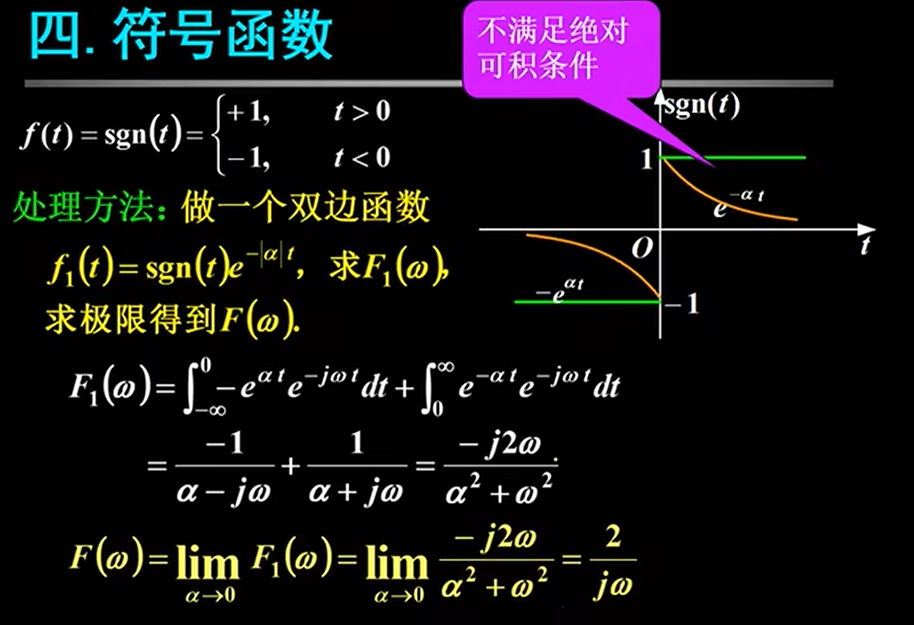
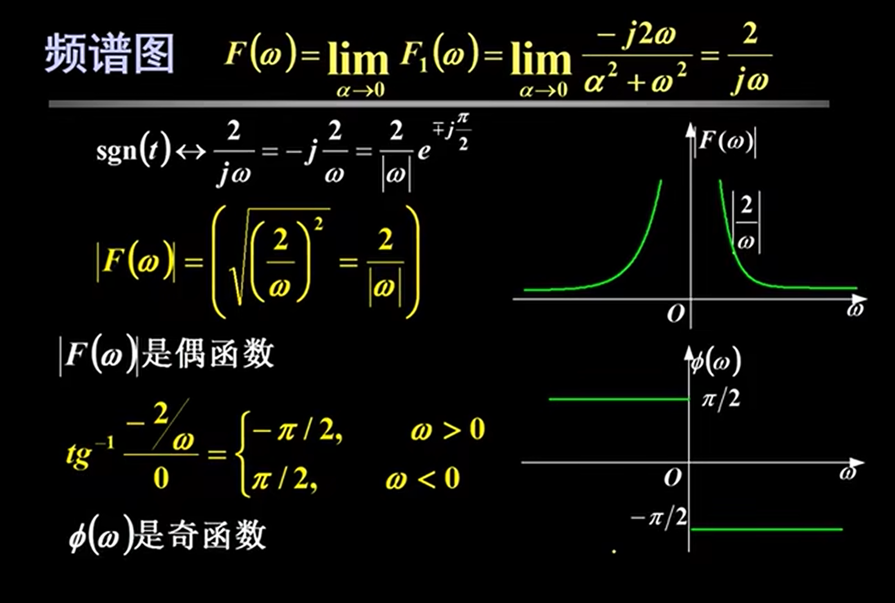

# 矩形脉冲信号$F(\omega) = \int_{-\infty}^{\infty} f(t)e^{-j\omega t} dt = F[f(t)]$

# 单边指数信号$F(\omega) = \int_{-\infty}^{\infty} f(t)e^{-j\omega t} dt = F[f(t)]$

# 直流信号$F(\omega) = \int_{-\infty}^{\infty} f(t)e^{-j\omega t} dt = F[f(t)]$

# 符号函数

