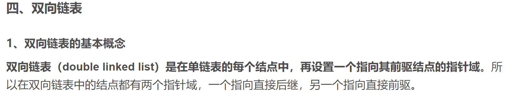
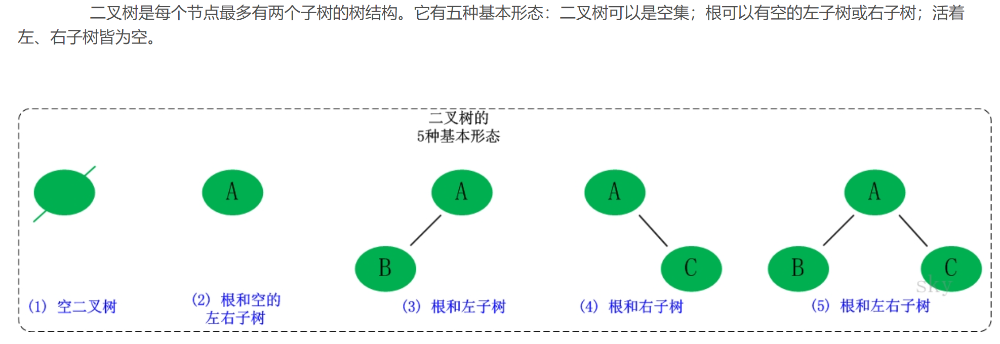
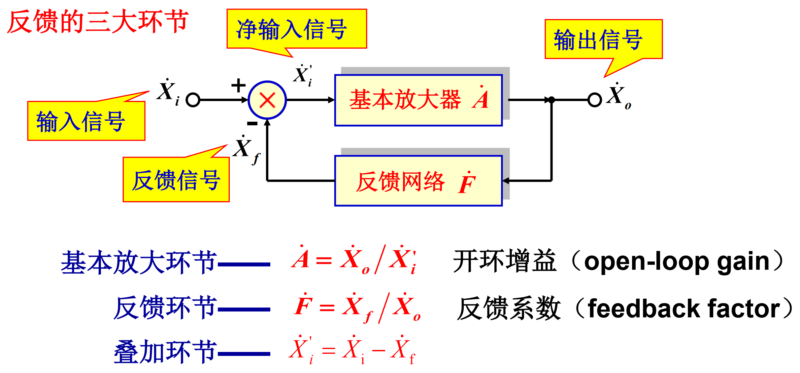

# 冲激响应
* 定义：系统在单位冲激信号$\delta (t)$作用下产生的**零状态响应**，称为单位冲激响应，简称冲激响应，一般用$h(t)$表示

## 一阶系统的冲激响应

## n阶系统的冲激响应

# 阶跃响应
* 定义：系统在单位阶跃信号作用下的**零状态响应**，称为单位阶跃响应，简称阶跃响应，一般用$g(t)$表示

## 阶跃响应与冲激响应的关系
* 线性时不变系统满足**微、积分**特性

