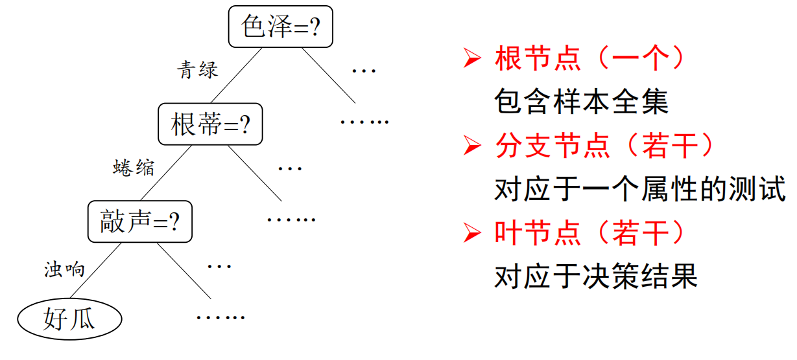
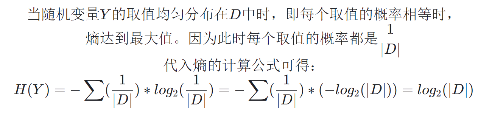
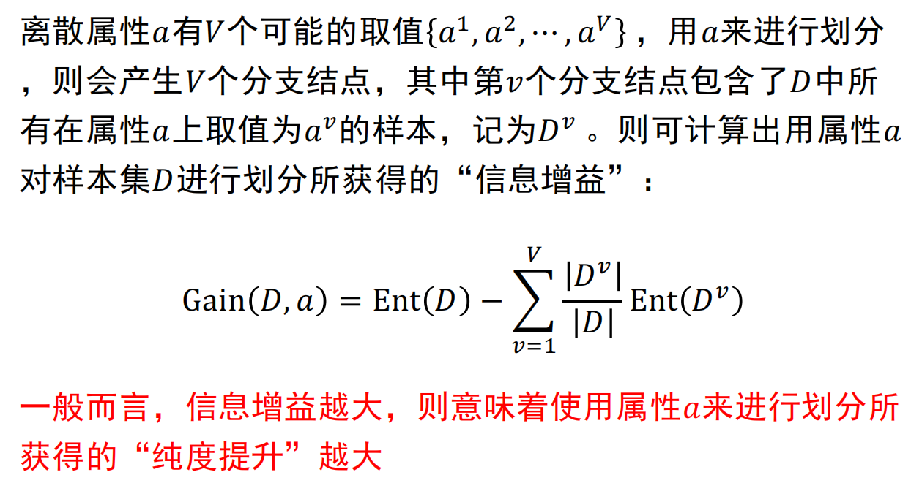
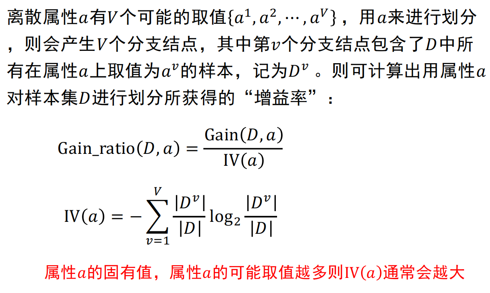

# 基本流程
* 决策树模型呈树型结构，主要由结点（根结点、内部结点和叶结点）和边组成

    

* 基本思想
    1. 构建根结点，将所有训练数据放在根结点

    2. **选择一个最优属性**，按照这一属性将训练集**分割**成子集，使得各个子集有一个**当前条件下最好的分类**
        * 如果这些子集已能被基本正确分类，那么**构建叶结点**，并将这些子集分到所对应的叶结点中

        * 如果还有子集不能被正确分类，那么**构建中间结点**，对这些子集选择新的最优属性，继续分割

    3. 如此**递归下去**，直到所有训练数据子集被基本正确分类，或者没有合适的属性为止

    4。 最后**构建叶结点**，每个子集**都被分到叶结点得到各自的类**
# 划分选择

## 信息增益ID3
* 对于样本$D$中第$k$类样本所占的比例为$p_k$，信息熵为
    $$Ent(D) = -\sum^{|y|}_{k = 1} p_k log_2p_k$$

    * $Ent(D)$的值越小，则$D$的纯度越高
    
    * 计算信息熵时约定：若$p_k = 0$则$p_k log_2p_k = 0$

    * $Ent(D)$的最小值为0，最大值为$log_2|y|$

        

* 数据纯度越高，信息熵越小

* 信息增益（**因某一属性使数据集分类的“纯度提升”程度**）
    
    

## 增益率C4.5
* 增益率

    

## 基尼指数CART
* 基尼值
    $$Gini(D) = 1 - \sum ^{|y|}_{k = 1} p^2_k$$

    * $Gini(D)$越小，数据集$D$的纯度越高

* 属性$a$的基尼指数
    $$Gini_index(D,a) = \sum ^V _{v = 1} \frac{|D^v|}{|D|} Gini(D^v)$$

    * 应选择使划分后基尼指数最小的属性作为最优划分属性
    