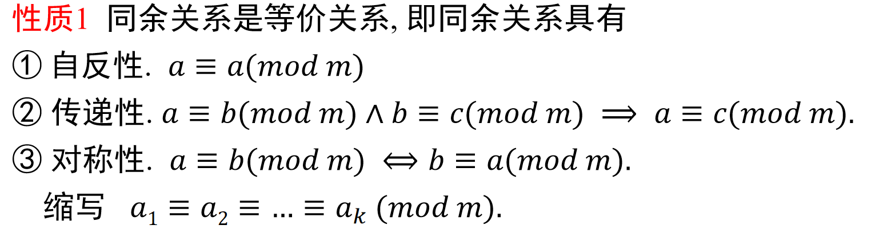

# 同余
* 定义1
    > 设m是正整数，a和b是整数。如$m|a-b$，则称**a模m同余于b**，或**a与b模m同余**，记作$a \equiv b(mod~m)$

    > 如a与b模m不同余，则记作$a\not \equiv b(mod~m)$

    

* 性质1

    

* 性质2（模算术运算）

    

    

* 性质3

    

* 性质4

    

* 性质5

    

# 剩余类及完全剩余系

# 一次同余方程

## 模m逆

## 中国剩余定理

# 欧拉定理与费马小定理

## 费马定理

## 欧拉定理

