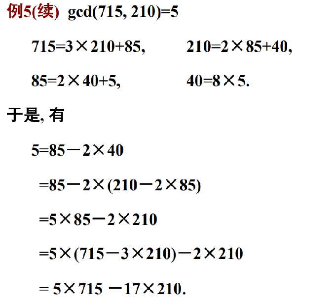

# 整除
* 整除：设a、b是两整数，且$b\neq 0$。如果存在整数$c$使得$a=bc$，则**a被b整除**，或**b整除a**，记作$b \mid a$。此时，又称a是b的**倍数**，b是a的**因子**。把b不整除a记作$b \nmid a$
    > 6有8个因子：$\pm1,\pm2,\pm3$和$\pm6$

    * 今后只考虑正整数的正因子

    * **平凡因子**：1和自身

    * **真因子**：除1和自身之外的因子

        > 2、3是6的真因子

* 带余除法：$a=qb+r,0\leq r \leq |b|$，记余数$r=a~mod~b$
    > $20~mod~6=2$，$-13~mod~4=3$（注意负数形式），$10~mod~ 2=0$

* 带余除法定理作用
    1. 带余除法可以将全体整数进行分类，可将无限问题转化为有限问题
        > 例如$b=2$，任意整数$a$可写成$2q$，或$2q+1$的形式，把整数分成奇数和偶数；取$b=3$则整数可分成$3k$，$3k+1$，$3k+2(或3k-1)$三种类型

    2. 在不同整数$a$和$b$之间建立了$a=bq+r$联系
     
## 整除的基本性质
1. 若$a|b$且$a|c$，则$\forall x,y$，有$a|xb+yc$

2. 若$a|b$且$b|c$，则$a|c$。（传递性）

3. 设$m\neq 0$，则$a|b$当且仅当$ma|mb$ 
    
4. 若$a|b$且$b|a$，则$a=\pm b$
    
5. 若$a|b$且$b\neq 0$，则$|a|\leq|b|$
    
* n次方差公式：$a^n-b^n=(a-b)(a^{n-1}+a^{n-2}b+...+ab^{n-2}+b^{n-1})$

* 例题

    

    

    

    

# 素数和合数
* 素数（质数）：大于1且只能被1和自身整除的正整数

* 合数：大于一且不是素数的正整数

* 性质1：$a>1$是合数当且仅当$a=bc$，其中$1<b<a$，$1<c<a$

* 性质2：合数必有素数因子

* 性质3：如果$d>1$，$p$是素数且$d|p$，则$d=p$

* 性质4：设$p$是素数且$p|ab$，则必有$p|a$或者$p|b$
    * 设$p$是素数且$p|a_1a_2...a_k$，则必存在$1\leq i \leq k$，使得$p|a_i$

    * 注意：当$d$不是素数时，$d|ab$不一定推出$d|a$或者$d|b$

* 素数定理
    1. 定理1：算术基本定理
        * 设$a>1$，则$a=p^{r_1}_1p^{r_2}_2...p^{r_k}_k$，其中$p_1,p_2,...,p_k$说不相同的素数，$r_1,r_2,...,r_k$时正整数，并且在不顺序的情况下，该表示是**唯一的**。该表达式称作整数$a$的**素因子分解**

        

    2. 定理2；有无穷多个素数

    4. 定理3
        

* 埃拉托斯特尼筛法
    * 用已经筛选出来的素数去过滤所有能够被它整除的数。这些素数就像是筛子一样去过滤自然数，最后被筛剩下的数自然就是不能被前面素数整除的数，根据素数的定义，这些剩下的数也是素数

# 最大公约数与最小公倍数
* $d$是$a$与$b$的公因子（公约数）：$d|a$且$d|b$

* $m$是$a$与$b$的公倍数：$a|m$且$b|m$

* 定义1：设$a$和$b$是两个不全为0的整数，称$a$与$b$的公因子中最大的数为$a$与$b$的**最大公因子**，或**最大公约数**，记作**gcd（a，b）**，或者（**a，b**）

* 定义2：设$a$和$b$是两个非零整数，称$a$与$b$最小的正公倍数为$a$与$b$的**最小公倍数**，记作**lcm（a，b）**

* 注意：**对任意的正整数$a$，$gcd(0,a)=a$，$gcd(1,a)=1$，$lcm(1,a)=a$**

* 定理

    

* 最大公约数的求解

    

* 最小公倍数的求解

    

* 辗转相除法

    

* 定理

    * 定理6其实就是辗转相除法
    dsfsfsfsfsfsdfsdfsdfsdfdsfdsfd激流高达这里沙发上；放大发
    

    

    

* 互素

    

    
