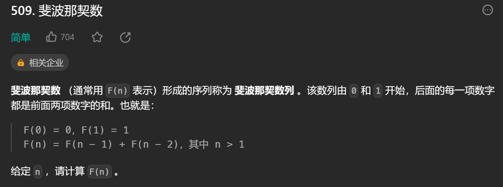

# 动态规划
* 一般步骤：
    1. 确定dp数组以及下标的含义

    2. 确定递推公式

    3. dp数组如何初始化

    4. 确定遍历顺序

    5. 举例推导dp数组

1. 斐波那契数

    

    * 思路：
        1. 数组表示：dp[i]表示第i个斐波那契数为dp[i]

        2. 递推公式：dp[i]=dp[i-1]+dp[i-2]

        3. 边界条件：dp[0]=0，dp[1]=1

        4. 递推过程：i从2开始i++递推

        5. 递推举例：dp[2]=d[1]+dp[0]=1，dp[3]=dp[2]+dp[1]=2，dp[4]=dp[3]+dp[2]=3

2. 爬楼梯

    

    * 思路：
        1. 数组表示：dp[i]表示爬到第i阶有dp[i]种方法

        2. 递推公式：dp[i]=dp[i-1]+dp[i-2]

        3. 边界条件：dp[1]=1，dp[2]=2

        4. 递推过程： i从3开始i++递推

        5. 递推举例：dp[3]=dp[2]+dp[1]=3，dp[4]=dp[3]+dp[2]=5，dp[5]=dp[4]+dp[3]=8
