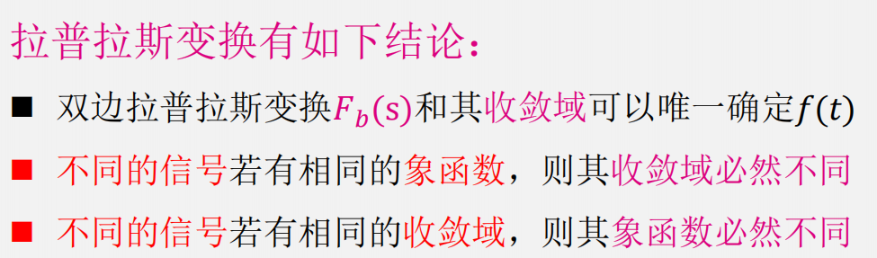
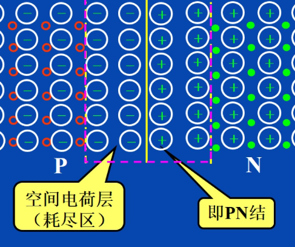
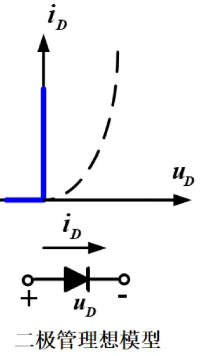
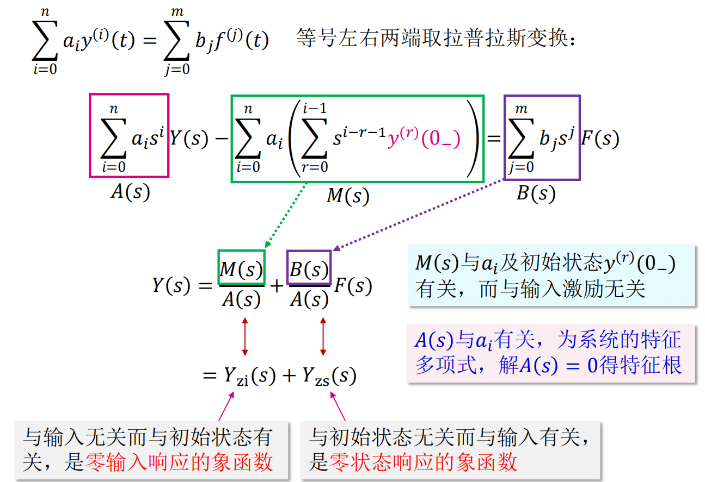
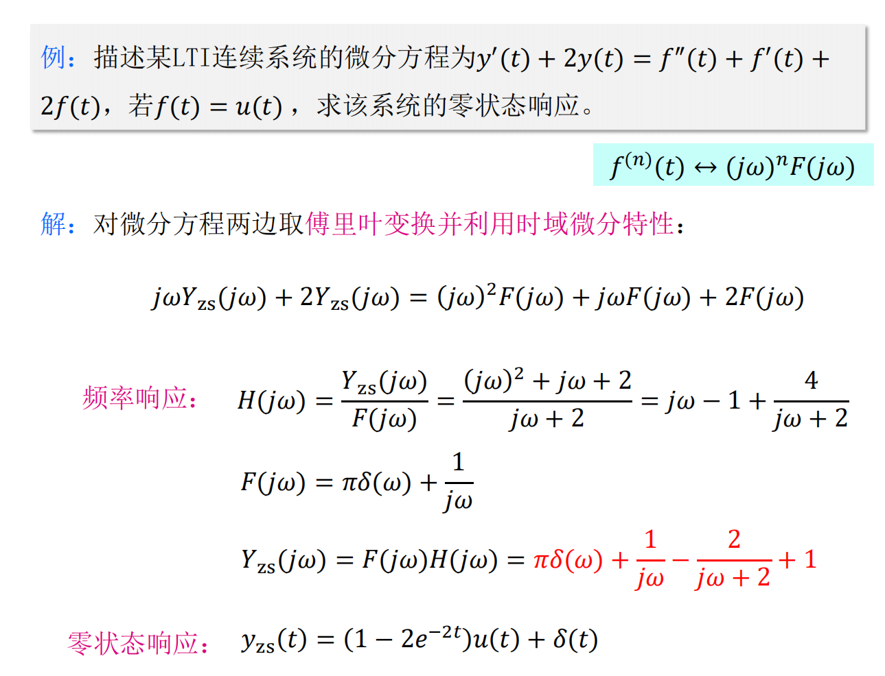
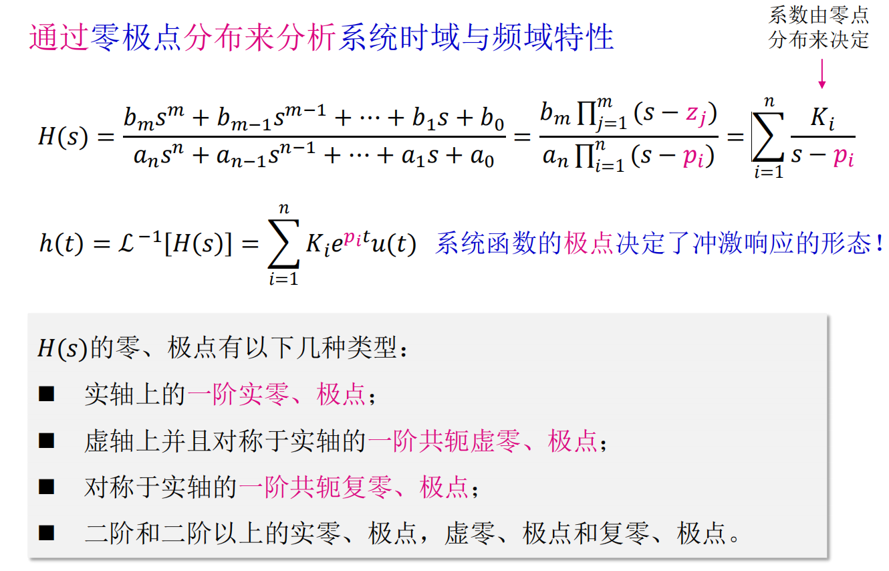

# 半导体的特性及PN结

## 根据电阻率的不同，物质可分为导体，绝缘体，半导体三大类
1. 半导体的导电能力介于导体和绝缘体之间

2. 半导体**受外界光和热的刺激时**，导电能力发生显著变化

3. 在纯净半导体中，加入微量的杂质，导电能力会急剧增强

# 本征半导体
* 纯净的，不含其他杂质的半导体称为**本征半导体**

* 室温下，本征半导体共价键中的价电子获得足够的能量，挣脱共价键的束缚成为自由电子，在原位留下一个空穴，这种产生电子-空穴对的现象称为**本征激发**    

        

* 由于随机热振动导致本征半导体共价键被打破而产生电子-空穴对

* 运载电荷的粒子称为载流子，本征半导体中存在两种载流子
    1. 带负电的自由电子

    2. 带正电的空穴

* 分别用n和p表示自由电子和空穴的浓度，则有`n=p`

* 载流子有两种运动方式:扩散运动和漂移运动（电场激发）

## 空穴/电子导电机理
* 空穴的移动方向和电子移动的方向是相反的，分别形成空穴电流和电子电流

* 本征半导体特点
    1. 电阻率大，导电能力很低

    2. 导电性能随温度变化大

    3. **本征半导体不能在半导体器件中直接使用**

# 杂质半导体
* 在本征半导体中参入某种特定杂质，成为杂质半导体后导电性能发生质的变化
    1. N型半导体（Negative）:掺入五价杂质元素的半导体

            

        * 半导体中产生了大量的自由电子和正离子
        
        * 多余的一个价电子因没有共价键束缚很容易形成自由电子
        
        * 自由电子是多数载流子，主要由**杂质原子**提供；空穴是少数载流子，由热激发(本征激发)形成

        * 五价杂质原子提供自由电子而成为正离子，故称为施主杂质

    2. P型半导体（Positive）：掺入三价杂质元素的半导体

            

        * 半导体中产生了大量的空穴和**负离子**
        
        * 三价杂质原子和硅原子形成共价键时，缺少一个价电子而在共价键中留下一个空穴
        
        * 空穴是多数载流子，主要由**杂质原子**提供；自由电子是少数载流子，由热激发(本征激发)形成

        * 空穴很容易俘获电子，使杂质原子成为负离子，故称为受主杂质

* 在**杂质半导体**中，多数载流子浓度主要取决于**杂质浓度**，少数载流子浓度主要取决于**温度**

* 杂质半导体中，N型和P型在总体上保持电中性

# 半导体二极管
* 二极管由一个特定的PN结和两引脚构成

## PN结及其单向导电性
* 把本征硅片一边做成P型半导体，另一边N型半导体，交界处会形成一个很薄的特殊物理层（PN结）

        

    * N区中的电子扩散到P区，结果在P区和N区交界面上留下了一个不能移动的振幅粒子

        

        

    * N区少了电子呈正极，P区多了电子呈负极，电中性被破坏，形成内电场

        

    * PN结内电场一方面**阻碍多子的扩散**，另一方面**加速了少子的漂移**

    * 当扩散与漂移作用平衡（动态平衡）时:
        1. 流过PN结的净电流为零

        2. PN结厚度一定(约几个微米)
        
        3. 接触电位一定(即内建电势差，约为零点几伏)

            

* PN结的单向导电性
    1. PN结正向偏置:给PN结加上电压，是电压的正极接P区，负极接N区

        

        * 多子进行扩散，内电场被削弱（N区失去的电子被补充，P区得到的电子被夺走），使空间电荷区变薄，打破原来的动态平衡，这时PN结对外呈现较小的阻值，处于正向导通状态    
    
    2. PN结反向偏置:使电压的正极接N区，负极接P区

            

        * 因少子浓度主要与**温度**有关，反向电流与反向电压几乎无关，此电流称为反向饱和电流 记为`Is`

        * （从N区夺走电子，向P区提供电子）结果使PN结变厚（内电场增大），呈现较大的阻值，打破原来的动态平衡，使漂移运动增强
        * 由于漂移运动是少子运动，因而漂移电流很小，若忽略漂移电流，则可以称为**PN结截止**

            

        * 闭合电路中，由于两点间存在温差而出现的电位差叫做热电压

## 二极管
* 二极管分类
    1. 按使用的半导体材料不同分为硅管/锗管
    
    2. 按结构形式不同分为平面型/点接触型
        * 平面型

            

        * 点接触型

                

* 二极管的伏安特性

      

    * 正向特性:加正向电压时的特性叫正向特性

        

        1. 近似呈现为指数曲线

                

        2. 有死区(iD约等于0的区域)
            * 死区电压约为(**硅管0.5V**)(锗管0.1V)

               

        3. 导通压降(硅管0.6~0.7V)(锗管0.2~0.3V)

    * 反向特性:加反向电压时的特性叫反向特性

            

            

        * 击穿根据击穿可逆性分为电击穿和热击穿
            1. 热击穿(不可逆击穿)？？？

            2. 电击穿(可逆击穿)？？？？

* 温度对二极管伏安特性的影响
    * 温度升高时，二极管特性减弱（减弱正向导通能力，减弱反向阻碍能力）

            

# 二极管的基本电路及其分析方法

## 二极管正向V-I特性的建模

## 1. 理想模型
* 在正向偏置时，其管压降为0V，而在反向偏置时，认为电阻无穷大（当uD>>Uon时）    

    

## 2. 恒压降模型
* 二极管导通后，其管压降认为是恒定的，且不随电流的变化，典型值是**0.7V**（硅管压降），但这只有当二极管的电流iD近似**等于或大于1mA**时才是正确的    

    

## 3. 折线模型
* 二极管的管压降不是恒定的，而是随着通过二极管电流的增加而增加，Von约为**0.7V**，其中，rD的值是固定不变的`rD=ΔuD/ΔiD`（相当于内阻）    

    

## 4. 小信号模型
* 二极管对叠加在Q点上的微小增量而言，等效为一电阻rd，其值为该直线段斜率的倒数

* 小信号模型仅限于计算叠加在Q点上**微小增量电压或电流**的响应    

     

* 二极管正向偏置，有交流小信号us输入，且uD>>UT(二极管的开启电压)时:

    

# 模型分析法应用举例

## 1. 二极管电路静态工作情况分析

    

    

## 2. 限幅电路
  
    

## 3. 开关电路
* 在开关电路中，利用二极管的单向导电性以接通或断开电路.在分析这种电路时，应掌握一条基本原则，即**判断电路中二极管处于导通状态还是截止状态，可以先将二极管断开，然后观察(或经过计算)阴/阳两极间的极性和大小，来判断电路中的二极管处于导通状态还是截止状态**

## 4. 低电压稳压电路
* 利用二极管正向压降基本恒定的特点，可以构成**低电压稳压电路**

       

        

    

# 稳压二极管
* 稳压二极管又称**齐纳二极管**，正向特性曲线与普通二极管相似，反向击穿特性曲线**很陡**，`Uz`表示反向击穿电压，即稳压管的稳定电压

        

* 稳压二极管原理：**当电流有很大增量时，二极管两端的电压基本上稳定在击穿电压附近，只引起很小的电压变化**。反向击穿曲线越陡，动态电阻越小，稳压管的稳压性能越好

## 稳压二极管的主要参数
1. 稳定电压`Uz`
    * 指稳压管工作在反向击穿区时的稳定工作电压

2. 稳定电流`Iz(Izmin~Izmax)`
    * 指稳压管正常工作时的参考电流。若工作电流小于`Izmin`，则不能稳压；若工作电流大于`Izmax`，则会因功耗过大而烧坏

    

3. 动态电阻`rz=ΔUz/ΔIz`
    * 指稳压二极管两端电压和电流的变化量，`rz`越小，反映稳压二极管的击穿特性越陡，稳压性越好

4. 电压的温度系数`aU`
    * 指稳压的电流保持不变时，环境每变化1℃所引起**稳定电压**`Uz`变化（一般不超过每度±10*10^-4V）的百分比，一般地：
        * `Uz>7V`，`aU`为正值
        * `Uz<4V`，`aU`为负值
        * `4V<Uz<7V`，`aU`值较小，稳压性能稳定

5. 额定功率`Pz`
    * 指稳压管工作电压`Uz`与最大工作电流`Izmax`的乘积`Pz=Uz*Izmax`

    * 稳压管允许的温升（在稳压管工作时因为电流通过它而导致的温度升高）决定了额定功率

## 稳压管电路分析（并联式稳压电路）
* 限流电阻R的计算

    

    1. 当输入电压最小，负载电流最大（RI最小）时，流过稳压二极管的电流最小。此时Iz不应该小于Izmin，由此可得**限流电阻的最大值**

        

    2. 当输入电压最大，负载电流最小（RL最大）时，流过稳压二极管的电流最大。此时Iz不应超过Izmax，由此可得**限流电阻的最小值**

        

    3. 得出限流电阻的取值范围

        

