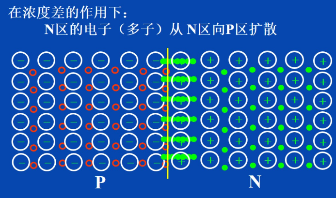

# 半导体的特性及PN结
* 根据电阻率的不同,物质可分为导体,绝缘体,半导体三大类
1. 半导体的导电能力介于导体和绝缘体之间
2. 半导体受外界光和热的刺激时,导电能力发生显著变化
3. 在纯净半导体中,加入微量的杂质,导电能力会急剧增强
# 本征半导体
* 纯净的/不含其他杂质的半导体称为本征半导体
* 室温下,本征半导体共价键中的价电子获得足够的能量,挣脱共价键的束缚成为自由电子,在原位留下一个空穴,这种产生电子-空穴对的现象称为本征激发
        
* 由于随机热振动致使本征半导体共价键被打破而产生电子-空穴对
* 运载电荷的粒子称为载流子
* 本征半导体中存在载流子
    1. 带负电的自由电子
    2. 带正电的空穴
* 分别用n和p表示自由电子和空穴的浓度,则有`n=p`
* 载流子有两种运动方式:扩散运动和漂移运动
## 空穴/电子导电机理
* 空穴的移动方向和电子移动的方向是相反的,分别形成空穴电流和电子电流
* 本征半导体特点
    * 电阻率大
    * 导电能力很低
    * 导电性能随温度变化大
    * **本征半导体不能在半导体器件中直接使用**
# 杂质半导体
* 在本征半导体中参入某种特定杂质,成为杂志半导体后,导电性能发生质的变化
* 分类
    1. N型半导体:掺入五价杂质元素的半导体
            
        * 半导体中产生了大量的自由电子和正离子
        * 多余的一个价电子因没有共价键束缚很容易形成自由电子
        * 自由电子是多数载流子,主要由杂质原子提供
        * 空穴是少数载流子,由热激发(本征激发)形成
        * 五价杂质原子提供自由电子而成为正离子,故称为施主杂质
    2. P型半导体:掺入三价杂质元素的半导体
            
        * 半导体中产生了大量的空穴和**负离子**
        * 三价杂质原子和硅原子形成共价键时,缺少一个价电子而在共价键中留下一个空穴
        * 空穴是多数载流子,主要由掺杂形成
        * 自由电子是少数载流子,由热激发(本征激发)形成
        * 空穴很容易俘获电子,使杂质原子成为负离子,故称为受主杂质
* 在杂质半导体中,多数载流子浓度主要取决于杂质浓度,少数载流子浓度主要取决于温度
* 杂质半导体,N型和P型,总体上保持电中性

# 半导体二极管
* 二极管由一个特定的PN结和两引脚构成
## PN结及其单向导电性
* 把本征硅片一边做成P型半导体,另一边N型半导体,交界处会形成一个很薄的特殊物理层,称为`PN结`
        
    * 结果在P区和N区交界面上留下了一个不能移动的振幅粒子
        
        
    * 电中性被破坏,形成内电场
        
    * PN结内电场一方面阻碍多子的扩散,另一方面加速了少子的漂移
    * 当扩散与漂移作用平衡(动态平衡)时:
        1. 流过PN结的净电流为零
        2. PN结厚度一定(约几个微米)
        3. 接触电位一定(即内建电势差,约为零点几伏)
            
* PN结的单向导电性
    1. PN结正向偏置:给PN结加上电压,是电压的正极接P区,负极接N区
        
        * 结果使空间电荷区变薄,打破原来的动态平衡,这时PN结对外呈现较小的阻值,处于正向导通状态    
    2. PN结反向偏置:使电压的正极接N区,负极接P区
            
        * 因少子浓度主要与温度有关,反向电流与反向电压几乎无关,此电流称为反向饱和电流 记为`Is`
        * 结果使PN结变厚,呈现较大的阻值,打破原来的动态平衡,使漂移运动增强
        * 由于漂移运动是少子运动,因而漂移电流很小,若忽略漂移电流,则可以称为**PN结截止**
            
# 二极管
* 二极管分类
    1. 按使用的半导体材料不同分为硅管/锗管
    2. 按结构形式不同分为平面型/点接触型
        * 平面型
            
        * 点接触型
                
* 二极管的伏安特性
        
    * 正向特性:加正向电压时的特性叫正向特性
        
        1. 近似呈现为指数曲线
                
        2. 有死区(iD约等于0的区域)
            * 死区电压约为(硅管0.5V)(锗管0.1V)
                
        3. 导通压降(硅管0.6~0.7V)(锗管0.2~0.3V)
    * 反向特性:加反向电压时的特性叫反向特性
            
            
        * 击穿根据击穿可逆性分为电击穿和热击穿
            1. 热击穿(不可逆击穿)
            2. 电击穿(可逆击穿)
* 温度对二极管伏安特性的影响
    * 温度升高时
            
