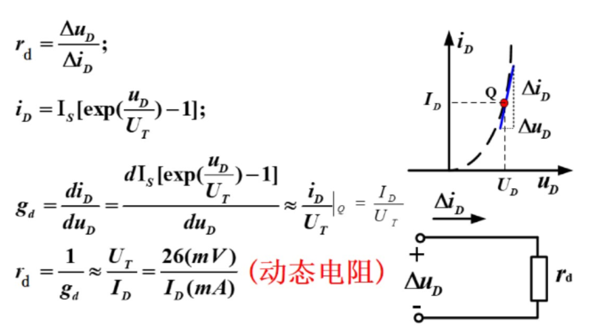
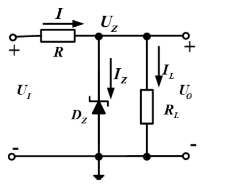

# 半导体的特性
*  根据电阻率的不同，物质可分为导体、绝缘体和半导体三大类

*  半导体的导电能力介于导体和绝缘体之间

*  半导体**受外界光和热的刺激时**，导电能力发生显著变化

*  在纯净的半导体中，**加入微量的杂质，导电能力会急剧增强**

# 本征半导体（不含其它杂质的半导体）
* 本征半导体特点
    1. 电阻率大，导电能力很低

    2. 导电性能随温度变化大

    3. **本征半导体不能在半导体器件中直接使用**

* 室温下，本征半导体共价键中的价电子获得足够的能量，挣脱共价键的束缚成为自由电子，在原位留下一个空穴，这种现象称为**本征激发** 

        

* 运载电荷的粒子称为**载流子**，本征半导体中存在**带负电的自由电子**和**带正电的空穴**两种载流子，且**浓度相等**

* 载流子有两种运动方式：扩散运动（浓度差）和漂移运动（电场激发）

* 空穴的移动方向和电子移动的方向是**相反**的，分别形成**空穴电流和电子电流**

# 杂质半导体（本征半导体掺入杂质）
1. N（Negative）型半导体：掺入**五价**杂质
    * 半导体中产生大量的**自由电子**和**正离子**
    
    * 自由电子是多数载流子，主要由**杂质原子**提供
    
    * 空穴是少数载流子，由**热激发**(**本征激发**)形成

2. P（Positive）型半导体：掺入**三价**杂质
    * 半导体中产生大量的**空穴**和**负离子**
    
    * **空穴是多数载流子**，主要由**杂质原子**提供；自由电子是少数载流子，由热激发(本征激发)形成

* 在**杂质半导体**中，多数载流子浓度主要取决于**杂质浓度**，少数载流子浓度主要取决于**温度**，N型和P型在总体上都保持**电中性**

# PN结及其单向导电性
* 把本征硅片一边做成P型半导体，另一边N型半导体，交界处会形成一个很薄的特殊物理层（PN结）

        

    * N区中的电子扩散到P区，结果在P区和N区交界面上留下了一个不能移动的振幅粒子（电子空穴中和）

        

    * N区少了电子呈正极，P区多了电子呈负极，电中性被破坏，形成内电场（PN结的位置）

        

    * PN结内电场一方面**阻碍了多子的扩散**，另一方面**加速了少子的漂移**

* PN结的单向导电性
    1. PN结正向偏置：正极接P区，负极接N区
        * **内电场被削弱，使空间电荷区变薄**，PN结对外呈现较小的阻值，处于正向导通状态    
    
    2. PN结反向偏置：正极接N区，负极接P区
        * 因少子浓度主要与**温度**有关，反向电流与反向电压几乎无关，此电流称为反向饱和电流，记为$I_s$
        
        

# 二极管
* 二极管的伏安特性
    * 正向特性
        1. 近似呈现为指数曲线：$i_D\approx I_Se^{\frac{u_D}{U_T}}$   

        2. 有死区($i_D$约等于0的区域)
            * 死区电压约为(**硅管0.5V**)(锗管0.1V)

        3. 导通压降(硅管0.6~**0.7V**)(锗管0.2~0.3V)

           

    * 反向特性

        

        1. 当$|u_D|<U_{(BR)}$时，$|i_D|\approx I_S$

        2.  当$|u_D|>U_{(BR)}$时，反向电流急剧增大，二极管反向击穿

        * 击穿根据击穿可逆性分为电击穿和热击穿
            1. 热击穿（不可逆击穿）：不加限流措施，PN结因过热而损坏

            2. 电击穿（可逆击穿）：即反向击穿，指的是反向电压达到一定数值，反向电流急剧增加的现象

* 温度对二极管伏安特性的影响
    * 温度升高时，二极管特性减弱（**减弱正向压降能力，减弱反向阻碍能力**）

      

# 二极管的四种模型  
1. 理想模型
    * 在正向偏置时，其管压降为$0V$，而在反向偏置时，认为电阻无穷大（当$u_D>>U_{on}$时）    

        

2. 恒压降模型
    * 二极管导通后，其管压降认为是恒定的，且不随电流的变化，典型值是**0.7V**（硅管压降）

        

3. 折线模型
    * 二极管的管压降**不是恒定的**，而是随着通过二极管电流的增加而增加，$V_{on}$约为**0.7V**（启动电压），其中，$r_D$的值是固定不变的$r_D=\frac{Δu_D}{Δi_D}$（相当于内阻）    

        

4. 小信号模型
    * 二极管对叠加在$Q$点上的微小增量而言，等效为一电阻$r_d$，其值为该直线段斜率的倒数

    * 小信号模型仅限于计算叠加在$Q$点上**微小增量电压或电流**的响应

         

    * 二极管正向偏置，有交流小信号$u_s$输入，且$u_D>>U_T$(二极管的开启电压)时:

        

    * $r_d\approx \frac{U_T}{I_D}=\frac{26(mV)}{I_D(mA)}$

# 开关电路
* 在开关电路中，利用二极管的单向导电性以接通或断开电路。**判断电路中二极管处于导通状态还是截止状态，可以先将二极管断开，然后观察（或计算）阴、阳两极间的极性和大小，来判断电路中的二极管处于导通状态还是截止状态**

# 稳压二极管
* 稳压二极管又称**齐纳二极管**，正向特性曲线与普通二极管相似，反向击穿特性曲线**很陡**，$U_z$表示反向击穿电压，即稳压管的稳定电压（**反向击穿后电压很稳定**）

        

* 稳压二极管原理：**当电流有很大增量时，二极管两端的电压基本上稳定在击穿电压附近，只引起很小的电压变化**

## 稳压二极管的主要参数
1. 稳定电压$U_z$
    * 指稳压管工作在反向击穿区时的稳定工作电压

2. 稳定电流$I_z(I_{zmin}\sim I_{zmax})$
    * 指稳压管正常工作时的参考电流。若工作电流小于$I_{zmin}$，则不能稳压；若工作电流大于$I_{zmax}$，则会因功耗过大而烧坏

    

## 稳压管电路分析（并联式稳压电路）
* 限流电阻R的计算

    

    1. 当输入电压最小，负载电流最大（$R_I$最小）时，流过稳压二极管的电流最小。此时$I_z$不应该小于$I_{zmin}$，由此可得**限流电阻的最大值**

        * $R_{max}=\frac{U_{Imin}-U_Z}{I_{Zmin}+{I_{Lmax}}}$

    2. 当输入电压最大，负载电流最小（$R_L$最大）时，流过稳压二极管的电流最大。此时$I_Z$不应超过$I_{Zmax}$，由此可得**限流电阻的最小值**

        * $R_{max}=\frac{U_{Imax}-U_Z}{I_{Zmax}+{I_{Lmin}}}$

    3. 得出限流电阻的取值范围

        * $R_{min}<R<R_{max}$
