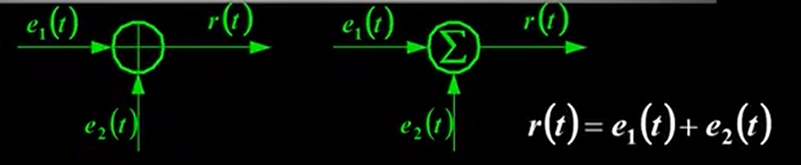

# 双极型三极管（BJT）
* 双极结型晶体管（BJT），是一种把**输入电流进行放大**的半导体元器件，也叫半导体三极管或晶体三极管

## 三极管的结构
* NPN型

    

* PNP型

    

* 其中电路图中的箭头方向代表电流的方向

## 三极管的放大作用和载流子的运动
* 三极管内部存在两个PN结，表面看来似乎相当于两个二极管背靠背地串联在一起，但将两个单独的二极管这样连接起来后**并不具有放大作用**

    

* 晶体管能实现放大，必须从**内部结构**和**外部偏置条件**来保证

1. 内部结构
    1. 发射区掺杂浓度**最高**，因而其中的多数载流子浓度很高（作用：**发射载流子**）

    2. 基区做得很薄，而且掺杂浓度**最低**，即基区中多子 浓度很低（作用：**传送和控制载流子**）

    3. 集电结结面积**比较大**，且集电区多子浓度远比发射区多子浓度低（作用：**收集载流子**）

    
    

2. 外部条件
    * 三极管在工作时要加上适当的**直流偏置电压**

    * 放大状态：
        1. 发射结正偏：由VBB保证：`UBE=UB-UE>0.7V`

        2. 集电结反偏：由VCC、VBB保证：`UCB=UC-UB>0`

        

        * BJT内部的载流子传输过程
            1. 因为发射结正偏，所以发射区向基区注入电子，形成**扩散电流IEN**（IEN的E表示对于IE内部的Negative电子的电流，方向为电子方向，**无需考虑电子运动的相反为正方向等等**）。同时从基区向发射区也有空穴的扩散运动，形成的电流为IEP（IEP表示对于IE内部的Positive空穴的电流，方向为空穴方向），但其数量小，**可忽略**。所以**发射极电流**`IE=IEPIEN≈IEN`

                

            2. 发射区的电子注入基区后，变成了少数载流子，**少部分电子**遇到空穴被复合掉，发射结正偏使得基区产生空穴用以复合**上述的少部分电子**，形成**基区复合电流IBN**。所以**基极电流**`IB=IBP+IBN≈IBN`。**大部分电子**到达了集电极的边缘

                

            3. 由于集电极反偏，促进少子扩散（基区少子电子，集电区少子空穴），集电区收集从基区漂移到集电区的电子，形成**收集电流ICN**。集电区的少子空穴和基区少子电子的漂移形成**集电结方向饱和电流ICBO**（CBO表示反向截止状态时从C集电区到B基区的微小电流），`IC=ICN+ICBO`

                

        * BJT三个电极上电流分配关系
            1. 三电流之间的关系
                * `IE=IEN+IEP=ICN+IBN+IEP`：IEN（发射区的电子）分为ICN（反向截止促进偏移的基区的电子）和IBN（发射区的电子与基区的空穴复合）
                
                * `IC=ICN+ICBO`
                
                * `IB=IBN+IEP-ICBO`：ICBO跑出回路

                * 由上面两式可得：`IE=IB+IC`

                * 当忽略IEP时可得到：`IE≈ICN+IBN`，IE在B极和C极之间的分配比例主要**取决于基区宽度、基区多子浓度**

                

3. 电流分配关系（忽略各区少子产生的电流（IEP、ICBO）

* _α称为**共基极**直流电流放大系数（共体现在输入信号接在基极）。显然_α小于小于1而接近1

* _β称为共**发射极**直流电流放大倍数（共体现在输入信号接在发射极）

* 电流放大系数只与管子的结构尺寸和掺杂浓度有关，与外加电压无关

* 电路中各处的电压和电流是由直流电源和交流信号源共同产生的，各电量的总瞬时值可分解为直流分量和交流分量

# BJT的伏安特性曲线（共发射极接法）
1. 输入特性曲线
    * 当uCE不变时，输入回路中的电流iB与电压uBE之间的关系曲线称为输入特性曲线

        

    1. `uCE=0V`时，相当于两个PN结并联，从中间P向两侧正向导通

        
        
    2. `uCE=1V`时，集电结反偏，开始收集电子，所以**基区复合减少**，在同一uBE电压下，iB减小。特性曲线将向右稍微移动一些

        

    3. `uCE≥1V`再增加时，曲线右移很不明显

        

2. 输出特性曲线
    * 当iB不变时，输出回路中的电流iC与电压uCE之间的关系曲线称为输出特性曲线

        

    * 以`IB=60μA`为例

    1. 当`uCE=0V`时，因集电极无收集作用，故iC=0

        

    2. 当uCE上升时，iC也随值增大

    3. 当`uCE>1V`后，收集电子的能力足够强。此时发射到基区的电子**都被集电极收集**，形成iC。**故uCE再增加，iC基本保持不变

        

3. 温度对晶体管的特性影响

# BJT的主要参数
# 放大的概念及主要指标参数

# BJT放大电路的三种基本组态

# 多级放大电路简介