# 双极型三极管（BJT）
* 双极结型晶体管（BJT），是一种把**输入电流进行放大**的半导体元器件，也叫半导体三极管或晶体三极管

## 三极管的结构
* NPN型（由P流向N，即从基极流向发射极）

    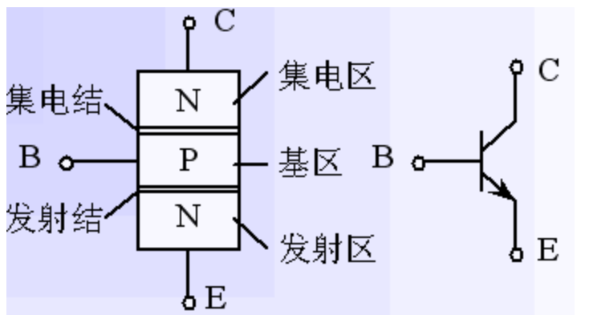

* PNP型（由P流向N，即从发射极流向基极）

    

## 三极管的放大作用和载流子的运动
* 三极管内部存在两个PN结，表面看来似乎相当于两个二极管背靠背地串联在一起，但将两个单独的二极管这样连接起来后**并不具有放大作用**

    

* 晶体管能实现放大，必须从**内部结构**和**外部偏置条件**来保证

1. 内部结构
    1. 发射区掺杂浓度**最高**，因而其中的多数载流子浓度很高（作用：**发射载流子**）

    2. 基区做得很薄，而且掺杂浓度**最低**，即基区中多子 浓度很低（作用：**传送和控制载流子**）

    3. 集电结结面积**比较大**，且集电区多子浓度远比发射区多子浓度低（作用：**收集载流子**）

2. 外部条件
    * 三极管在工作时要加上适当的**直流偏置电压**

    * 放大状态：
        1. 发射结正偏：由VBB保证：`UBE=UB-UE>0.7V`

        2. 集电结反偏：由VCC、VBB保证：`UCB=UC-UB>0`

        * BJT内部的载流子传输过程
            1. 因为发射结正偏，所以发射区向基区注入电子，形成**扩散电流IEN**（IEN的E表示对于IE内部的Negative的电流，方向为电子方向，**无需考虑电子运动的相反为正方向等等**）。同时从基区向发射区也有空穴的扩散运动，形成的电流为IEP（IEP表示对于IE内部的Positive的电流，方向为空穴方向），但其数量小，**可忽略**。所以**发射极电流**`IE=IEP+IEN≈IEN`

                

            2. 发射区的电子注入基区后，变成了少数载流子，**少部分电子**遇到空穴被复合掉，发射结正偏使得基区产生空穴用以复合**上述的少部分电子**，形成**基区复合电流IBN**。所以**基极电流**`IB=IBP+IBN≈IBN`。**大部分电子**到达了集电极的边缘

                

            3. 由于集电极反偏，促进少子扩散（基区少子电子，集电区少子空穴），集电区收集从基区漂移到集电区的电子，形成**收集电流ICN**。集电区的少子空穴和少子电子的漂移形成**集电结方向饱和电流ICBO**（CBO表示反向截止状态时从C集电区到B基区的微小电流），`IC=ICN+ICBO`

                

        * BJT三个电极上电流分配关系
            1. 三电流之间的关系
                * `IE=IEN+IEP=ICN+IBN+IEP`：IEN（发射区的电子）分散为ICN（反向截止促进偏移的基区的电子）和IBN（发射区的电子与基区的空穴复合）
                
                * `IC=ICN+ICBO`
                
                * `IB=IBN+IEP-ICBO`：ICBO跑出回路

                * 由上面三式可得：`IE=IB+IC`

                * 当忽略IEP时可得到：`IE≈ICN+IBN`，IE在B极和C极之间的分配比例主要**取决于基区宽度、基区多子浓度**

                

3. 电流分配关系（忽略各区少子产生的电流（IEP、ICBO）

* _α称为**共基极**直流电流放大系数。显然_α小于小于1而接近1

* _β称为共**发射极**直流电流放大倍数

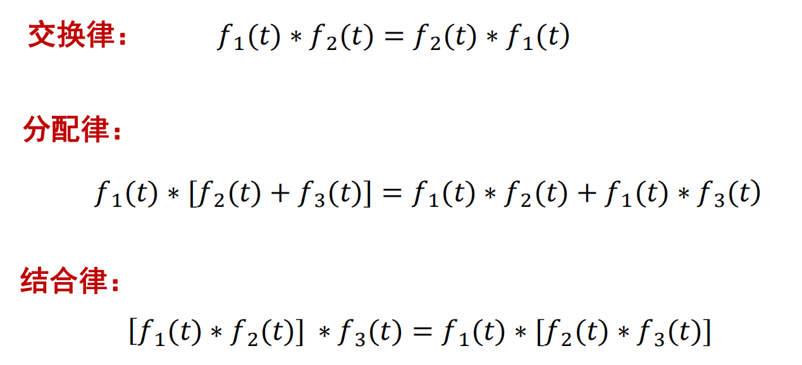

* 电流放大系数**只与管子的结构尺寸和掺杂浓度有关**，与外加电压无关

* 电路中各处的电压和电流是由直流电源和交流信号源共同产生的，各电量的总瞬时值可分解为直流分量和交流分量

# BJT的伏安特性曲线（共发射极接法）
1. 输入特性曲线
    * 当uCE不变时，输入回路中的电流iB与电压uBE之间的关系曲线称为输入特性曲线

        

    1. `uCE=0V`时，**相当于两个PN结并联**，从中间P向两侧正向导通

        
        
    2. `uCE=1V`时，集电结反偏，开始收集电子，所以**基区复合减少**，在同一uBE电压下，**iB减小**。特性曲线将向右稍微移动一些

        

    3. `uCE≥1V`再增加时，曲线右移很不明显

        

2. 输出特性曲线
    * 当iB不变时，输出回路中的电流iC与电压uCE之间的关系曲线称为输出特性曲线

        

    * 以`IB=60μA`为例

    1. 当`uCE=0V`时，因集电极无收集作用，故iC=0

        

    2. 当uCE上升时，iC也随值增大

    3. 当`uCE>1V`后，收集电子的能力足够强。此时发射到基区的电子**都被集电极收集**，形成iC。**故uCE再增加，iC基本保持不变**

        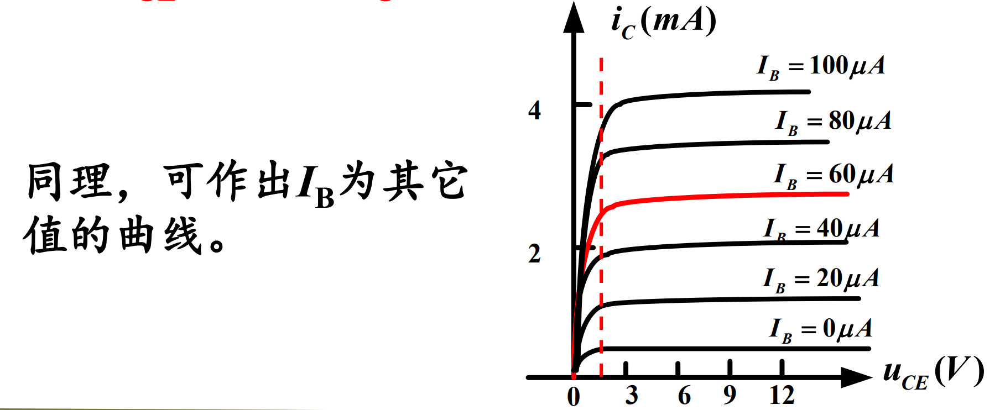

    * 输出特性曲线可以分为三个区域：
        1. 饱和区：IC受UCE显著控制的区域，该区域内UCE<0.7V。此时**发射结正偏，集电结也正偏或零偏**

            

        2. 截止区：IC接近零的区域，即IB=0的曲线的下方，此时**发射结反偏或零偏，集电结反偏**

            
        3. 放大区：曲线基本平行等距，此时，**发射结正偏，集电结反偏**，该区中有：

            

3. 温度对晶体管的特性影响
    1. 温度对输入特性的影响

        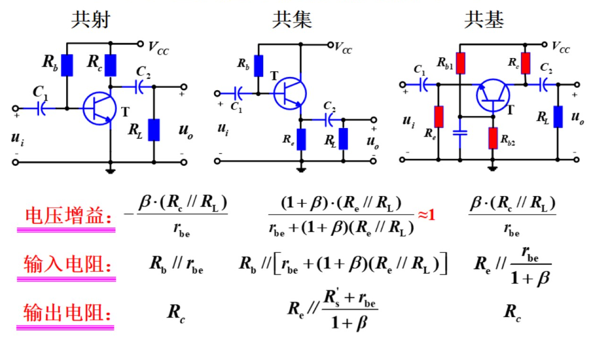

    2. 温度对β的影响

        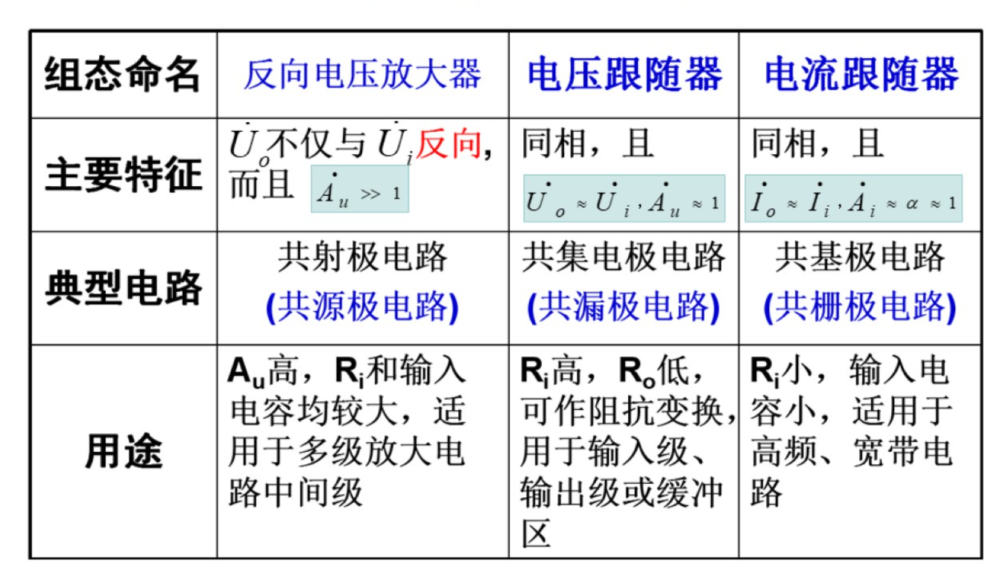

    3. 温度对ICBO、ICEO的影响

        

        

    4. 温度对输出特性的影响

        

1. 三极管结偏置判定法

    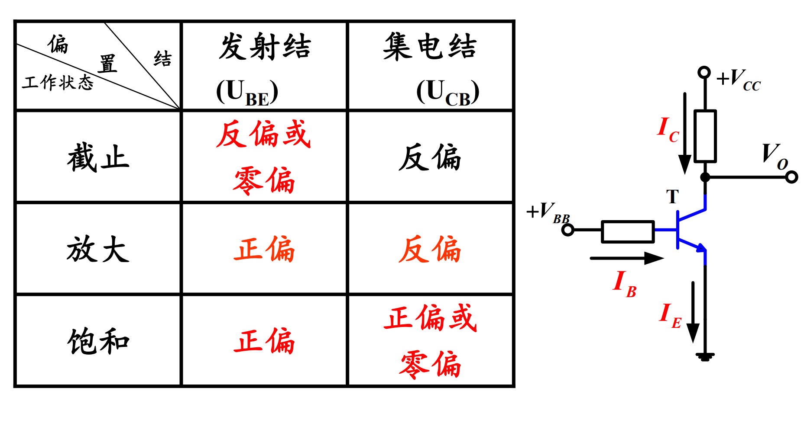

2. 三极管电流关系判定法

    

    

    

    

# BJT的主要参数
1. 电流放大系数
    1. 共发射极放大系数：

        

    2. 共基极电流放大系数：

        

2. 极间反向电流

    

    1. 集电极基极极间反向饱和电流ICBO
        * 发射极开路时，在其集电结上加反向电压，得到反向电流。它实际上就是一个PN结上的反向电流。**其大小和温度有关**

    2. 集电极发射极间的穿透电流ICEO
        * 基极开路时，集电极到发射极间的电流-穿透电流。**其大小与温度有关**

        

3. 极限参数
    1. 集电极最大允许电流ICM
        * IC过大时，β要下降。当β下降到线性放大区β值的70%时，所对应的集电极电流称为集电极最大允许电流ICM

    2. 集电极最大允许功率损耗PCM
        * 集电极电流通过集电结时所产生的损耗
        
        

        

    3. 极间反向击穿电压
        * BJT有两个PN结，其反向击穿电压有以下几种：
        
        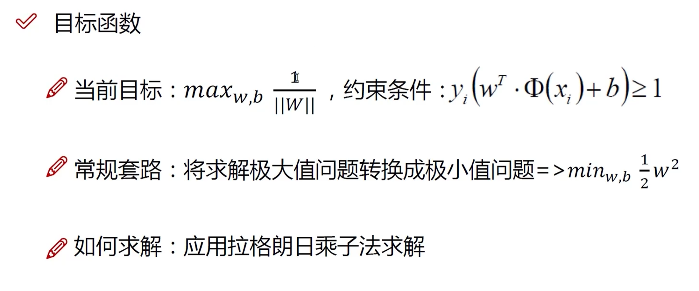

        

# 放大的概念及主要指标
1. 放大倍数（增益）
    * 表示放大器的放大能力

    

    1. 电压放大倍数

        

    2. 电流放大倍数

        

    3. 功率增益

        

2. 输入电阻
    * 从放大电路的输入端看进去的**线性应用**情况下的**交流等效电阻**

    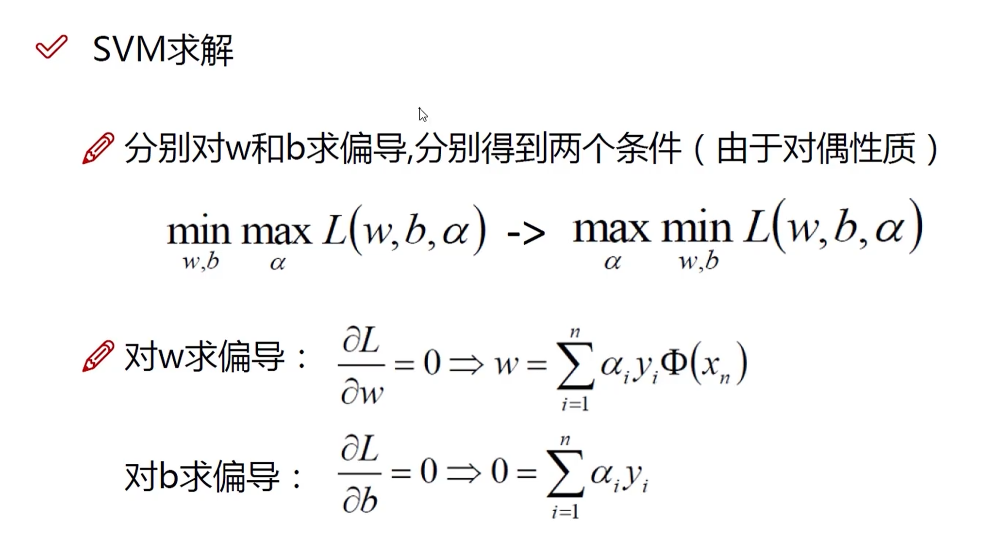

    * Ri决定了放大电路从信号源吸取信号幅值的大小

    1. 对输入电压信号的放大电路，Ri越大越好

    2. 对输入电流信号的放大电路，Ri越小越好

3. 输出电阻
    * 从放大电路的输出端看进去的**线性应用的情况下的**交流等效电阻**

    

    * 输出电阻Ro表明放大电路带负载的能力，输出量与负载大小的关联性越弱，放大电路的带负载能力越强

4. 频率响应及带宽
    

5. 线性失真
    1. 幅度失真
        * 由于放大电路对不同频率信号的增益不同，产生的失真

        

    2. 相位失真
        * 当放大电路对不同频率的信号产生的相移不同时，也要产生失真

        

6. 非线性失真
    * 由放大器件的**非线性特性**所引起的

    * 向放大电路输入**标准的正弦波信号**，可以测定输出信号的非线性失真，并用下面定义的非线性失真的系数来衡量

    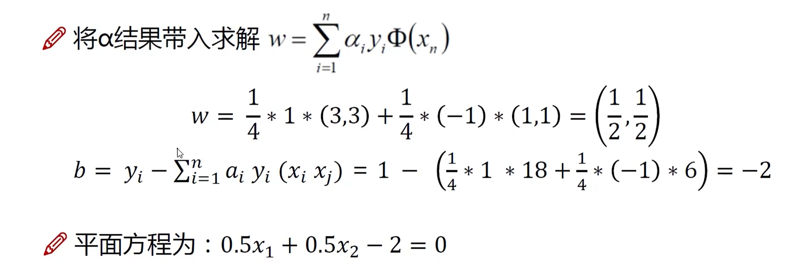

    * **线性失真和非线性失真的主要区别**：
        1. 线性失真：不产生新的频率成分的失真

        2. 非线性失真：产生新的频率成分的失真

7. 最大输出幅度
    * 表示在输出波形**不失真的情况下**，放大电路能够提供给负载的**最大输出电压和电流**

8. 最大输出功率与效率
    * 输出功率：指在输出信号**不产生明显失真的前提下**，能够向负载提供的**最大输出功率**，用`Pom`表示

    * 效率：最大输出功率`Pom`与直流电源消耗的功率Pv之比

    

9. 线性电路和静态、动态电路的概念
    
    

    1. 静态
        * 在没有加输入信号（ui=0）时，放大电路的工作状态称为**静态**

        * 由于静态时电路中的各处电压、电流都是直流量，所以静态又称为**直流工作状态**

        * 放大电路处于静态时对其直流量的分析，计算应依据的是**直流通路**

        

    2. 动态
        * 在电路的输入端加上输入信号后，电路的工作状态称为**动态**

        * 动态时BJT**各电极的电流和各级间的电压都在静态值的基础上叠加了随输入信号变化的交流量**

        * 动态时，电流、电压的瞬时总量中有直流量，还有交流量

        * 放大电路处于动态时对其交流量的分析，计算应依据的是**交流通路**

        

# BJT放大电路的三种基本组态

## 单管共发射极电路的组成

* VBB：使发射结正偏，并提供适当的静态IB和UBE

* 放大元件iC=βiB：工作在放大区，要保证集电结反偏，发射结正偏

* VCC：集电极电源，为电路提供能量。并保证集电结反偏

* Rc：将**变化的电流**转化为**变化的电压**

* 耦合电容C1和C2：电解电容且有极性，大小为10μF~50μF，作用是**隔直通交**，隔离隔离输入输出与电路直流的联系，同时能使信号顺利输入输出

* 基本放大电路的习惯画法

    

## 单管共发射极放大电路的工作原理

* 组成放大电路时必须遵循以下几个规则：
    1. 外加直流电源的极性必须使三极管**发射结正偏，集电结反偏**以保证其工作于放大区
    
    2. 输入回路的接法应该使输入电压的变化量Δui能够传送到基极回路，并使基极电流产生相应的变化量Δib
    
    3. 输出回路的接法应使集电极电流的变化量Δic能够转化为集电极电压的变化量Δuce，并传送到输出端

## 放大电路的基本分析方法
* 分析方法
    1. 近似计算法
        * 对放大电路的工作情况进行近似估算

    2. 图解法
        * 在放大管的特性曲线上用作图的方法求解

    3. 微变等效电路法
        * 在一个比较小的变化范围内，近似认为放大器件的特性曲线是线性的，从而将**非线性问题转化为线性问题**，然后利用适用于线性电路的各种规律、定理来对放大电路求解

1. 直流通路与交流通路
    * 放大电路中的电抗元件对直流信号和交流信号呈现的阻抗是不同的

    * 电容（**通交阻直**）：对直流信号的阻抗是无穷大，故不允许直流信号通过；但对交流而言，电容容抗为`1/ωC`,当电容足够大时，容抗很小，交流信号在电容上的压降可以忽略，可视为短路

    * 电感（**通直阻交**）：对直流信号而言阻抗很小，视为短路；对交流呈现感抗`ωL`

    * 理想电压源：如VCC等，由于其电压恒定不变，即电压变化量为0，故在交流通路中相当于**短路**

    * 理想电流源：由于电流恒定不变，即电流变化量为0，故在交流通路中相当于**开路**

    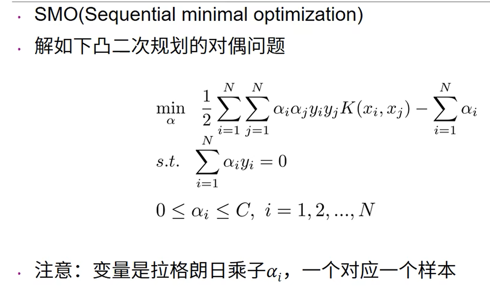

    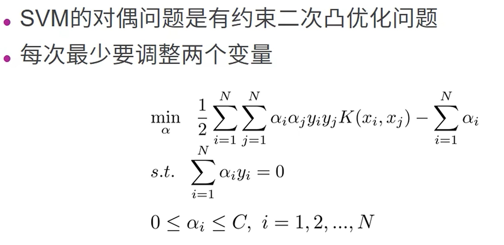

2. 静态工作点的近似估算
    1. 静态工作点-`ui=0`时电路的工作状态

        

        * （**IB，UBE**）**和**（**IC，UCE**）分别对应于输入、输出特性曲线上的一个点，称为静态工作点，一般用Q表示

        * 放大电路建立正确的静态工作点，是为了使三极管工作在线性区（放大区），以保证信号不失真

    2. 静态工作点的近似估算（IBQ、UBEQ、ICQ、UCEQ）

        

        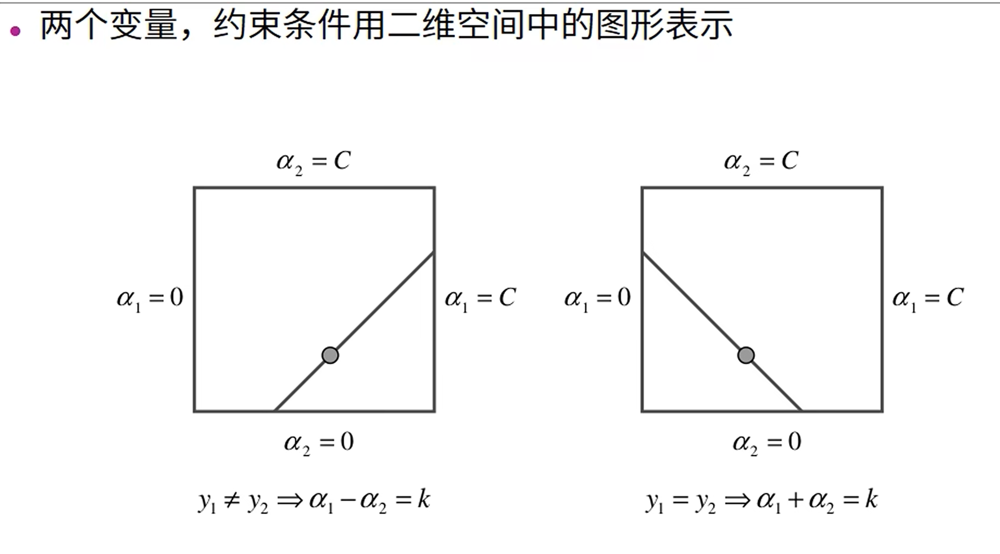

    

3. 图解法
    1. 关键点：图解法是利用晶体管内部的**电压和电流特性曲线**和晶体管外部的**电压和电流关系曲线**，通过作图对放大电路的静态和动态进行分析

    2. 分析思路：
        1. 交、直流分开讨论
        
        2. 先静态后动态，即先求输入量ui=0时的IBQ、UBEQ、ICQ、UCEQ

    * 图解法分析**静态**
        1. 输入回路
            * 由于`UBE=VCC-IB*RB`，所以
                * 当`IB=0`时，`UBE=VCC`，与横坐标的交点为`(VCC,0)`

                * 当`UBE=0`时，`IB=VCC/RB`，与纵坐标的交点为`(0,VCC/RB)`

                * 连接两点所得到的直线与**输入特性曲线**的交点`Q(UBEQ,IBQ)`就是静态工作点

                

        2. 输出回路
            * 由于`UCE=VCC-IC*RC`，所以
                * 当`IC=0`时，`UCE=VCC`，与横坐标的交点为`(VCC,0)`
                
                * 当`UCE=0`时，`IC=VCC/RC`，与纵坐标的交点为`(0,VCC/RC)`

                * 连接两点所得到的直线与**输出特性曲线**的交点`Q(UCEQ,ICQ)`就是静态工作点

                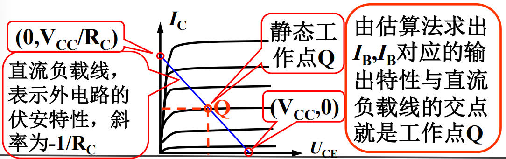

                
                
    * 图解法分析**动态**
        
        

        1. 作交流负载线

        2. 交流放大工作情况（设输出空载）

        3. 非线性失真与Q的关系#############
## 工作点的稳定问题

# 多级放大电路简介