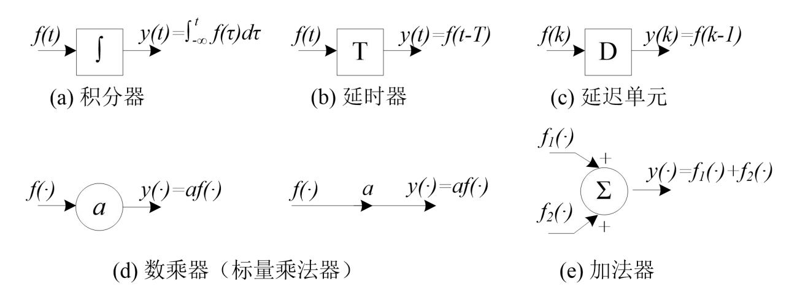

# 双极型三极管（BJT）
* 双极结型晶体管（BJT），是一种把**输入电流进行放大**的半导体元器件，也叫半导体三极管或晶体三极管

## 三极管的结构
* NPN型

    

* PNP型

    

* 其中电路图中的箭头方向代表电流的方向

## 三极管的放大作用和载流子的运动
* 三极管内部存在两个PN结，表面看来似乎相当于两个二极管背靠背地串联在一起，但是将两个单独的二极管这样连接起来后**它们并不具有放大作用**

    

* 晶体管能实现放大，必须从**内部结构**和**外部偏置条件**来保证

1. 内部结构
    1. 发射区掺杂浓度**最高**，因而其中的多数载流子浓度很高（作用：**发射载流子**）

    2. 基区做得很薄，而且掺杂浓度**最低**，即基区中多子 浓度很低（作用：**传送和控制载流子**）

    3. 集电结结面积**比较大**，且集电区多子浓度远比发射区多子浓度低（作用：**收集载流子**）

    
    

2. 外部条件
    * 三极管在工作时要加上适当的**直流偏置电压**

    * 放大状态：
        1. 发射结正偏：由VBB保证：`UBE=UB-UE>0.7V`

        2. 集电结反偏：由VCC、VBB保证：`UCB=UC-UB>0`

        

        * BJT内部的载流子传输过程
            1. 因为发射结正偏，所以发射区向基区注入电子，形成**扩散电流IEN**。同时从基区向发射区也有空穴的扩散运动，形成的电流为IEP。但其数量小，可忽略。所以**发射极电流IE≈IEN**

                

            2. 发射区的电子注入基区后，变成了少数载流子。少部分遇到空穴被复合掉，形成IBN。所以基极电流IB≈IBN。大部分到达了集电极的边缘

                

            3. 因为集电极反偏，集电区收集扩散到集电区边缘的电子，形成电流ICN。集电结区的少子形成形成漂移电流ICBO

                

# 放大的概念及主要指标参数

# BJT放大电路的三种基本组态

# 多级放大电路简介