# 双极型三极管（BJT）
* 双极结型晶体管（BJT），是一种把**输入电流进行放大**的半导体元器件，也叫半导体三极管或晶体三极管

## 三极管的结构
* NPN型

    

* PNP型

    

## 三极管的放大作用和载流子的运动
1. 内部结构
    1. 发射区掺杂浓度**最高**，故其中的多数载流子浓度很高（作用：**发射载流子**）

    2. 基区做得很薄，而且掺杂浓度**最低**，即基区中多子 浓度很低（作用：**传送和控制载流子**）

    3. 集电结结面积**比较大**，且集电区多子浓度远比发射区多子浓度低（作用：**收集载流子**）

2. 外部条件
    * 放大状态：
        1. 发射结正偏：由$V_{BB}$保证：$U_{BE}=U_B-U_E>0.7V$

        2. 集电结反偏：由$V_{CC}$、$V_{BB}$保证：$U_{CB}=U_C-U_B>0$

        * BJT内部的载流子传输过程
            1. 因为发射结正偏，所以发射区向基区注入电子，形成**扩散电流$I_{EN}$**（$I_{EN}$的E表示对于$I_E$内部的Negative的电流，方向为电子方向，**无需考虑电子运动的相反为正方向**）。同时从基区向发射区也有空穴的扩散运动，形成的电流为$I_{EP}$（$I_{EP}$表示对于$I_E$内部的Positive的电流，方向为空穴方向），但其数量小，**可忽略**。所以**发射极电流**$I_E=I_{EP}+I_{EN}≈I_{EN}$

                

            2. 发射区的电子注入基区后，变成了少数载流子，**少部分电子**遇到空穴被复合掉，发射结正偏使得基区产生空穴用以复合**上述的少部分电子**，形成**基区复合电流$I_{BN}$**。所以**基极电流**$I_B=I_{BP}+I_{BN}≈I_{BN}$。**大部分电子**到达了集电极的边缘

                

            3. 由于集电极反偏，促进少子扩散（基区少子电子，集电区少子空穴），集电区收集从基区漂移到集电区的电子，形成**收集电流$I_{CN}$**。集电区的少子空穴和少子电子的漂移形成**集电结方向饱和电流$I_{CBO}$**（CBO表示反向截止状态时从C集电区到B基区的微小电流），$I_C=I_{CN}+I_{CBO}$

                

        * BJT三个电极上电流分配关系
            1. 三电流之间的关系
                * $I_E=I_{EN}+I_{EP}=I_{CN}+I_{BN}+I_{EP}$：$I_{EN}$（发射区的电子）分散为$I_{CN}$（反向截止促进偏移的基区的电子）和$I_{BN}$（发射区的电子与基区的空穴复合）
                
                * $I_C=I_{CN}+I_{CBO}$
                
                * $I_B=I_{EN}-I_{CN}+I_{EP}-I_{CBO}=I_{BN}+I_{EP}-I_{CBO}$

                * 由上面三式可得：$I_E=I_B+I_C$

                * 当忽略$I_{EP}$时可得到：$I_E≈I_{CN}+I_{BN}$，$I_E$在B极和C极之间的分配比例主要**取决于基区宽度、基区多子浓度**

                

3. 电流分配关系（忽略各区少子产生的电流（$I_{EP}$、$I_{CBO}$））

* $\bar{\alpha}=\frac{I_C}{I_E}$

* $\bar α$称为**共基极**直流电流放大系数,显然$\bar α$小于小于1而接近1

* $\bar β$称为共**发射极**直流电流放大倍数

* $\bar \beta=\frac{I_C}{I_B}=\frac{\bar\alpha}{1-\bar{\alpha}}$

* 电流放大系数**只与管子的结构尺寸和掺杂浓度有关**，与外加电压无关

* 电路中各处的电压和电流是由直流电源和交流信号源共同产生的，各电量的总瞬时值可分解为直流分量和交流分量

# BJT的伏安特性曲线（共发射极接法）
1. 输入特性曲线
    * 当$u_{CE}$不变时，输入回路中的电流$i_B$与电压$u_{BE}$之间的关系曲线称为输入特性曲线

        

    1. $u_{CE}=0V$时，**相当于两个PN结并联**，从中间P向两侧正向导通

        
        
    2. $u_{CE}=1V$时，集电结反偏，开始收集电子，所以**基区复合减少**，在同一$u_{BE}$电压下，**$i_B$减小**。特性曲线将向右稍微移动一些

        

    3. $u_{CE}≥1V$再增加时，曲线右移很不明显

        

2. 输出特性曲线
    * 当$i_B$不变时，输出回路中的电流$i_C$与电压$u_{CE}$之间的关系曲线称为输出特性曲线

        

    * 以$I_B=60μA$为例

    1. 当$u_{CE}=0V$时，因集电极无收集作用，故$i_C=0$

        

    2. 当$u_CE$上升时，$i_C$也随值增大

    3. 当$u_{CE}>1V$后，收集电子的能力足够强。此时发射到基区的电子**都被集电极收集**，形成$i_C$。**故$u_{CE}$再增加，$i_C$基本保持不变**

        

    * 输出特性曲线可以分为三个区域：
        1. 饱和区：$I_C$受$U_{CE}$显著控制的区域，该区域内$U_{CE}<0.7V$。此时**发射结正偏，集电结也正偏或零偏**

            

        2. 截止区：$I_C$接近零的区域，即$I_B=0$的曲线的下方，此时**发射结反偏或零偏，集电结反偏**

            
        3. 放大区：曲线基本平行等距，此时，**发射结正偏，集电结反偏**，该区中有：

            * $\Delta I_C=\beta \Delta I_B$，$\beta=\frac{\Delta I_C}{\Delta I_B}$称为共发射极**交流**电流放大倍数

3. 温度对晶体管的特性影响
    1. 温度对输入特性的影响

        * 温度升高，少子数目增加，PN变薄，发射结势垒电压下降，在维持$I_B$不变的情况下，需要输入电压$U_{BE}$**下降**。输入特性曲线随温度升高左移

    2. 温度对$β$的影响

        * 温度升高，扩散作用增强，$I_C$大幅度增高，增高幅度大于$I_B$，导致$\beta$**提高**

    3. 温度对$I_{CBO}$、$I_{CEO}$的影响

        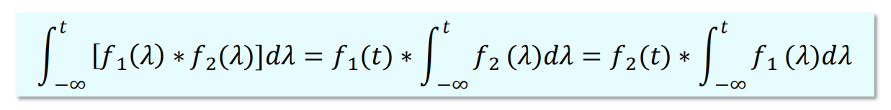

        * $I_{CEO}$是基极开路（即$I_B=0$）时由集电极直通到发射极的电流。当基极开路时，加在集电极和发射极间的正值电压$V_{CE}$被分配到两个结上，即$V_{CB}$为正值，集电结上加的是反偏；$V_{BE}$为正值，发射结上加的是正偏，**晶体三极管仍工作在放大模式，具有正向受控作用。至于$I_B=0$，就是$I_B$中的受控成分等于$I_{CBO}$，其值被放大：$I_{CEO}=I_{CBO}+\bar{\beta}I_{CBO}=(1+\bar{\beta})I_{CBO}$，故温度升高，$I_{CEO}$也升高

4. 温度对输出特性的影响

    * 温度升高，使$I_{CBO}$、$I_{CEO}$和$\beta$增加，使输出特性曲线向上移，且间距拉大

    

1. 三极管结偏置判定法

    

2. 三极管电流关系判定法

工作状态|$I_B$|$I_C$|$I_E$
-|-|-|-
截止|0|0|0|
|放大|>0|$\beta I_B$|$I_B+I_C=(1+\beta)I_B$|
|饱和|$I_B\geqslant I_{BS}$|$<\beta I_B$|$<(1+\beta)I_B$|

* $I_{BS}$称为三极管临界饱和时基极应该注入的电流

* 用电流关系判断三极管的工作状态时，可先假设三极管处于放大状态，求出$I_B$。然后根据$U_{CES}$电压求出临界饱和时的$I_{BS}$，若$I_B>I_{BS}$，则三极管处于饱和状态；若$I_B<I_{BS}$，则是放大状态

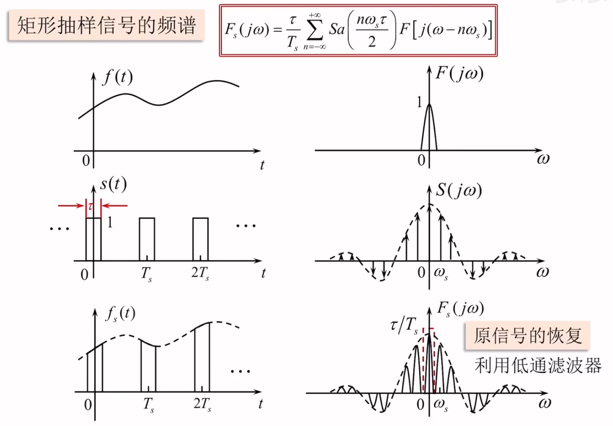

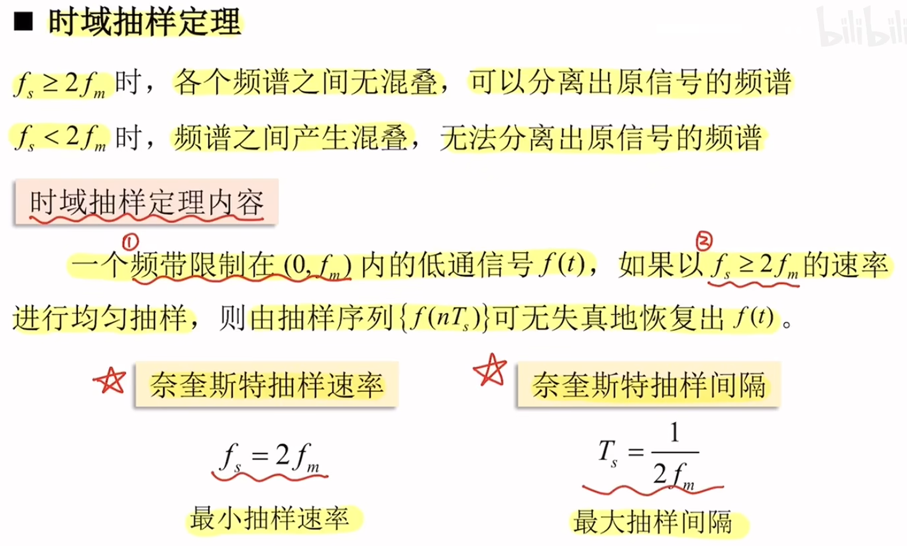

# BJT的主要参数
1. 电流放大系数
    1. 共发射极放大系数：
        * 直流：$\bar{\beta}=\frac{I_C}{I_B}$，交流：$\beta=\frac{\Delta i_C}{\Delta i_B}$

    2. 共基极电流放大系数：
        * 直流：$\bar{\alpha}=\frac{I_C}{I_E}$，交流：$\alpha=\frac{\Delta i_C}{\Delta i_E}$

2. 极间反向电流

    

    1. 集电极、基极极间反向饱和电流$I_{CBO}$
        * 发射极开路时，在其集电结上加反向电压，得到反向电流。它实际上就是一个PN结上的反向电流。**其大小和温度有关**

    2. 集电极发射极间的穿透电流$I_{CEO}$
        * 基极开路时，集电极到发射极间的电流-穿透电流。**其大小与温度有关**

        * $I_{CEO}=(1+\beta)I_{CBO}$

3. 极限参数
    1. 集电极最大允许电流$I_{CM}$
        * $I_C$过大时，$β$要下降。当$β$下降到线性放大区$β$值的$70\%$时，所对应的集电极电流称为集电极最大允许电流$I_{CM}$

    2. 集电极最大允许功率损耗$P_{CM}$
        * 集电极电流通过集电结时所产生的损耗：$P_C=I_CU_{CE}<P_{CM}$

        

    3. 极间反向击穿电压
        * BJT有两个PN结，其反向击穿电压有以下几种：
        
        1. $U_{(BR)EBO}$-集电极开路时，发射极与基极之间允许的最大反向电压。一般几伏~十几伏 

        2. $U_{(BR)CBO)}$-发射极开路时，集电极与基极之间允许的最大反向电压。一般几十~几百伏

        3. $U_{(BR)CEO}$-基极开路时，集电极与发射极之间允许的最大反向电压

        * $U_{CBO}>U_{CEO}>U_{EBO}$

        

        

# 放大的概念及主要指标
1. 放大倍数（增益）
    * 表示放大器的放大能力

    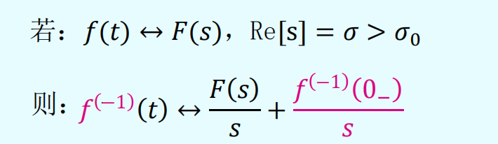

    1. 电压放大倍数$\dot{A}_u=\frac{\dot{u_o}}{\dot u_i}$或电压增益=$20lg|\dot{A_u}|(dB)$

    2. 电流放大倍数$\dot{A}_i=\frac{\dot i_o}{\dot{i_i}}$或电流增益=$20lg|\dot{A_i}|(dB)$

    3. 功率放大倍数$A_p=\frac{p_o}{p_i}$或功率增益=$10lgA_p$

2. 输入电阻
    * 从放大电路的输入端看进去的**线性应用**情况下的**交流等效电阻**

    

    * $R_i$决定了放大电路从信号源吸取信号幅值的大小

    1. 对输入电压信号的放大电路，$R_i$越大越好

    2. 对输入电流信号的放大电路，$R_i$越小越好

3. 输出电阻
    * 从放大电路的输出端看进去的**线性应用的情况下的**交流等效电阻

    

    * 输出电阻$R_o$表明放大电路带负载的能力，输出量与负载大小的关联性越弱，放大电路的带负载能力越强
        * 比如，如果一个单片机的引脚输出5伏电压信号，如果接上一个负载后，它的5伏保持不变，那么，它就可以带动这个负载，如果变小，那就说明带不动负载

4. 频率响应及带宽

    

5. 线性失真
    1. 幅度失真
        * 由于放大电路对不同频率信号的增益不同，产生的失真

        

    2. 相位失真
        * 当放大电路对不同频率的信号产生的相移不同时，也要产生失真

        

6. 非线性失真
    * 由放大器件的**非线性特性**所引起的

    * 向放大电路输入**标准的正弦波信号**，可以测定输出信号的非线性失真，并用下面定义的非线性失真的系数来衡量

    

    * **线性失真和非线性失真的主要区别**：
        1. 线性失真：不产生新的频率成分的失真

        2. 非线性失真：产生**新的频率**成分的失真

7. 最大输出幅度
    * 表示在输出波形**不失真的情况下**，放大电路能够提供给负载的**最大输出电压和电流**

8. 最大输出功率与效率
    * 输出功率：指在输出信号**不产生明显失真的前提下**，能够向负载提供的**最大输出功率**，用$P_{om}$表示

    * 效率：最大输出功率$P_{om}$与直流电源消耗的功率$P_v$之比：$\eta=\frac{P_{om}}{P_v}$

9. 线性电路和静态、动态电路的概念
    
    

    1. 静态
        * 在没有加输入信号（$u_i=0$）时，放大电路的工作状态称为**静态**

        * 由于静态时电路中的各处电压、电流都是直流量，所以静态又称为**直流工作状态**

        * 放大电路处于静态时对其直流量的分析，计算应依据的是**直流通路**

        

    2. 动态
        * 在电路的输入端加上输入信号后，电路的工作状态称为**动态**

        * 动态时BJT**各电极的电流和各级间的电压都在静态值的基础上叠加了随输入信号变化的交流量**

        * 动态时，电流、电压的瞬时总量中有直流量，还有交流量

        * 放大电路处于动态时对其交流量的分析，计算应依据的是**交流通路**

        

# BJT放大电路的三种基本组态

## 单管共发射极电路的组成

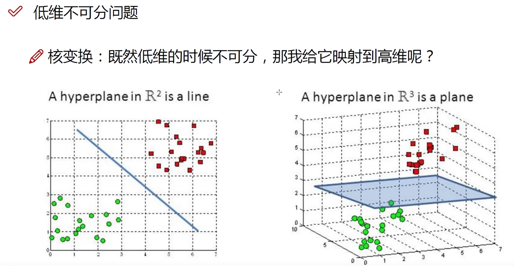

* $V_{BB}$：使发射结正偏，并提供适当的静态$I_B$和$U_{BE}$

* 放大元件$i_C=βi_B$：工作在放大区，要保证集电结反偏，发射结正偏

* $V_{CC}$：集电极电源，为电路提供能量。并保证集电结反偏

* $R_c$：将**变化的电流**转化为**变化的电压**

* 耦合电容$C_1$和$C_2$：电解电容且有极性，大小为$10μF\sim 50μF$，作用是**隔直通交**，隔离隔离输入输出与电路直流的联系，同时能使信号顺利输入输出

* 基本放大电路的习惯画法

    

## 单管共发射极放大电路的工作原理

## 放大电路的基本分析方法
* 分析方法
    1. 近似计算法
        * 对放大电路的工作情况进行近似估算

    2. 图解法
        * 在放大管的特性曲线上用作图的方法求解

    3. 微变等效电路法
        * 在一个比较小的变化范围内，近似认为放大器件的特性曲线是线性的，从而将**非线性问题转化为线性问题**，然后利用适用于线性电路的各种规律、定理来对放大电路求解

1. 直流通路与交流通路
    * 放大电路中的电抗元件对直流信号和交流信号呈现的阻抗**不同**

    * 电容（**通交阻直**）：对直流信号的阻抗是无穷大；对交流信号的电容容抗为$\frac{1}{ωC}$,当电容足够大时，容抗很小，交流信号在电容上的**压降可以忽略**，可视为短路

    * 电感（**通直阻交**）：对直流信号而言阻抗很小，视为短路；对交流呈现感抗$ωL$

    * 理想电压源：如$V_{CC}$等，由于其电压恒定不变，即电压变化量为0，故在交流通路中相当于**短路**

    * 理想电流源：由于电流恒定不变，即电流变化量为0，故在交流通路中相当于**开路**

    

2. 静态工作点的近似估算
    1. 静态工作点$u_i=0$时电路的工作状态

        

        * $(I_B,U_{BE})$和$(I_C,U_{CE})$分别对应于输入、输出特性曲线上的一个点，称为静态工作点，一般用$Q$表示

        * 放大电路建立正确的静态工作点，是为了使三极管**工作在线性区（放大区），以保证信号不失真**

    2. 静态工作点的近似估算（$I_{BQ}$、$U_{BEQ}$、$I_{CQ}$、$U_{CEQ}$）

        

        * 估算法一般步骤：
            1. 画出放大电路的**直流通路**

            2. 根据基极回路求$I_B$

            3. 由BJT的电流分配关系求$I_C$

            4. 由集电极回路求$U_{CE}$

    

3. 图解法
    1. 关键点：图解法是利用晶体管内部的**电压和电流特性曲线**和晶体管外部的**电压和电流关系曲线**，通过作图对放大电路的静态和动态进行分析

    * 图解法分析**静态**
        1. 输入回路
            * 由于$U_{BE}=V_{CC}-I_B\times R_B$，所以
                * 当$I_B=0$时，$U_{BE}=V_{CC}$，与横坐标的交点为$(V_{CC},0)$

                * 当$U_{BE}=0$时，$I_B=V_{CC}/R_B$，与纵坐标的交点为$(0,V_{CC}/R_B)$

                * 连接两点所得到的直线与**输入特性曲线**的交点$Q(U_{BEQ},I_{BQ})$就是静态工作点

                

        2. 输出回路
            * 由于$U_{CE}=V_{CC}-I_C\times R_C$，所以
                * 当$I_C=0$时，$U_{CE}=V_{CC}$，与横坐标的交点为$(V_{CC},0)$
                
                * 当$UCE=0$时，$I_C=V_{CC}/R_C$，与纵坐标的交点为$(0,V_{CC}/R_C)$

                * 连接两点所得到的直线与**输出特性曲线**的交点$Q(U_{CEQ},I_{CQ})$就是静态工作点

                

        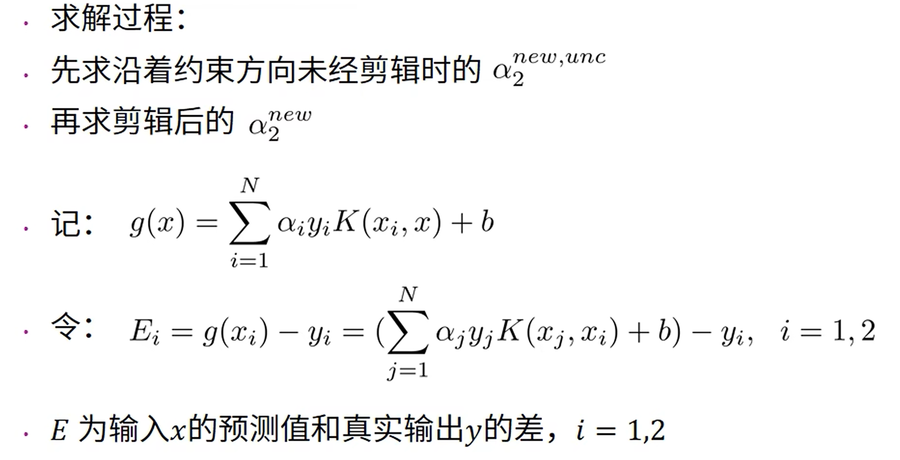
                
    * 图解法分析**动态**
        
        

        1. 作交流负载线
            * 输出端接入负载$R_L$：不影响$Q$（静态工作点），影响动态

            * $u_{ce}=-i_c(R_C//R_L)=-i_cR'_L$其中$R'_L=R_L//R_C$或：$i_c=-\frac{1}{R'_L}u_ce$，即斜率为$-\frac1{R'_L}$

            

        2. 交流放大工作情况（设输出空载）

            

            

            

        3. 非线性失真与Q的关系

            

            * 小信号$u_{ce}$使得$u_{CE}$增大但不能超过$v_{CC}$，否则会截断

                

            * 小信号$u_{ce}$使得$u_{CE}$减小，导致$u_{CB}$反偏电压增大使电流$i_C$增大，但$u_{CB}$大到一定程度时$i{_B}$饱和几乎不变，使$u_{BE}$几乎不变

                

4. 微变等效电路法
    * 思路：将非线性BJT等效成一个线性电路（在静态工作点附近小范围内）

    * 条件：交流**低频小信号**

    

    1. 三极管的H参数
        1. 三极管的H参数模型
            * 根据网络参数理论
                $$
                u_{BE}=f_1(i_B, u_{CE})\\
                i_C=f_2(i_B,u_{CE})
                $$

            * 求电压电流的微变关系-全微分：（**偏导数视为变化率，微分视为微小变化量**）
                $$
                du_{BE}=\frac{\partial u_{BE}}{\partial i_B}|_{U_{CEQ}}\cdot di_B+\frac{\partial u_{BE}}{\partial u_{CE}}|_{I_{BQ}}\cdot du_{CE}\\

                di_C=\frac{\partial i_C}{\partial i_B}|_{u_{CEQ}}\cdot di_B+\frac{\partial i_C}{\partial u_{CE}}|_{I_{BQ}}\cdot du_{CE}
                $$

            * 在小信号的情况下：
                $$
                u_{be}=h_{ie}i_b+h_{re}u_{ce}\\
                i_c=h_{fe}i_b+h_{oe}u_{ce}
                $$

            * 各H参数的物理意义：
                * 命名规则：
                    1. H是hybrid的首字母

                    2. 下标第一个字母（i-input-输入）（r-reverse-反向传输）（f-forward-正向传输）（o-output-输出），下标第二个字母（e-emitter-共发射极接法）

                * $h_{ie}=\frac{\partial u_{BE}}{\partial i_B}|_{u_{CE}}$：**输出端交流短路**时的输入动态电阻，用$r_{be}$表示，此时：$u_{CE}=U_{CEQ}，h_{ie}=r_{be}$

                * $h_{re}=\frac{\partial u_{BE}}{\partial u_{CE}}|_{i_B}$：输入端交流开路时的反向电压传输比，用$\mu_r$表示，此时：$i_B=I_{BQ}，h_{re}=\mu_r$

                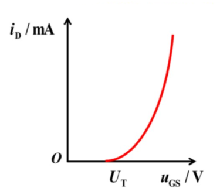

                * $h_{fe}=\frac{\partial i_C}{\partial i_B}|_{u_{CE}}$（forward transmission）：输出端交流短路时的正向电流放大系数，用$\beta$表示，此时：$u_{CE}=U_{CEQ}，h_{fe}=\beta$

                * $h_{oe}=\frac{\partial i_C}{\partial u_{CE}}|_{i_{B}}$：输入端交流开路时的输出电导，用$\frac{1}{r_{ce}}$表示，此时：$i_B=I_{BQ}，h_{oe}=1/r_{ce}$

                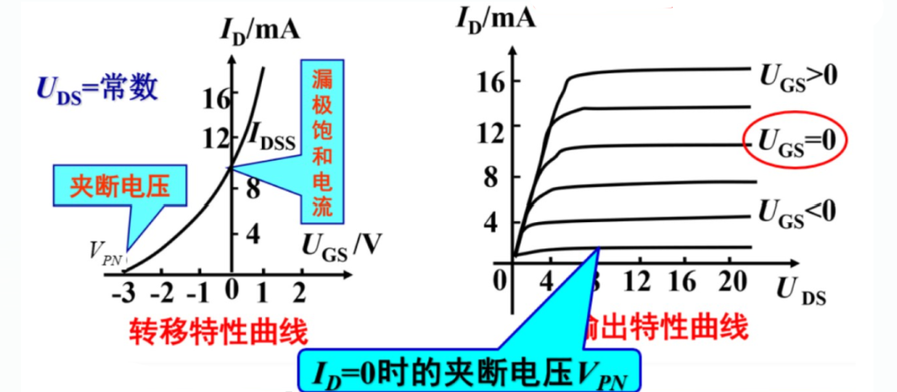

        2. 简化的H参数等效电路：
            1. $\mu _r<10^{-3}$，忽略

            2. $r_{ce}>10^5$，忽略

            * 得到三极管简化的H参数等效电路

                

        3. $r_{be}$的计算

            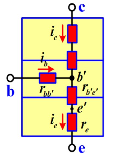

            * 由PN结的电流公式$I_E=I_S(e^{\frac{u_{b'e'}}{U_T}}-1)$

            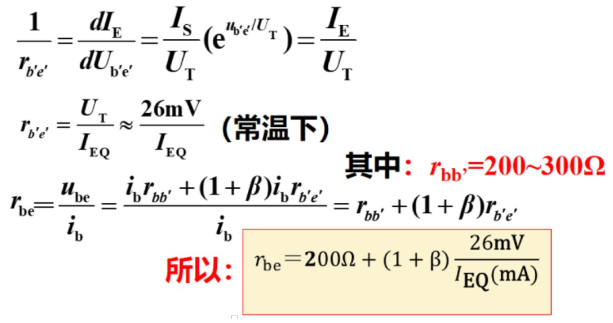
            
    2. 共射组放大器的交流分析
        1. 画出放大器的微变等效电路
            1. 画出放大器的交流通路

            2. 将交流通路中的三极管用H参数等效电路代替

                
        2. 电压放大倍数的计算：
            * $u_i=i_br_{be}$

            * $u_o=-\beta i_bR_L'$（记得有**负号**）

            * $R_L'=R_C//R_L$

            * 得出$A_u=\frac{u_o}{u_i}=-\beta\frac{R'_L}{r_{be}}$，电压反向放大

        3. 输入电阻的计算：
            * 根据输入电阻的定义：$R_i=\frac{u_i}{i_i}=R_b//r_{be}$，当$R_b>>r_{be}$时有$R_i\approx r_{be}$

            * 电路的输入电阻越大，从信号源取得的电压越大，因此一般总是希望希望得到较大的输入电阻

        4. 输出电阻的计算：
            * $R_o=\frac{u_o}{i_o}|_{R_L=\infty,u_i=0}$

        

## 工作点的稳定问题
1. 静态工作点稳定电路
    1. 分压式偏置电路的组成

        

    2. 静态工作点稳定过程

        

    3. 静态分析

        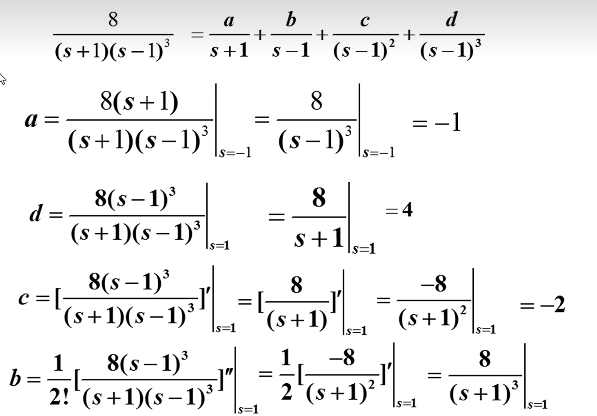

    4. 动态分析

        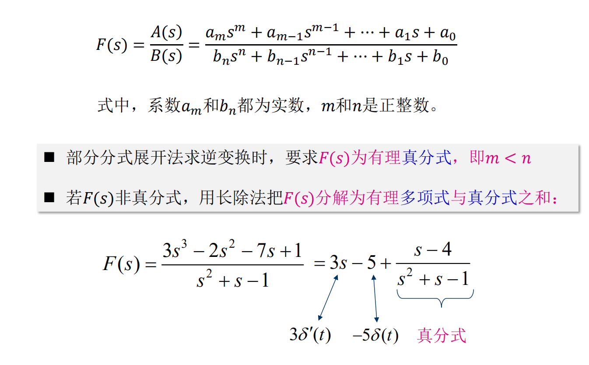

        1. 电压放大倍数

            

        2. 输入电阻

            

        3. 输出电阻
            * $R_o=R_c$

# 单管共集电极电路和共基极放大电路
1. 共集电极放大电路（电压跟随器）
    1. 电路结构

        

    2. 直流通路及静态工作点分析

        

    3. 动态分析

        

        1. 交流通道及微变等效电路

            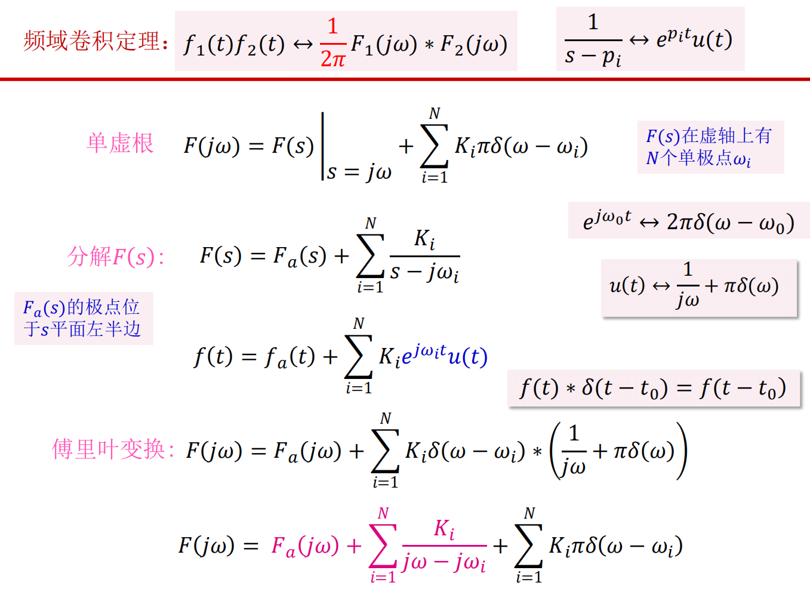

        2. 电压放大倍数

            

        3. 电流放大倍数

            

        4. 输入电阻

            

        5. 输出电阻

            

    

2. 共基极电路（电流跟随器）
    1. 电路结构

        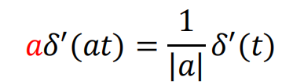

    2. 直流通路及静态工作点分析

        

    3. 动态分析
        1. 交流通路及微变等效电路

            

        2. 电压放大倍数

            

        3. 电流放大倍数

            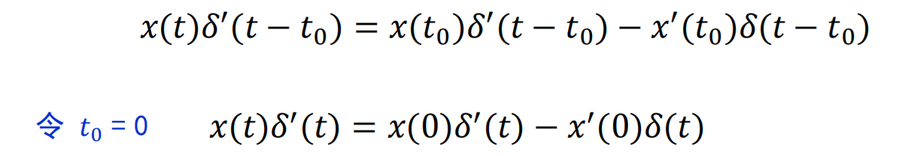

        4. 输入电阻

            

        5. 输出电阻

            

## 三种基本组态的比较

# 多级放大电路简介

## 多级放大电路的组成

## 多级放大电路的耦合方式
* 耦合-放大电路与信号源、前后极放大电路、负载以及电路内部各级之间的连接

1. 阻容耦合多级放大电路

    

    * 主要特点：
        1. 各级电路的静态工作点**相互独立**，便于设计和调试 

        2. 可以抑制**零点漂移**

        3. 无法放大低频信号和直流信号

        4. 适用于频率特高或输出功率特高的情况

        5. 在集成电路中，无法制造大电容，因而用**分立元件**电路实现

2. 直接耦合

* 直接耦合放大电路存在两个特殊问题：
    1. 各级静态工作点不独立，不便于设计和调试；信号的动态范围受静态工作点的限制

    

    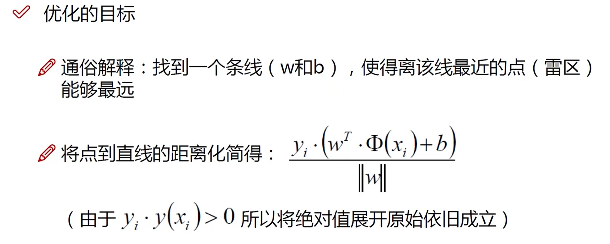
    
    2. 零点漂移问题

        

         

        

        

    3. 变压器耦合

        

        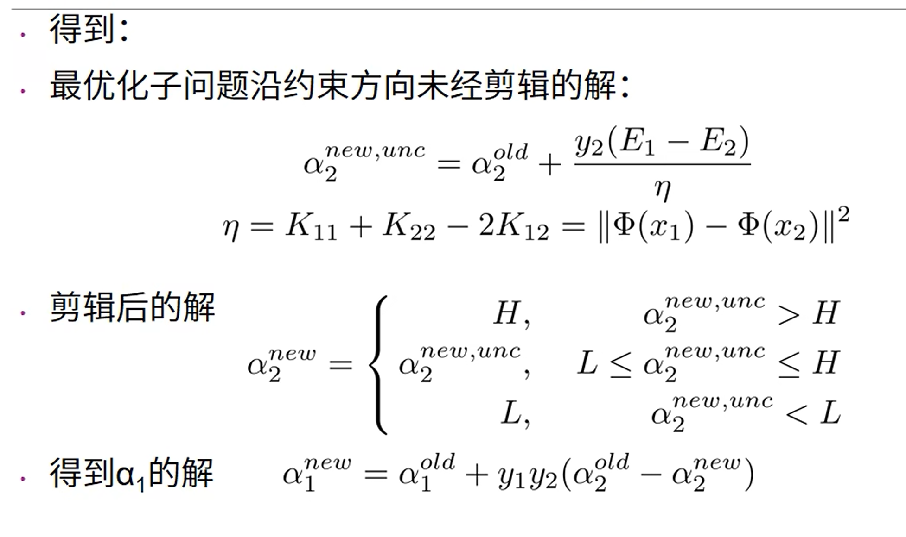

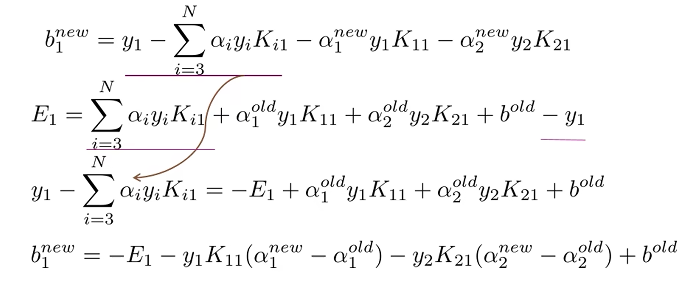

# 双极结三极管及其放大电路总结

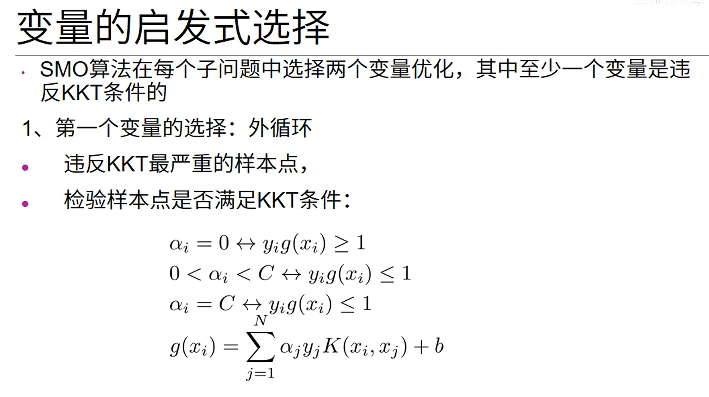

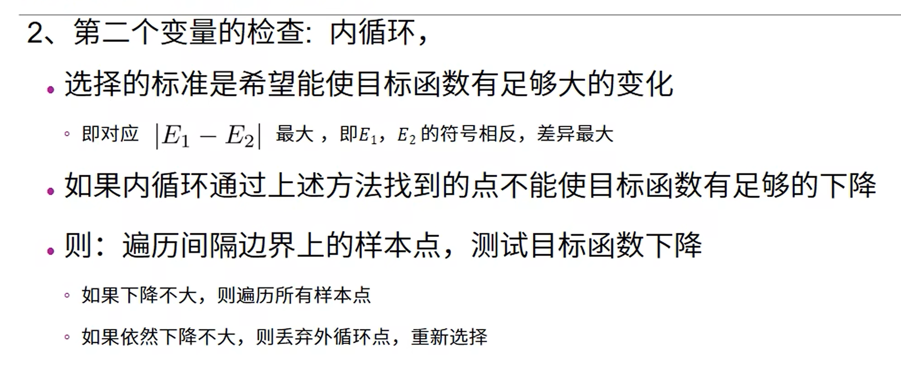
