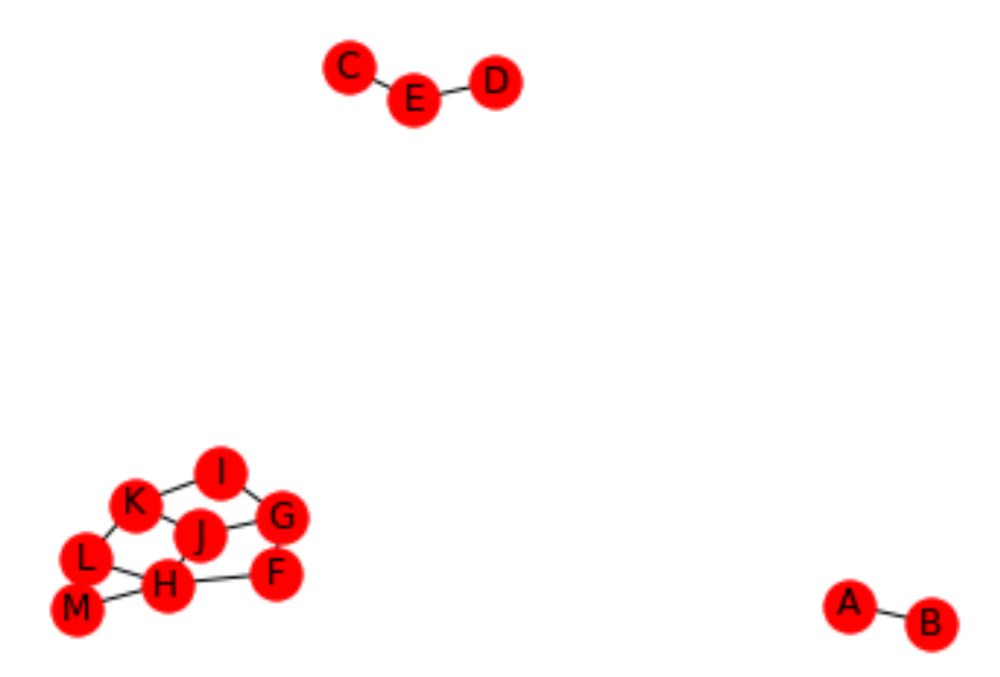

# 深度优先搜索DFS
* 一直朝一个没被标记过的方向走，如果四周全被标记过，则原路返回直到遇到有没被标记过的方向，最终返回终点

```cpp
void DFS(LGraph Graph,Vertex V)
{
    if(Visited[V])//已经访问过
    {
        return;
    }
    Visited[u]=true;//对已访问结点进行标记
    //递归思想：对当前结点的周围所有未访问的结点从小到大进行DFS，直到四周都被访问
    for(int i=0;i<Graph->NumVertex;++i)
    {
        //i从0迭代到NumVertex，用于找到目前顶点已经存在的边，并且从小往大寻找
        if(!Visited[i]&&Graph->G[u][i]!=INFNITY)
        {
            DFS(i);
        }
    }
}
```

# 广度优先搜索BFS
* 类似二叉树层序遍历，从起点开始一层一层访问，直到最后一层

```cpp
void BFS(MGraph Graph,Vertex S)
{
    Queue Q=CreateQueue(MAXSIZE);
    Visit(S);
    Visited[S]=true;//标记当前结点
    AddQ(Q,S);//入栈，用于下一层访问
    while(!IsEmpty(Q))
    {
        Vertex V=DeleteQ(Q);
        for(Vertex W=0;W<Graph->NumVertex;W++)
        {
            if(!Visited[W]&&Graph->G[V][W]!=INFNITY)
            {
                Visit(W);
                Visited[W]=true;
                AddQ(Q,W);
            }
        }
    }
}
```

# 概念

* 连通：从V到W存在一条（无向）路径，则V和W是连通的

* 路径：V到W的路径是一系列顶点的集合，其中任一对相邻的顶点间都有图中的边
    * 路径的长度：路径中的边数（如果带有权，则是所有边的权重和）

    * 简单路径：V到W之间和所有顶点都不同

* 回路：起点等于终点的路径

* 完全图：任意两顶点都有**边**

* 连通图：图中任意两顶点均**连通**

* 满足条件的图G的子集称为图G的连通分量：
    1. G的结点子集中任意两个结点均**连通**

    2. 该子集不是其它满足条件1子集的一部分

    * 例子中的图有三个连通分量

        

* 强连通:**有向图**中V和W之间存在**双向**路径

* 强连通图：有向图中任意两顶点均强连通

* 强连通分量：与连通分量类似，不过是有向图
    1. 子集中任意两个结点均**强连通**

    2. 该子集不是其它满足条件1子集的一部分

* 弱连通图：将有向图的所有有向边替换为无向边，所得到的图称为原图的基图。如果基图是连通图，则有向图是弱连通图
