# 场效应三极管
* 场效应管（FET）：利用电场效应来控制电流大小，空穴或电子导电，**单极型**三端有源器件

* FET定义及分类：
    * BJT是一种电流控制器件($i_B \sim i_C$)，工作时 **多数载流子和少数载流子都在运行**，所以称为**双极型器件**

    * 场效应管（FET）是一种**电压控制**（电场效应控制）器件（$u_{GS}\sim i_D$），工作时只有一种（多数）载流子参与导电，因此是**单极性器件**

## 结型场效应管（JFET）
1. JFET结构和符号

    

2. JFET工作原理

    

    1. $U_{DS}=0$时，栅源电压$U_{GS}$对**导电沟道**的**控制**作用
        * $U_{GS}$越小（$U_{GS}<0$），PN结反偏电压越大，则PN结越厚，直到夹断电压$U_{P}$使得沟道电流$i_G$几乎为0

        

    2. $U_{GS}$固定时，$U_{DG}$对漏极电流的影响：$U_{GD}$越负，DG处沟道越窄，直到夹断电压$U_P$
        1. $U_{DG}<|U_P|$：DS呈现电阻特性
     
        2. $U_{DG}=|U_P|$预夹断：$I_D$呈现**恒流状态**，$I_D$与$U_{DG}$基本无关，只受$U_{GS}$的影响    
        
            

    3. 特性曲线-输出特性
        * $i_D=f(u_{DS})|_{U_{GS}=常量}$

        * 低频跨导：$g_m=\frac{\Delta i_D}{\Delta u_{GS}}|_{U_{DS}=常量}$

        * $g_m$是变化的，不像$\beta$基本固定。$V_{GS}$越大，$g_m$越大；$I_{DSS}$是$V_{GS}=0$时的$I_{DS}$,即沟道最宽时的电流值

        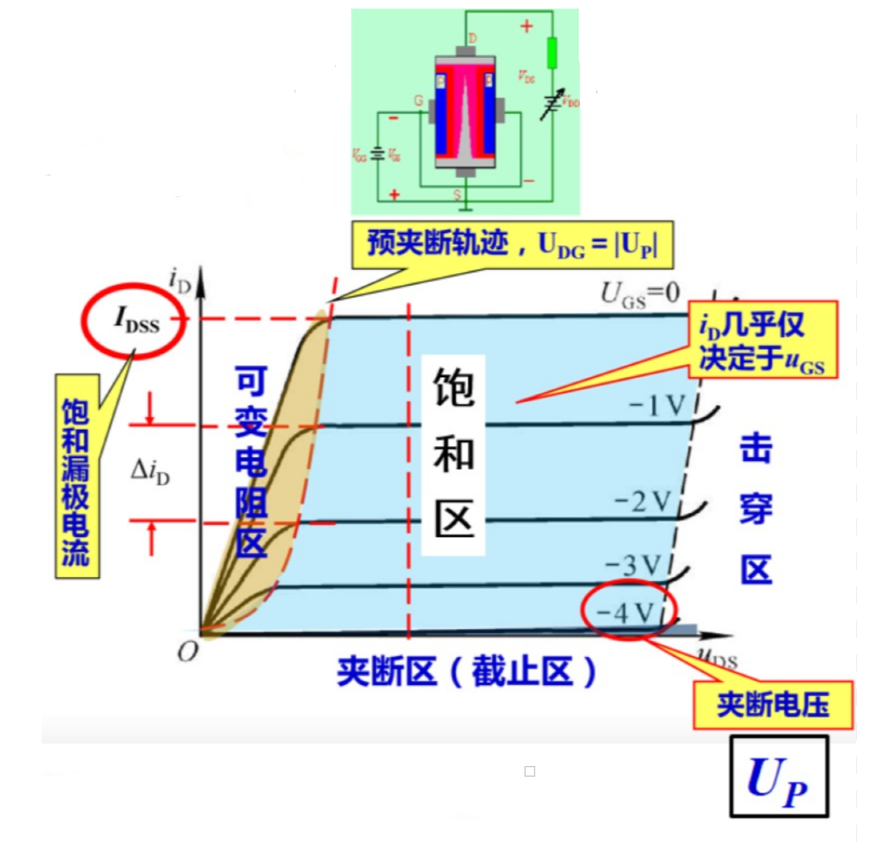 

    4. 特性曲线-转移特性（画法1）
        * 对于不同的$U_{DS}$，对应的转移曲线特性不同

        * 在可变电阻区，不同$U_{DS}$的转移特性曲线差别较大

        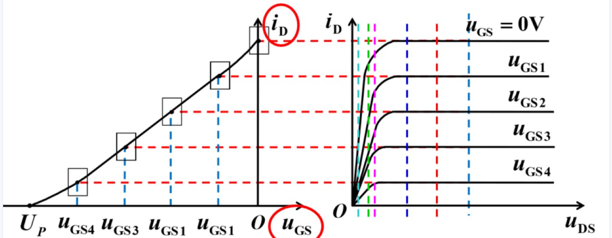

    5. 特殊曲线-转移特性（画法2）

        * （**记忆**）肖克莱方程：$i_D=I_{DSS}(1-\frac{u_{GS}}{U_P})^2$

        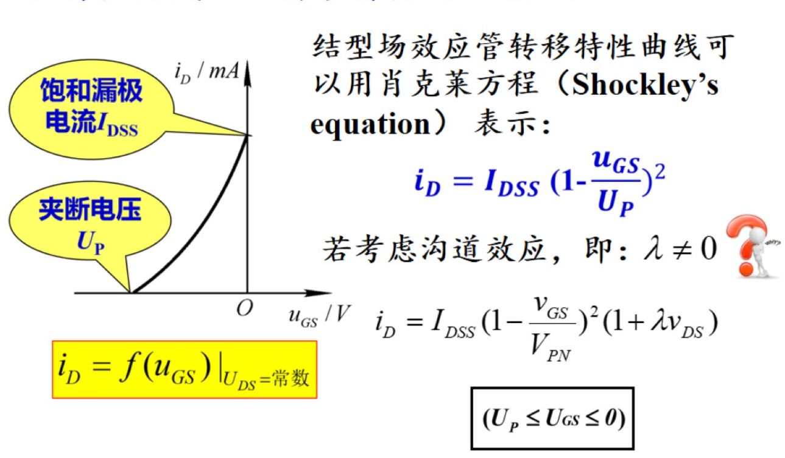

    6. JEFT分类

        

## 绝缘栅型场效应管（MOSFET）
* 金属氧化物半导体场效应管，简称MOSFET
    * 分类
        1. N沟道增强型E-NMOS

        2. N沟道耗尽型D-NMOS

        3. P沟道增强型E-PMOS

        4. P沟道耗尽型D-PMOS

1. N沟道增强型MOS管
    1. 结构与符号
        * 立体结构图

            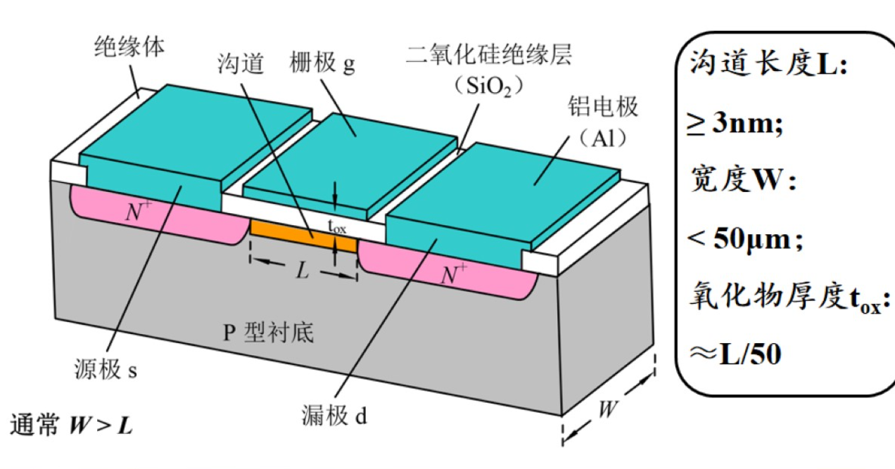

        * 平面结构图

            

    2. 工作原理
        1. $U_{GS}$对导电沟道的控制（$U_{DS}=0)$
            * 开启电压$U_T$：**漏源电压**作用下导电时的**栅源电压**

            

        2. $U_{DS}$对$I_D$的控制（$U_{GS}>U_T$）

            

        3. 输出特性曲线
            * $i_D=f(U_{DS})|_{U_{GS}=常数}$

            * 低频跨导：$g_m=\frac{\Delta i_D}{\Delta u_{GS}}|_{u_{DS}=常量}$

            * 可变电阻区就是设定$V_{GS}$不变时，改变电源输入电压，$I_{DS}$也随之线性改变，并且$U_{DS}/I_{DS}=R
            $，R不变。 此时场效应管看起来貌似一个电阻。 那既然R不变，为什么又叫可变电阻区？ 因为R不变是以$V_{GS}$不变为前提条件的，当改变$V_{GS}$时，R就变化了。

            

        4. 转移特性曲线（画法1）

            * $V_{TN}$为：在漏源电压一定时，开始导电时的**栅源**电压$V_{GS}$称为开启电压$V_{TN}$(N表示N沟道)

            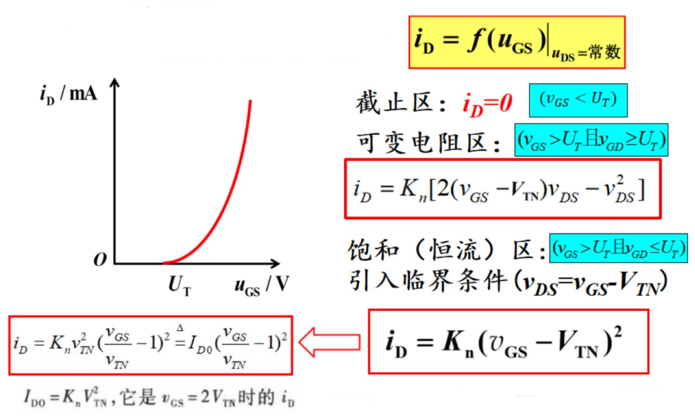

            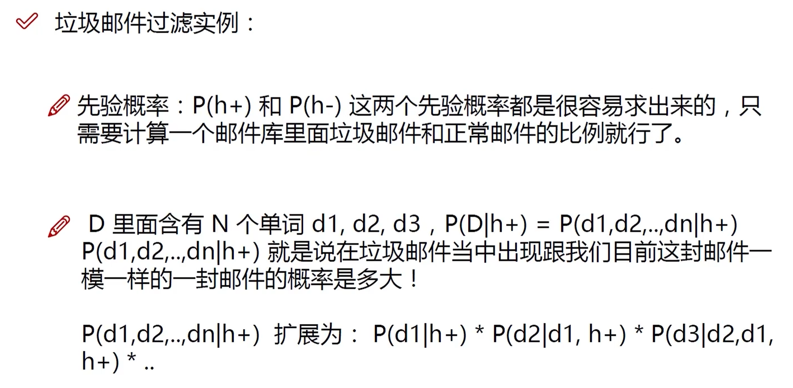

        5. 转移特性曲线（画法2）

            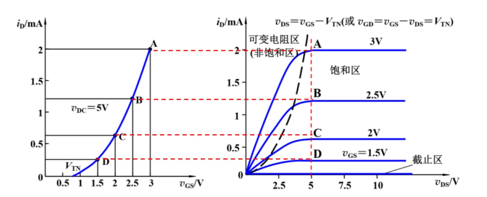

2. N沟道耗尽型MOS管
    1. 结构和符号

        

    2. 特性曲线

        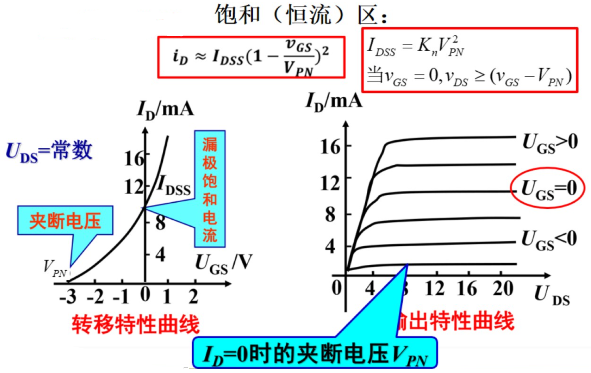

3. 绝缘栅型场效应管四种类型

    

    

## 场效应管放大电路分析
1. 直流参数
    * 饱和漏极电流$I_{DSS}$：**耗尽型场效应管**，当$U_{GS}=0$时所对应的漏极电流

    * 夹断电压$U_{P}$：**耗尽型场效应管**的参数

    * 开启电压$U_T$：**增强型MOS场效应管**的参数，当栅源电压小于开启电压的绝对值时，场效应管不能导通

    * 直流输入电阻$R_{GS}$：场效应管的栅源输入电阻的典型值，对于**结型场效应管**，反偏时$R_{GS}$约大于$10^7\Omega$，对于**绝缘栅型场效应管**，$R_{GS}$约为$10^9\sim 10^{15}\Omega$

2. 交流参数
    1. 低频跨导$g_m=\frac{\Delta i_D}{\Delta u_{GS}}|_{U_{DS}=常量}$：低频跨导反映了$U_{GS}$对$I_D$的控制作用。$g_m$可以在转移特性曲线上求取，单位是$mS$（毫西门子）

    2. 极间电容：管子三个电极之间的等效电容，越小越好，一般几$pF$
    
3. 极限参数
    1. 漏极最大允许耗散功率$P_{DM}$：最大漏极功耗可由$P_{DM}=U_{DS}\times I_D$决定，与双极型三极管的$P_{CM}$相当

    2. 漏源击穿电压$U_{(BR)DS}$：当漏极电流$I_D$急剧上升产生雪崩击穿时的$U_{DS}$
    
    3. 栅源击穿电压$U_{(BR)GS}$：当$U_{GS}$过高时，**结型场效应管PN结可能击穿**；MOS场效应管可能将二氧化硅绝缘层击穿，使栅极与衬底发生短路，形成破坏性击穿

        

## 场效应管放大电路的偏置和静态分析
1. 场效应管放大电路组成原则
    1. 静态：适当的静态工作点，使场效应管工作在恒流区（即饱和区），场效应管的偏置电路设计相对简单

    2. 动态：能将交流信号从信号源传输到负载

        
        
2. 场效应管静态偏置电路的要求
    1. 栅极只需要偏压，不需要偏流

    2. 注意各类FET的**偏置极性**区别

    3. 采用偏置稳定电路：固定偏置电路、自给偏压电路和分压式自偏压电路
        1. 固定偏置电路：保证$U_{GS}$为负才有DG夹断实现恒流的可能

            

            

        2. 自给偏压电路

            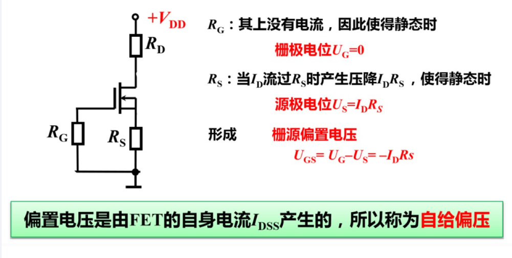

            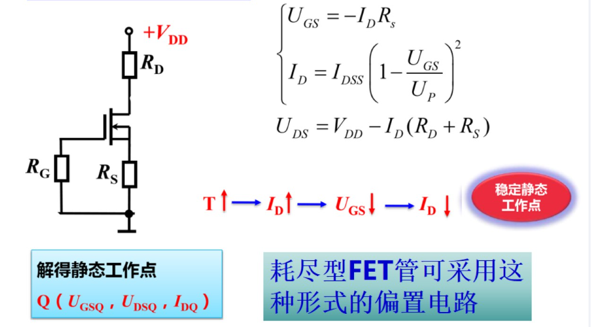

        3. 分压式自偏压电路
 
            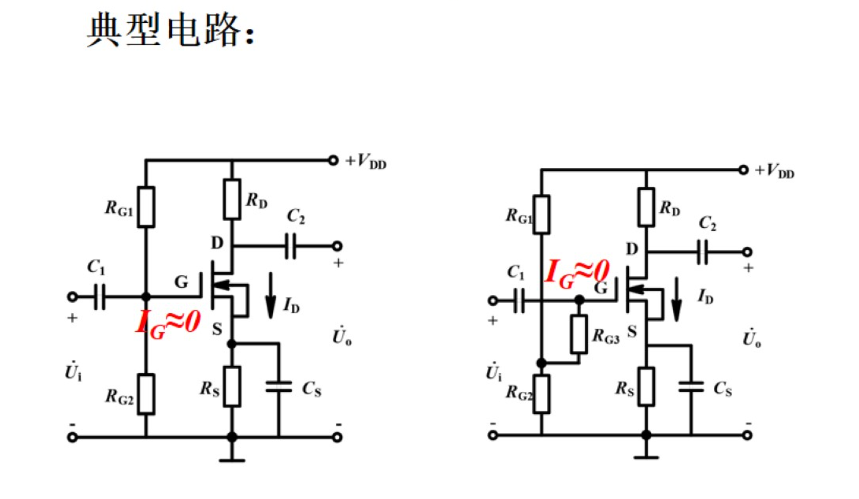

            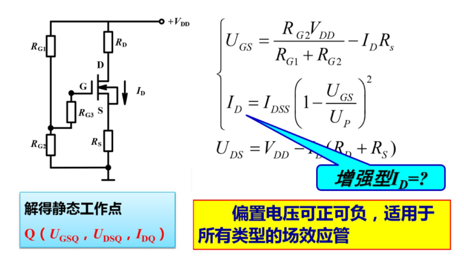

## 场效应管微变等效模型及放大电路
* 将场效应管也看成一个双端口网络，栅极和源极之间视为输入端口，漏极和源极之间视为输出端口

    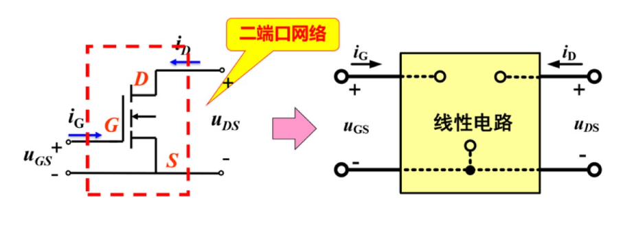

1. 场效应管微变等效模型（低频交流小信号）

    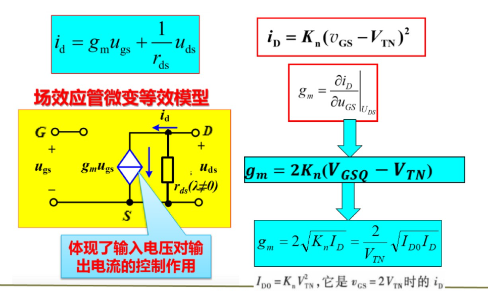

    1. 反映$v_{GS}$对$i_D$的控制能力，相当于转移特性上静态工作点处的斜率，因而$g_m$与静态工作点有关

    2. $i_D$越大，$g_m$越高

    3. 沟道宽长比$W/L$越大，$g_m$越高

2. FET低频微变等效模型与BJT的h参数对比

    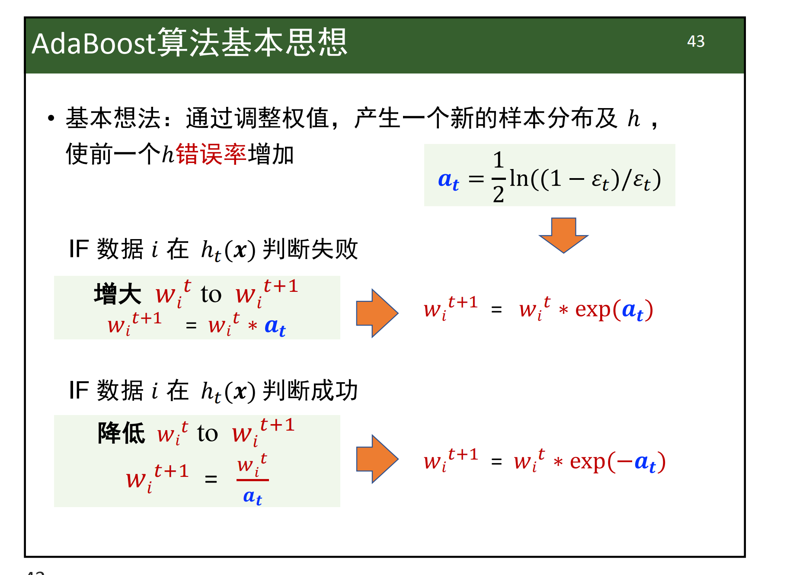

3. 场效应管放大电路及其动态分析

    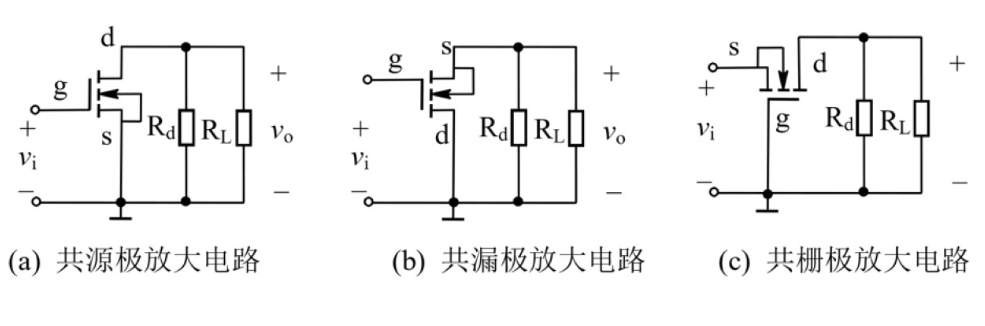

    1. 共源放大电路

        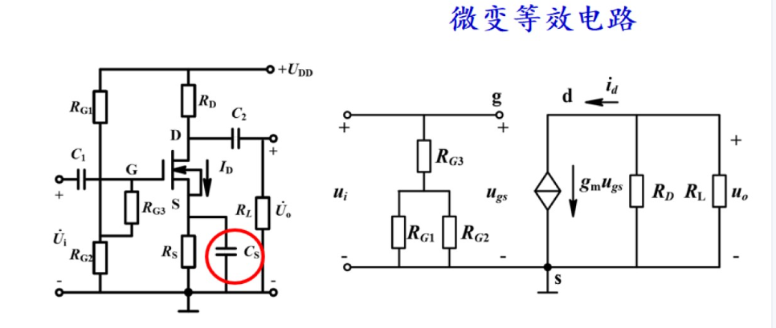

        1. 电压放大倍数

            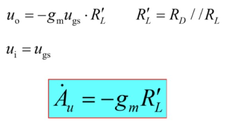

        2. 输入电阻

            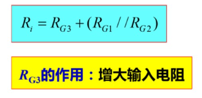

        3. 输出电阻

            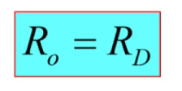

    2. 共漏放大电路

        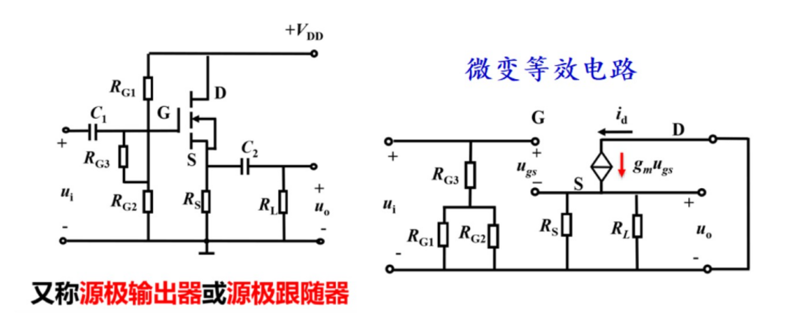

        1. 电压放大倍数

            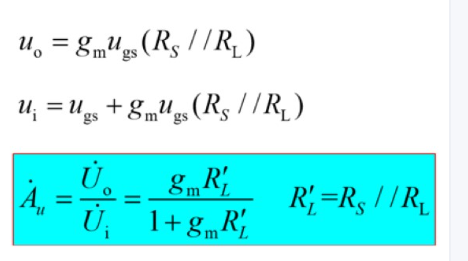

            

        2. 输入电阻

            

        3. 输出电阻

            
    
    3. 共栅放大电路

        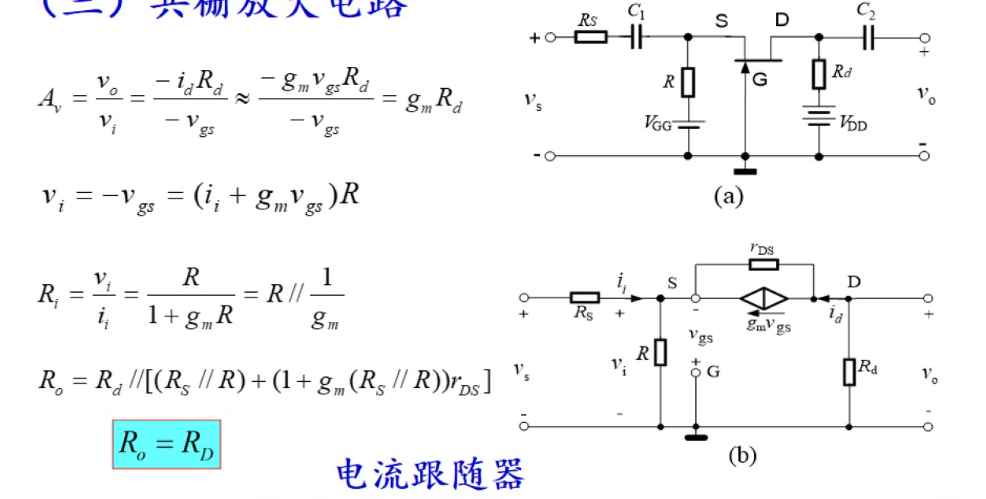

# 场效应管与晶体管放大电路的比较
1. 场效应管与晶体管比较

    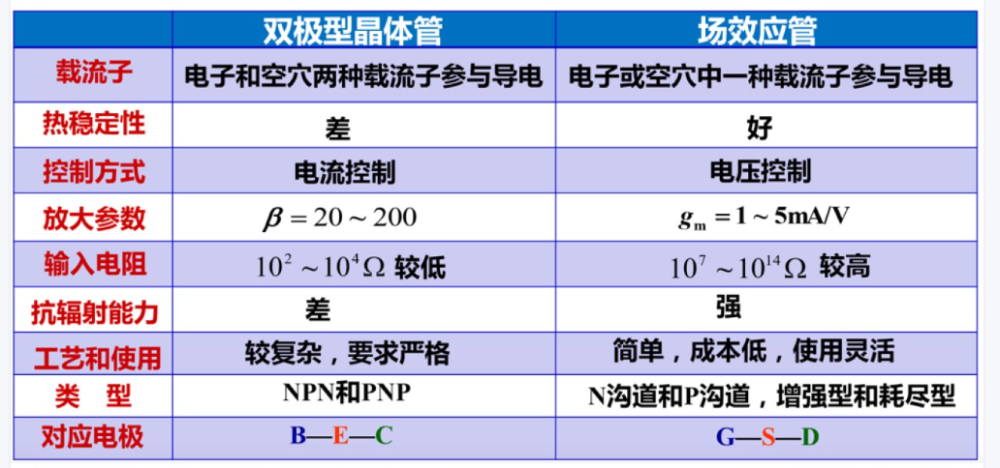

2. 场效应管与晶体管的选择
    * 只允许从信号源取较少电流时（信号源内阻高），用场效益管

    * 信号电压低，允许从信号源取较多电流时（信号内阻低），用晶体管

3. FET和BJT等效放大电路相比

    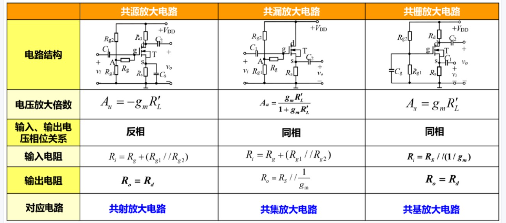

    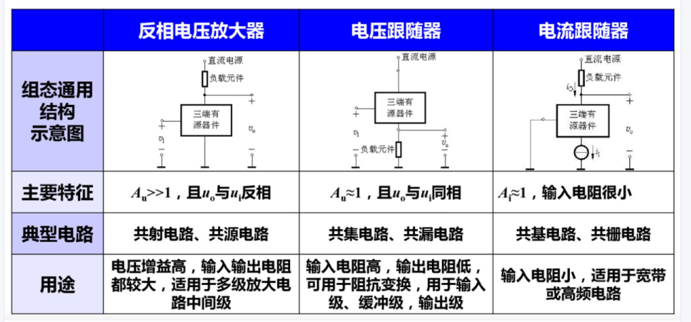

    

    

    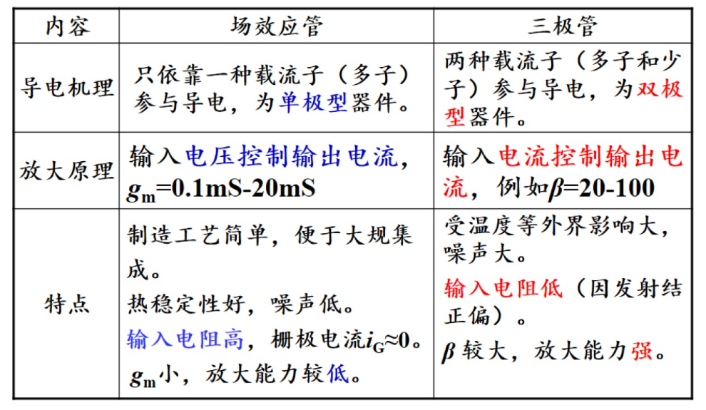
    