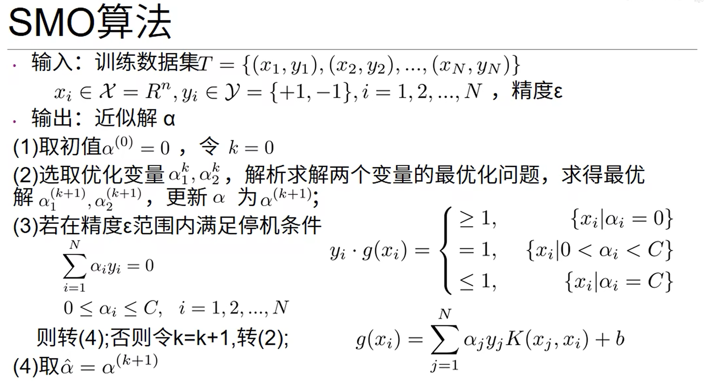

# 场效应三极管
* 场效应管（FET）：利用电场效应来控制电流大小，空穴或电子导电，**单极型**三端有源器件

* FET定义及分类：
    * BJT是一种电流控制器件($i_B \sim i_C$)，工作时多数载流子和少数载流子都在运行，所以称为**双极型器件**

    * 场效应管（FET）是一种**电压控制**（电场效应控制）器件（$u_{GS}\sim i_D$），工作时只有一种（多数）载流子参与导电，因此是**单极性器件**

## 结型场效应管（JFET）
1. JFET结构和符号

    

2. JFET工作原理

    

## 绝缘栅型场效应管（MOSFET）

## 场效应管放大电路分析

## 场效应管与晶体管放大电路的比较