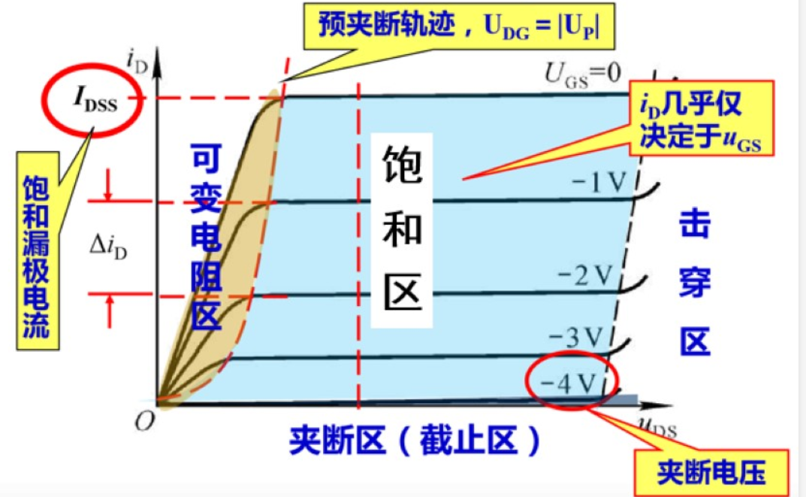
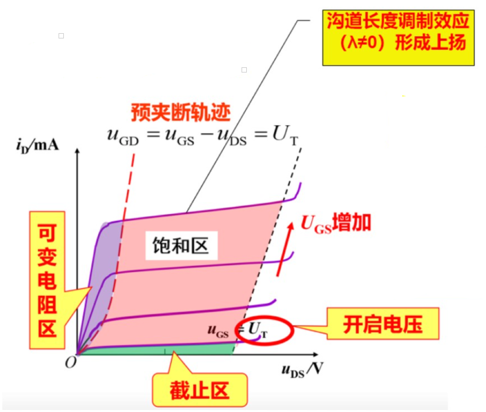

# 结型场效应管（JFET）
1. JFET结构和符号

    

2. JFET工作原理

    

    1. **当$U_{DS}=0$时**，栅源电压$U_{GS}$对**导电沟道**的**控制**作用
        * $U_{GS}$越小（$U_{GS}<0$），PN结反偏电压越大，则PN结越厚，直到夹断电压$U_{P}$使得沟道电流$i_G$几乎为0

        

    2. $U_{GS}$固定时，$U_{DG}$对漏极电流的影响：$U_{GD}$越负，DG处沟道越窄，直到夹断电压$U_P$
        1. $U_{DG}<|U_P|$：**DS端**呈现电阻特性
        
        2. $U_{DG}=|U_P|$预夹断：$I_D$呈现**恒流状态**，$I_D$与$U_{DG}$基本无关，只受$U_{GS}$的影响    
        
            

3. 特性曲线-输出特性

    * 低频跨导：$g_m=\frac{\Delta i_D}{\Delta u_{GS}}|_{U_{DS}=常量}$，$g_m$是变化的，不像$\beta$基本固定。$V_{GS}$越大，$g_m$越大
    
    * $I_{DSS}$是$V_{GS}=0$时的$I_{DS}$,即沟道最宽时的电流值

    

4. JEFT分类

    

# 绝缘栅型场效应管（MOSFET）
1. N沟道**增强型**MOS管
    1. 结构与符号

        

    2. 工作原理
        1. $U_{GS}$对导电沟道的控制（$U_{DS}=0)$
            * 开启电压$U_T$：**漏源电压**作用下导电时的**栅源电压**

            

        2. $U_{DS}$对$I_D$的控制（$U_{GS}>U_T$）

            

        3. 输出特性曲线
            * 低频跨导：$g_m=\frac{\Delta i_D}{\Delta u_{GS}}|_{u_{DS}=常量}$

            

        4. 转移特性曲线

            * $V_{TN}$为：在漏源电压一定时，开始导电时的**栅源**电压$V_{GS}$称为开启电压$V_{TN}$(N表示N沟道)

            

2. N沟道**耗尽型**MOS管
    1. 结构和符号

        

    2. 特性曲线（耗尽型预埋了微粒，需要相对于增强型额外克服）

        

3. MOSFET四种类型

    

    
