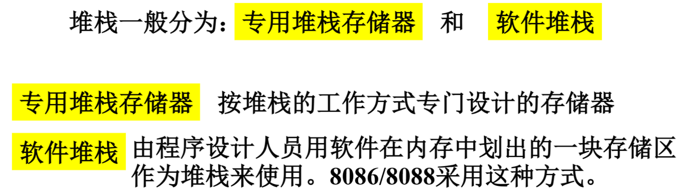
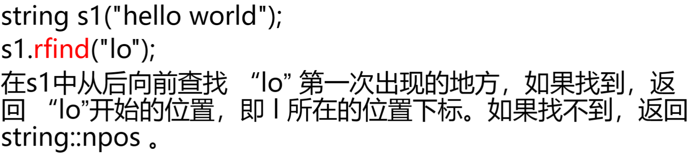
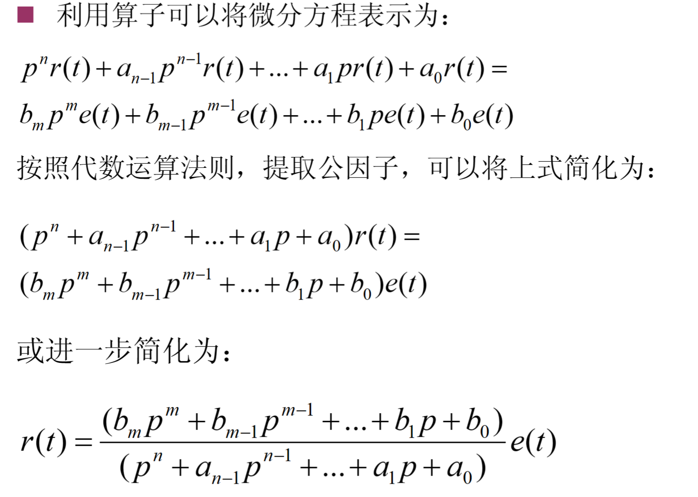
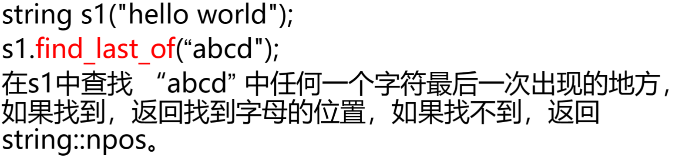
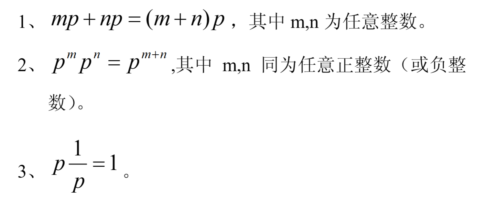
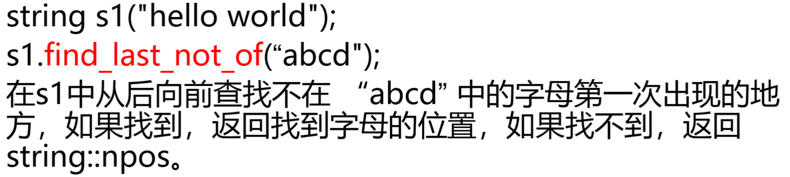
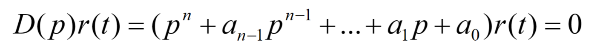
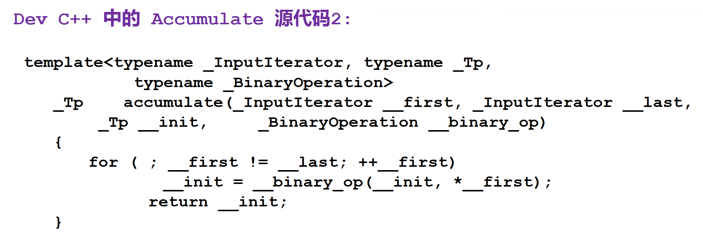

* 堆栈的用途:主要用于暂存数据以及在过程调用或处理中断时保持断点信息
    * 堆栈的构造
            
            
        * 堆栈存取数据规则:先进后出
    * 堆栈的组织
            
            
    * 堆栈操作
        * 设置堆栈
                
        * 进栈PUSH
                
                
                
        * 出栈POP
                
                
