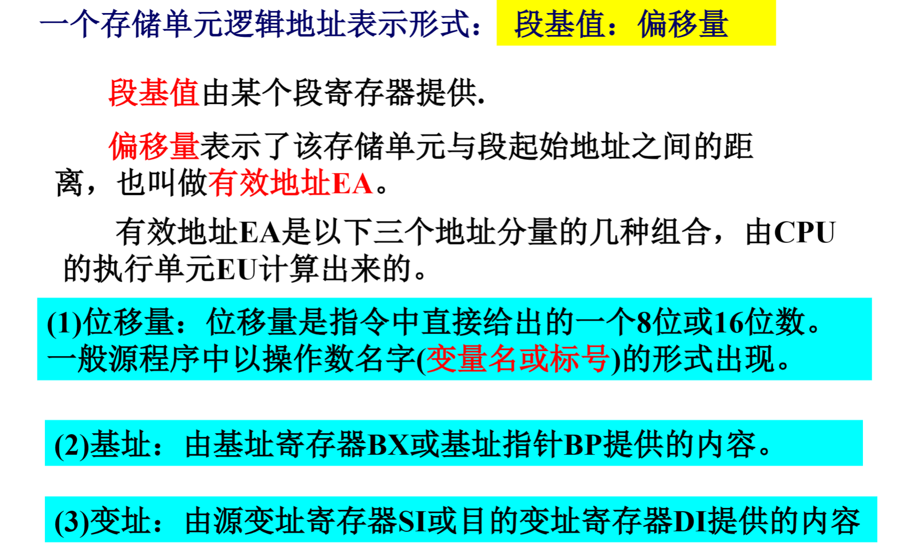
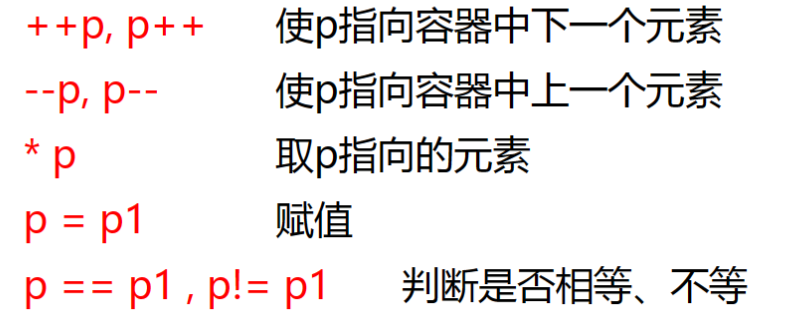
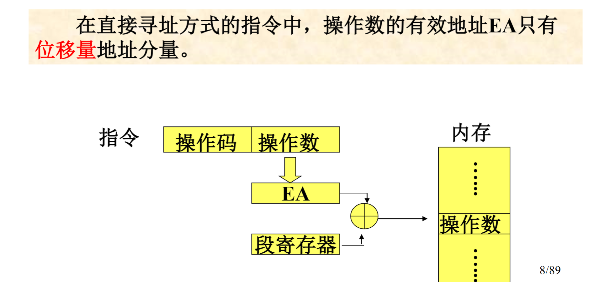
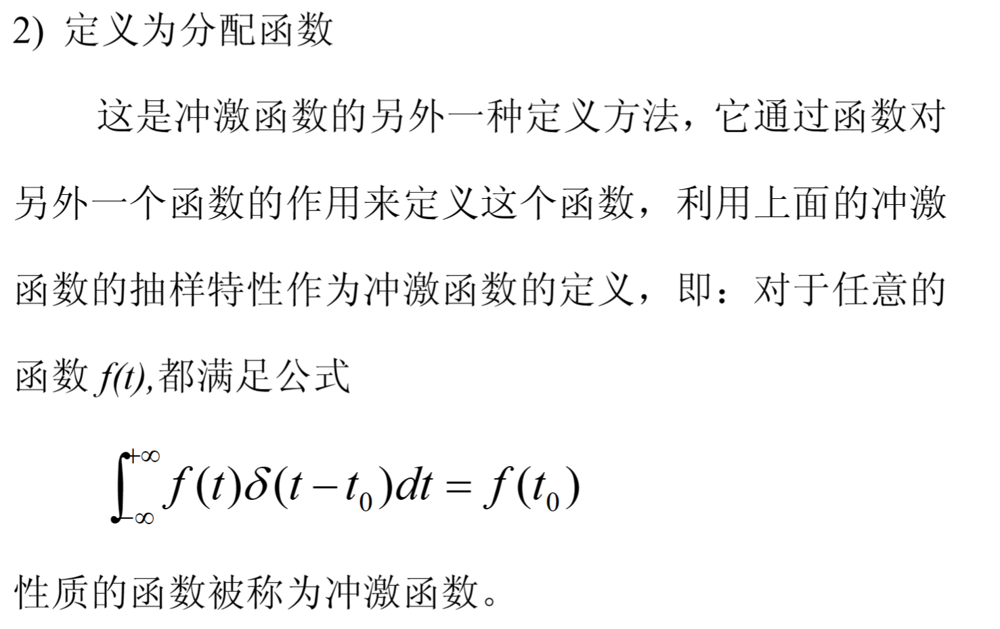

* 子函数的选取对系统分析至关重要,为了便于分析,要求子函数具有:

    1.完备性:任意函数(或绝大部分函数)都可以分解为该子信号的和,没有(或几乎没有)例外

    2.简单性:容易求得系统对该子信号的响应

    3.相似性:不同子信号的响应具有内在联系,可以类推

* 奇异函数是一种理想化的函数,它具有一个或多个间断点,在这些点上无法确定函数或其导数值.常用的有阶跃函数和冲激函数

