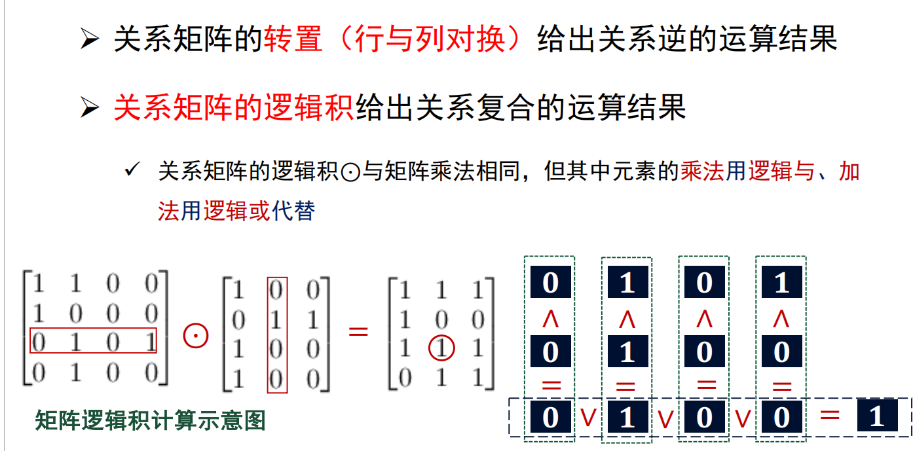
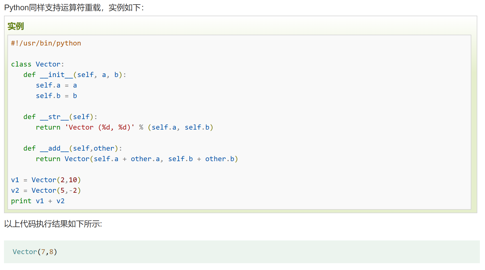
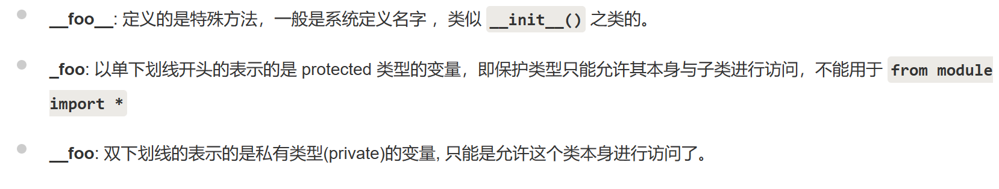

1. 存储器的组成
    * 存储器由若干个存储单元组成
        * 存储单元的多少就表示了存储器的容量
    * 每个存储单元存放相同长度的二进制数
        * 一个存储单元的长度一般为8位二进制数,即一个字节
    * 每个存储单元有一个唯一的地址编号-地址
    * 任何两个相邻字节单元构成一个字单元
        * 一个字存储单元的长度为16位二进制数,即两个字节.字单元的地址为两个字节单元中较小地址字节单元的地址
        * 16位长数据存放规则是低8位放较低地址字节单元中,高8位放较高地址字节单元中
    * 定义一个地址时必须指出是字节或字的类型属性
2. 存储器的段结构
    * CPU将1MB的存储空间划分为若干个段,每段的最大长度是64K(65536)个字节单元组成
    * 每个段的基址(段基址)必须是一个小节的首址    
    * 逻辑段在物理存储器中可以是邻接的,间隔的,部分重叠的和完全重叠4种情况    
    * 在任一时刻,一个程序只能访问4个当前段得的内容    
3. 逻辑地址与物理地址及对应关系
    * 物理地址
            
    * 逻辑地址
        * 一个逻辑地址包括两部分:段基值和偏移量    
            
            
    * 逻辑地址转换为物理地址
            
            
    * 逻辑地址的来源
            
