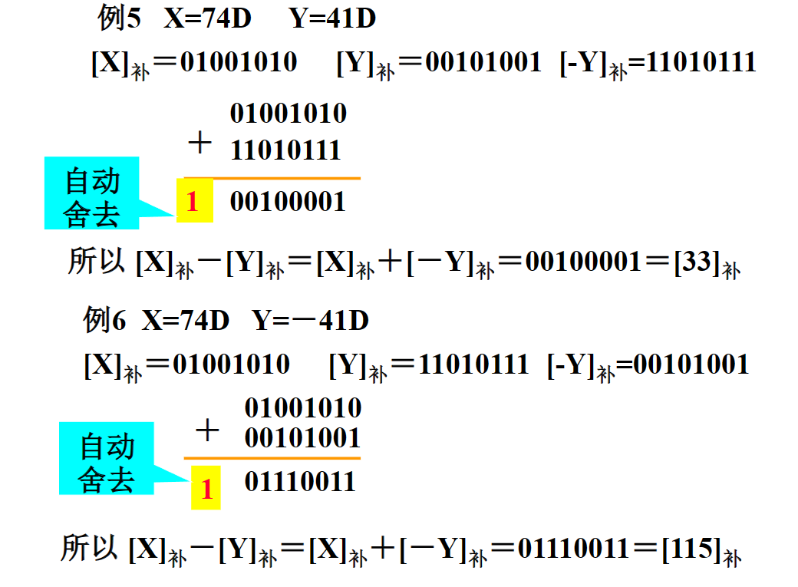
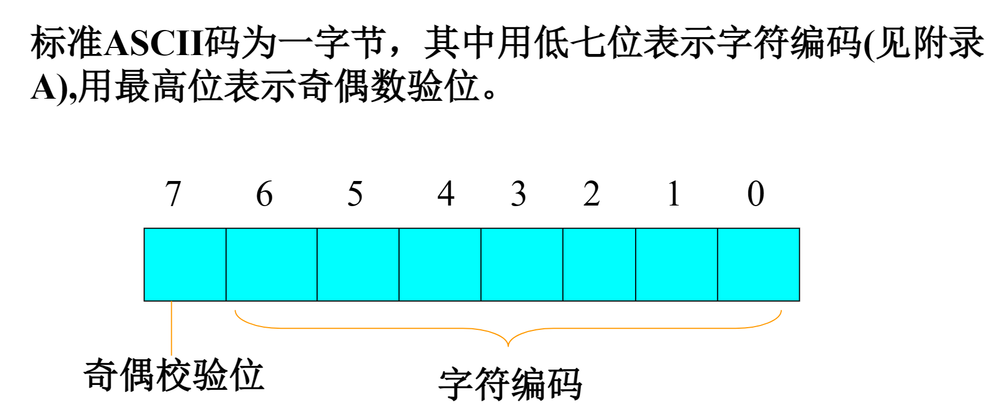

# stack
* stack是后进先出的数据结构，只能插入，删除，访问栈顶的元素
* 可用vector，list，deque来实现。缺省情况下，用deque实现
    
# queue
* 和stack基本类似，可以用list和deque实现。缺省情况下用deque实现
* 同样有push，pop，top函数，但push发生在队尾，pop，top发生在队头
* 有back成员函数可以返回队尾元素的引用
# priority_deque
* 和queuel类似，可以用vector和deque实现。缺省情况下用vector实现
* priority_queue通常用堆排序技术实现，保证最大元素总是排在最前面。即执行pop操作时，删除的是最大的元素；执行top操作时，返回的是最大元素的引用。默认的元素比较器是less<T>
* push、pop时间复杂度是O(logN)
* top()时间复杂度O(1)
# 容器适配器的元素个数
    
