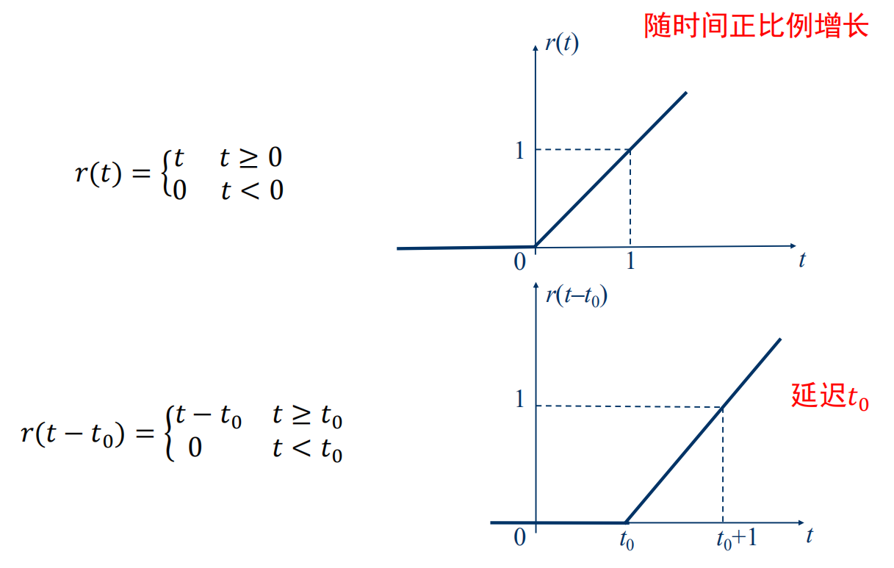

* 一条指令通常由两大部分组成:
    1. 操作码:表示指令应完成的具体操作,如加法,减法,乘法,移位等.在汇编语言中使用助记符表示
    2. 操作数:表示指令的操作对象
* 寻址方式:寻找指令中所需操作数的各种方法,也就是提供指令中操作数的存放信息的方式    
    1. 立即数寻址
            
            
    2. 寄存器寻址
            

        
        
    3. 直接寻址
            
            
    4. 寄存器间接寻址
            
            
    5. 基址寻址/变址寻址
            
            
    6. 基址变址寻址
             
            

        
    7. 串操作寻址方式
            
    8. I/O端口寻址
            
            
