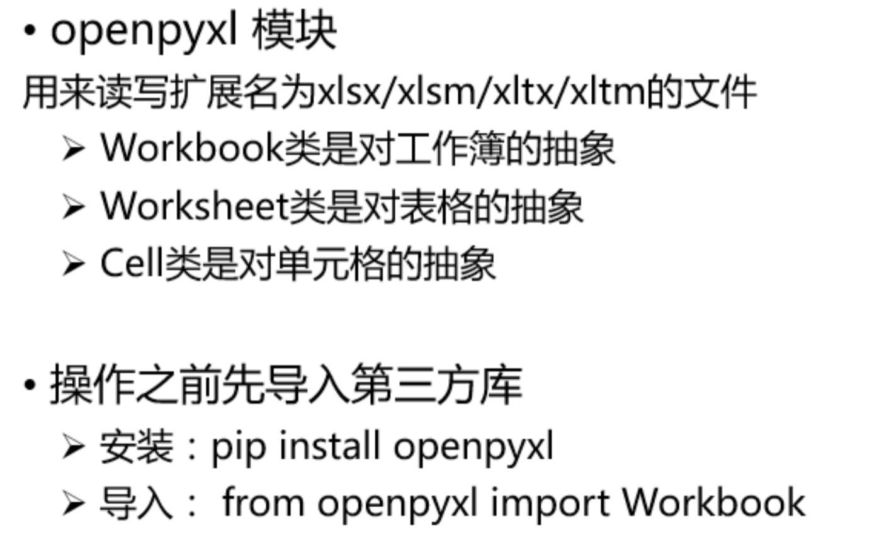
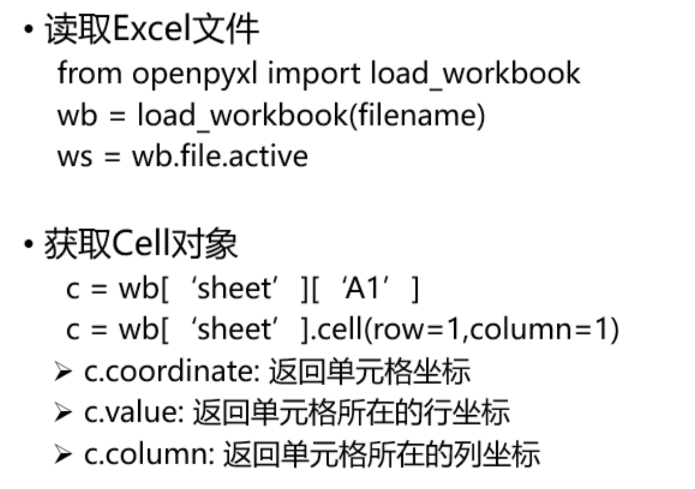

# 结构化文本文件CSV
* 纯文本文件，以逗号为分隔符
    * 值没有其它类型，所有值都是字符串
    
    * 不能指定单元格的宽高，不能合并单元格
    
    * 不能指定字体颜色等格式

    * 没有多个工作表

    * 不能嵌入图像和表格

* 文件读取
    * import csv：`content=csv.reader(文件名)`

* 文件的写入
    ```python
    w=csv.writer('aaa.csv','w')
    w.writerow(rows)
    ```
    
    * 当文件不存在时，自动创建文件

    * 支持单行写入和多行写入

# PDF的读写
* 库PyPDF2
    * 包含PdfFileReader、PdfFileMerger、PageObject和PdfFileWriter四个主要类

    * 能进行读写、分割、合并、文件转换等多种操作

    * 只能从PDF文档中提取文本并返回字符串，而无法提取图像、表格和其它媒体

* PDF读写
    * 读取PDF文件
    ```python
    readFile=open('text.pdf','rb')
    pdfFileReader=PdfFileReader(readFile)
    ```

    * pdfFileReader类
        * `getNumPages()`：计算PDF文件总页数

        * `getPage(index)`：检索指定编号的页面

    * 写入操作
        ```python
        writerFile='output.pdf'
        pdfFileWriter=PdfFileWriter()
        ```

    * pdfFileWriter类
        * `pdfFileWriter.addPage(pageObj)`：根据每页返回的PageObject，写入到文件

        * `pdfFileWriter.addBlankPage()`：在文件的最后一页写入一个空白页，保存到新文件

    * 合并多个文档
        ```python
        pdf_merger=PdfFileMerger()
        pdf_merger.append('python2018.pdf')
        pdf_merger.merge(20,'insert.pdf')
        pdf_merger.write('merge.pdf')
        ```

    * 单个页面的操作-PageObject类
        * `PageObject.extractText()`：按照顺序提取文本

        * `PageObject.getContents()`：访问页面内容

        * `PageObject.rotateClockwise(angle)`：顺时针旋转

# Excel的读写
    



