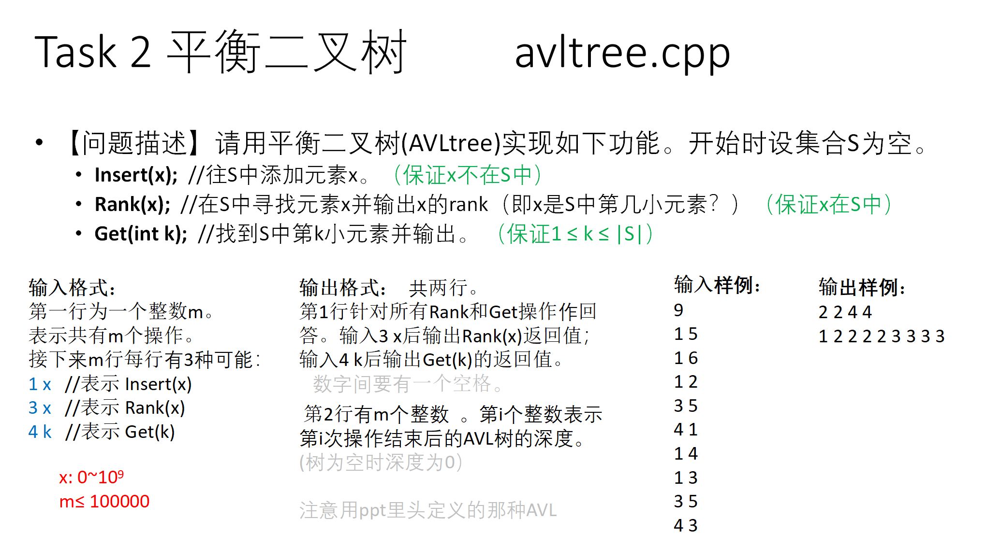

# 什么是平衡二叉树




```cpp
#include <stdio.h>
#include <malloc.h>

const int maxm = 100000;
int m;				// m次操作
int res[maxm + 1]; // 返回3、4的查询结果
int h[maxm + 1];   // 保存每次操作的树的深度

struct treeNode
{
	int val;			// 结点对应的值
	int depth = 1;		// 高度差，右减左
	int numNodes = 1;	// 结点总数
	treeNode *parent = NULL;	// 父结点
	treeNode *lchild = NULL;	// 左结点
	treeNode *rchild = NULL;	// 右结点
} *root;

// 计算AVL树的高度差（右减左）
int computeBF(treeNode *x)
{
	return (x->rchild == NULL ? 0 : x->rchild->depth) -
		   (x->lchild == NULL ? 0 : x->lchild->depth);
}

// 更新深度和包含结点数
void update(treeNode *x)
{
	int a = x->rchild == NULL ? 0 : x->rchild->depth;
	int b = x->lchild == NULL ? 0 : x->lchild->depth;
	int c = x->rchild == NULL ? 0 : x->rchild->numNodes;
	int d = x->lchild == NULL ? 0 : x->lchild->numNodes;
	x->depth = (a > b ? a : b) + 1;
	x->numNodes = c + d + 1;
}

/// 插入一个结点后需要使用此函数，从下往上平衡
void rebalance(treeNode *x)
{
	int BF = computeBF(x);
	while (BF <= 1 && BF >= -1)
	{
		if (x == root)
			return;	/// 找到根结点都没发现不平衡的，说明此AVL已平衡
		x = x->parent;
		update(x); /// 因为此前已插入数据，故要不断更新结点信息
		BF = computeBF(x);
	} // 得到最深的不平衡的点 x;

	treeNode *p = x->parent; // 将待平衡点的父亲结点进行保存
	treeNode *y, *z;
	if (BF == 2) /// 麻烦结点在右子树
		if (computeBF(x->rchild) == 1) /// 在右子树的右边
		{
			y = x->rchild;
			x->rchild = y->lchild;
			if(x->rchild)
			{
				x->rchild->parent = x; // 父亲从y变成x。要注意结点变换后有关父亲结点的信息
			}
			y->lchild = x;
			x->parent = y; /// 不要忘了结点保存了父亲结点的信息
			update(x); /// 先更新x在更新y，因为现在x是y子结点
			update(y);
			x = y;
		}
		else /// 在右子树的左边
		{
			y = x->rchild;
			z = y->lchild;
			y->lchild = z->rchild;
			if(y->lchild)
			{
				y->lchild->parent = y;
			}
			z->rchild = y;
			y->parent = z;
			x->rchild = z->lchild;
			if(x->rchild)
			{
				x->rchild->parent = x;
			}
			z->lchild = x;
			x->parent = z;
			update(x);
			update(y);
			update(z);
			x = z;
			// Fill this by your self.
		}
	else if (computeBF(x->lchild) == -1)  /// 在左子树的左边
	{
		// Fill this by your self.
		y = x->lchild;
		x->lchild = y->rchild;
		if(x->lchild)
		{
			x->lchild->parent = x;
		}
		y->rchild = x;
		x->parent = y;
		update(x);
		update(y);
		x = y;
	}
	else /// 在左子树的右边
	{
		// Fill this by your self.
		y = x->lchild;
		z = y->rchild;
		x->lchild = z->rchild;
		if(x->lchild)
		{
			x->lchild->parent = x;
		}
		y->rchild = z->lchild;
		if(y->lchild)
		{
			y->lchild->parent = y;
		}
		x->parent = y->parent = z;
		z->lchild = y;
		z->rchild = x;
		update(x);
		update(y);
		update(z);
		x = z;
	}

	// 更新根的父亲有关信息
	if (p == NULL)
		root = x; // 如果改变的是根结点，需要更新root结点的指向。
	else if (x->val > p->val)
		p->rchild = x;
	else
		p->lchild = x;
	x->parent = p;
}
// 往S中添加元素x
void insert(int x)
{
	treeNode *node = new treeNode();
	node->val = x;
	if (root == NULL)
		root = node;
	else
	{
		treeNode *p = root, *q = NULL; /// q指向p的父亲结点
		while (p != NULL)
		{
			q = p;
			q->numNodes++; /// 更新结点总数
			if (x < p->val)
				p = p->lchild;
			else
				p = p->rchild; /// 题目不考虑重复元素的插入
		}
		if (x < q->val)
			q->lchild = node;
		else
			q->rchild = node;
		node->parent = q;
	}
	rebalance(node);
}
// 在S中寻找元素x并输出x的rank
int rank(int x)
{
	treeNode *q = root;
	int cnt = 0;
	while (true)
	{
		int n = (q->lchild == NULL ? 0 : q->lchild->numNodes); /// 左子树的总数，即当前排名
		if (x > q->val)
		{
			cnt += n + 1;
			q = q->rchild;
		}
		else if (x < q->val)
			q = q->lchild;
		else
			return cnt + n + 1;
	}
}
// 找到S中第k小元素并输出
int get(int k)
{
	// Fill this part by yourself.
	treeNode *q = root;
	while(true)
	{
		int n = (q->lchild == NULL? 0 : q->lchild->numNodes);
		if(k > n + 1)
		{
			k -= n + 1;
			q = q->rchild;
		}
		else if(k <= n)
		{
			q = q->lchild;
		}
		else
		{
			return q->val;
		}
	}
	// Hint: similar to rank(int x).
}

int main()
{
	root = NULL;
	scanf("%d", &m);
	int 	j = 1; // j表示第一行输出的长度
	int x, y; // x表示操作, y为对应的数
	for (int i = 1; i <= m; i++)
	{
		scanf("%d %d", &x, &y);
		if (x == 1)
		{
			insert(y);
		}
		else if (x == 3)
		{
			res[j++] = rank(y);
		}
		else
		{
			res[j++] = get(y);
		}
		h[i] = root->depth;
	}
	for (int i = 1; i < j; i++)
	{
		printf("%d ", res[i]);
	}
	printf("\n");
	for (int i = 1; i <= m; i++)
	{
		printf("%d ", h[i]);
	}
	return 0;
}

```

# 下面涉及旋转的代码较为难以理解，故已被取代，上面较好理解且实现简单

# 平衡二叉树的实现（作废）

```cpp
struct Node
{
    ElementType Data;
    struct Node *Left,*Right;
    int Height;//树的高度
}*AVLTree;
```

# 平衡二叉树的操作（作废）

* 左单旋（麻烦结点在根结点的**左**子树的**左**边）


```cpp
AVLTree SingleLeftRotation(AVLTree A)
{
    AVLTree B=A->Left;//左单旋，根结点的左结点作为新的根结点
    A->Left=B->Right;   
    B->Right=A;
    A->Height=Max(GetHeight(A->Left),GetHeight(A->Right))+1;
    B->Height=Max(GetHeight(B->Left),A->Height)+1;
    return B;
}
```

* 右单旋（麻烦结点在**右**子树的**右**边）


```cpp
AVLTree SingleRightRotation(AVLTree A)
{
    AVLTree B=A->Right;
    A->Right=B->Left;
    B->Left=A;
    A->Height=Max(GetHeight(A->Left),GetHeight(A->Right))+1;
    B->Height-Max(GetHeight(B->Right),A->Height)+1;
}
```

* 左右双旋（麻烦结点在**左**子树的**右边**）
    * 根结点的左结点进行右单旋，然后对根结点进行左单旋

```cpp
AVLTree DoubleLeftRightRotation(AVLTree A)
{
    A->Left=SingleRightRotation(A->Left);
    return SingleLeftRotation(A);
}
```

* 右左双旋（麻烦结点在**右**子树的**左边**）
    * 根结点的右结点进行左单旋，然后对根结点进行右单旋

```cpp
AVLTree DoubleRightLeftRotation(AVLTree A)
{
    A->Right=SingleLeftRotation(A->Right);
    return SingleRightRotation(A);
}
```

* 插入元素

```cpp
AVLTree Insert(AVLTree T,ElementType X)
{
    if(!T)//空树
    {
        T=new Node;
        T->Data=X;
        T->Height=0;
        T->Left=T->Right=NULL;
    }
    else if(X<T->Data)//先插入后平衡
    {
        T->Left=Insert(T->Left,X);
        if(GetHeight(T->Left)-GetHeight(T->Right)==2)
        {
            if(X<T->Left->Data)//麻烦结点在左子树的左边
            {
                T=SingleLeftRotation(T);
            }
            else//麻烦结点在左子树的右边
            {
                T=DoubleLeftRightRotation(T);
            }
        }
    }
    else if(X>T->Data)//先插入后平衡
    {
        T->Right=Insert(T->Right,X);
        if(GetHeight(T->Left)-GetHeight(T->Right)==-2)
        {
            if(X>T->Right->Data)//麻烦结点在右子树的右边
            {
                T=SingleRightRotation(T);
            }
            else//麻烦结点在右子树的左边
            {
                DoubleRightLeftRotation(T);
            }
        }
    }
    T->Height=Max(GetHeight(T->Left),GetHeight(T->Right))+1;
    return T;
}
```
