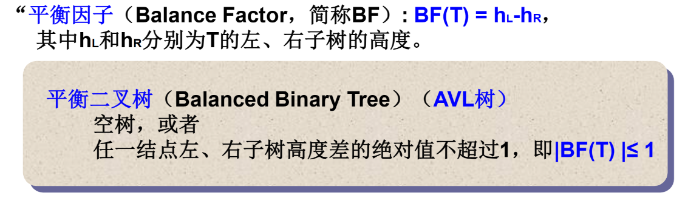
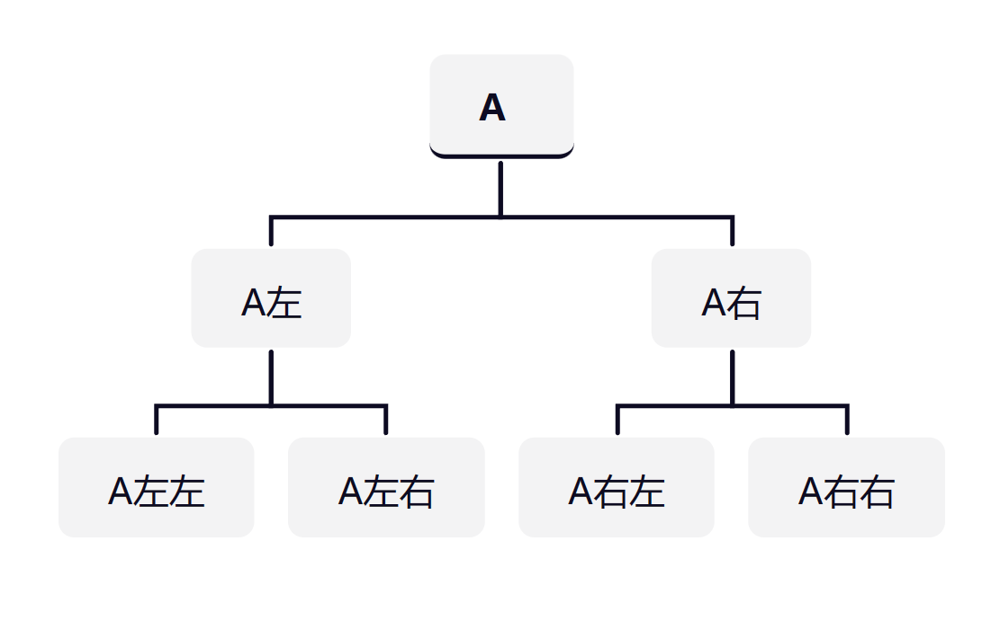
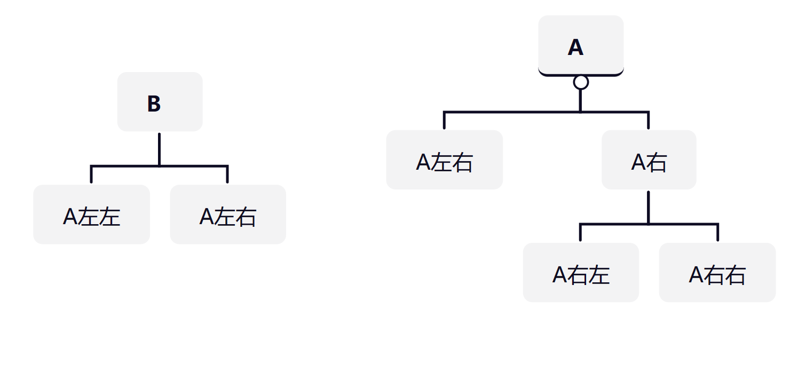
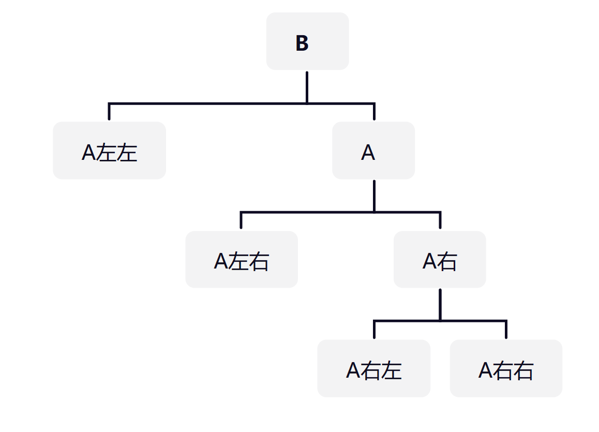
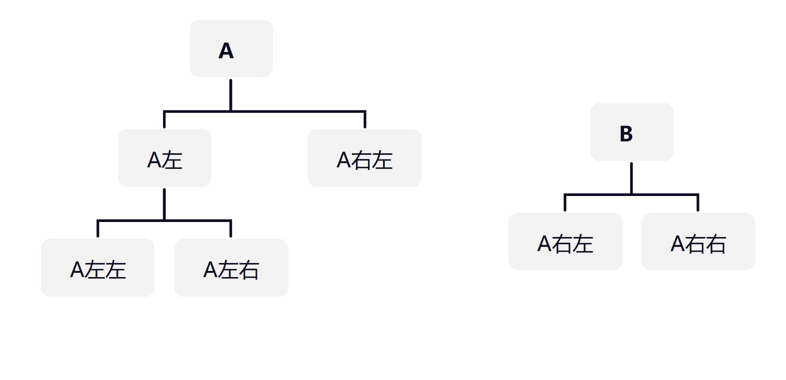
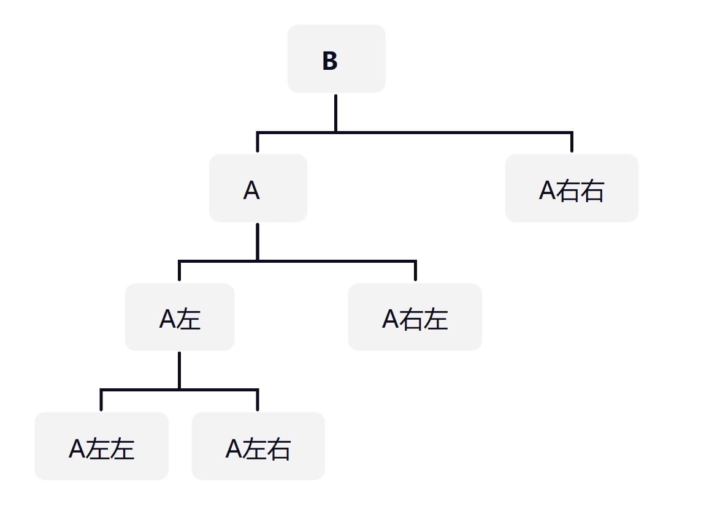

# 什么是平衡二叉树



# 平衡二叉树的实现

```cpp
struct Node
{
    ElementType Data;
    struct Node *Left,*Right;
    int Height;//树的高度
}*AVLTree;
```

# 平衡二叉树的操作

* 左单旋（麻烦结点在根结点的**左**子树的**左**边）







```cpp
AVLTree SingleLeftRotation(AVLTree A)
{
    AVLTree B=A->Left;//左单旋，根结点的左结点作为新的根结点
    A->Left=B->Right;   
    B->Right=A;
    A->Height=Max(GetHeight(A->Left),GetHeight(A->Right))+1;
    B->Height=Max(GetHeight(B->Left),A->Height)+1;
    return B;
}
```

* 右单旋（麻烦结点在**右**子树的**右**边）






```cpp
AVLTree SingleRightRotation(AVLTree A)
{
    AVLTree B=A->Right;
    A->Right=B->Left;
    B->Left=A;
    A->Height=Max(GetHeight(A->Left),GetHeight(A->Right))+1;
    B->Height-Max(GetHeight(B->Right),A->Height)+1;
}
```

* 左右双旋（麻烦结点在**左**子树的**右边**）
    * 根结点的左结点进行右单旋，然后对根结点进行左单旋

```cpp
AVLTree DoubleLeftRightRotation(AVLTree A)
{
    A->Left=SingleRightRotation(A->Left);
    return SingleLeftRotation(A);
}
```

* 右左双旋（麻烦结点在**右**子树的**左边**）
    * 根结点的右结点进行左单旋，然后对根结点进行右单旋

```cpp
AVLTree DoubleRightLeftRotation(AVLTree A)
{
    A->Right=SingleLeftRotation(A->Right);
    return SingleRightRotation(A);
}
```

* 插入元素

```cpp
AVLTree Insert(AVLTree T,ElementType X)
{
    if(!T)//空树
    {
        T=new Node;
        T->Data=X;
        T->Height=0;
        T->Left=T->Right=NULL;
    }
    else if(X<T->Data)//先插入后平衡
    {
        T->Left=Insert(T->Left,X);
        if(GetHeight(T->Left)-GetHeight(T->Right)==2)
        {
            if(X<T->Left->Data)//麻烦结点在左子树的左边
            {
                T=SingleLeftRotation(T);
            }
            else//麻烦结点在左子树的右边
            {
                T=DoubleLeftRightRotation(T);
            }
        }
    }
    else if(X>T->Data)//先插入后平衡
    {
        T->Right=Insert(T->Right,X);
        if(GetHeight(T->Left)-GetHeight(T->Right)==-2)
        {
            if(X>T->Right->Data)//麻烦结点在右子树的右边
            {
                T=SingleRightRotation(T);
            }
            else//麻烦结点在右子树的左边
            {
                DoubleRightLeftRotation(T);
            }
        }
    }
    T->Height=Max(GetHeight(T->Left),GetHeight(T->Right))+1;
    return T;
}
```
