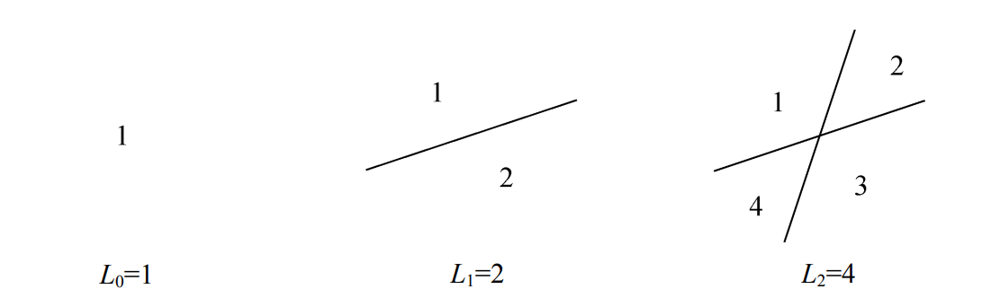

* 问题:用一把刀直直地切n刀,可以得到多少块披萨饼(平面上n条直线所界定的区域的最大个数Ln是多少)?

* 没有直线的平面有`1`个区域,有`2`条直线的平面有`4`个区域(每条直线都在两个方向无限延伸)



* 但当增加第`3`条直线(图中粗线),发现无论怎样放置前面两条直线,它至多都只能分裂`3`个已有的区域,从而`L3=4+3=7`是最好结果:


* 第`n(n>0)`条直线使得区域的个数增加`k`个,当且仅当它对`k`个已有区域进行了分裂.而它对`k`个已有区域进行分裂,当且仅当它在`k-1`个不同的地方与前面那些直线相交,两条直线至多相交于一点,因而这条新的直线与那`n-1`条已有直线至多相交于`n-1`个不同的点,故必定有`k<=n`,则有上界`Ln<=L(n-1)+n,n>0`

* 放置第`n`条直线,使得它不与其他直线中的任何一条平行(从而它与它们全部相交),且它不经过任何已经存在的交点(从而它与它们全都在不同的点相交),于是该递归式为

```
L0=1
Ln=L(n-1)+n,n>0
```

* 求得封闭形式的解


* 新问题:假如用折线代替直线,平面上由n条这样的折线所界定的区域最大个数Zn是多少?


* 意识到,除了这'两条'直线不经过它们的交点延伸出去而使得区域相融合之外,一条折线与两条直线相似:


* 区域2,3,4对于两条直线来说它们是不同的区域,但对折线来说是相同的区域,于是折线对两条直线来说少了两个区域.如果放置的好,那就是失去的全部.也就是说,对每条直线仅仅损失两个区域.从而有`Zn=L(2n)-2n=2n^(2)-n+1,n>=0`
