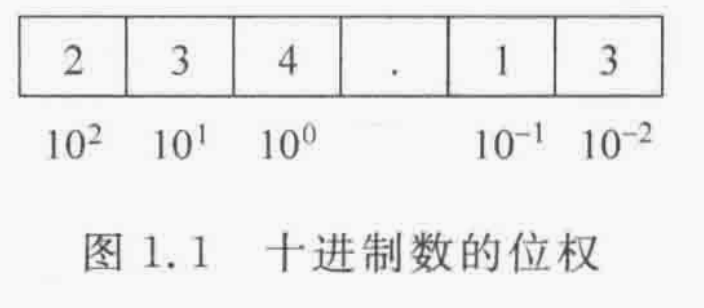
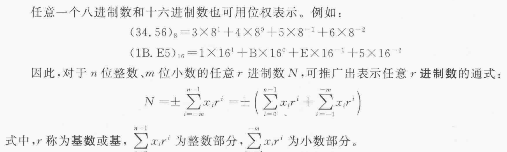
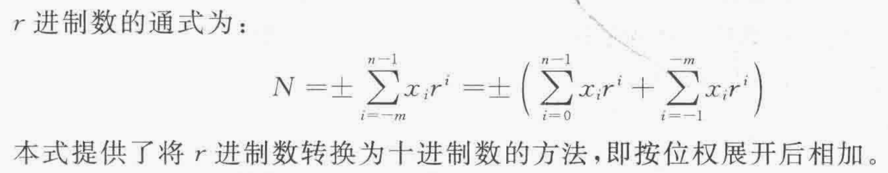
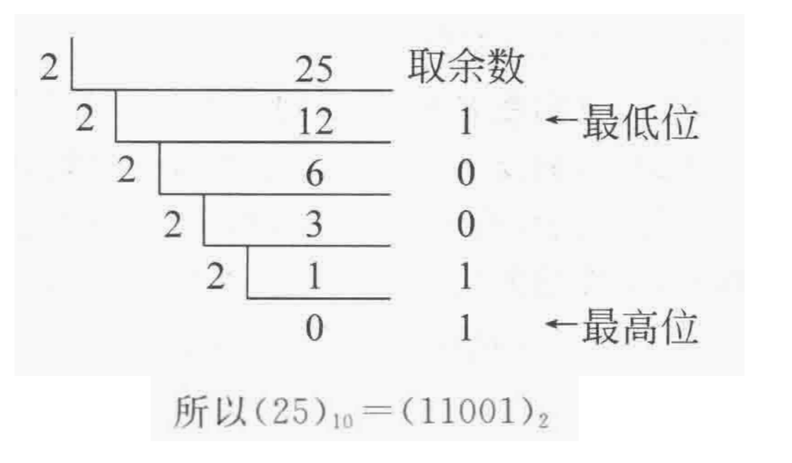
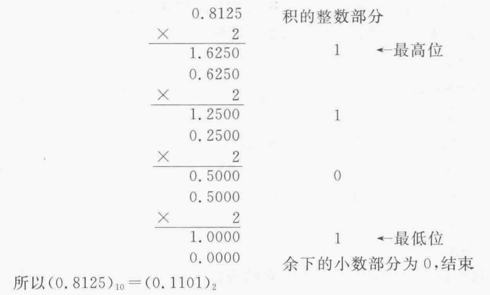
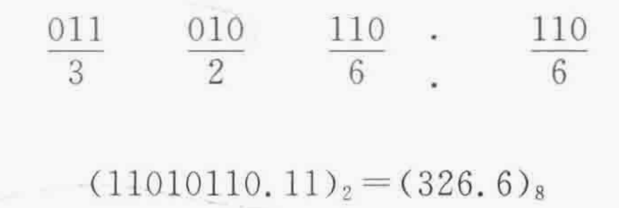

# 数与数制
* 位权：某个固定位置上的计数单位
    * 用位权表示为：$(234.13)_{10} = 2 * 10 ^ 2 + 3 * 10 ^ 1 + 4 * 10 ^ 0 + 1 * 10 ^ { -1 } + 3 * 10 ^ {-2}$

    

## 数制转换
* $r$进制数转换为十进制数

    

* 十进制数转换为$r$进制数
    1. 整数部分：**除$r$取余法**

        
    
    2. 小数部分：乘$r$取整法

        

* 二进制转换为八进制

    

# 数据格式
* 定点数表示方法
    pass

* 浮点数表示方法
    pass

# 二进制数的编码及运算
* 无符号数
    pass

* 有符号数
    pass

* 补码运算
    pass

# 十进制数的编码及运算
* BCD码
    pass

* BCD码的加减运算
    pass
