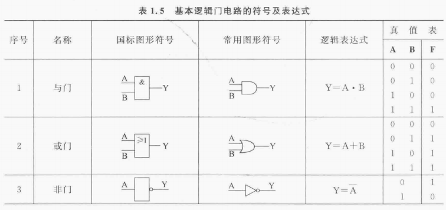
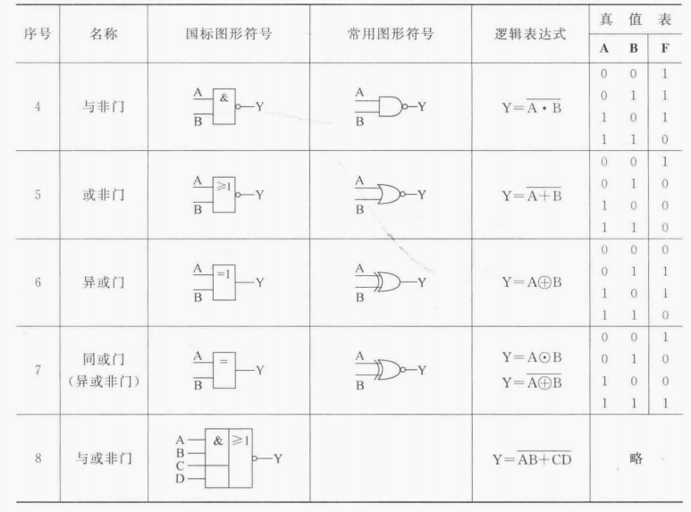
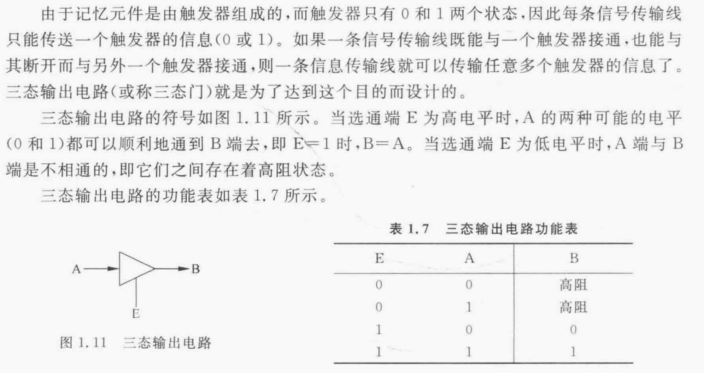
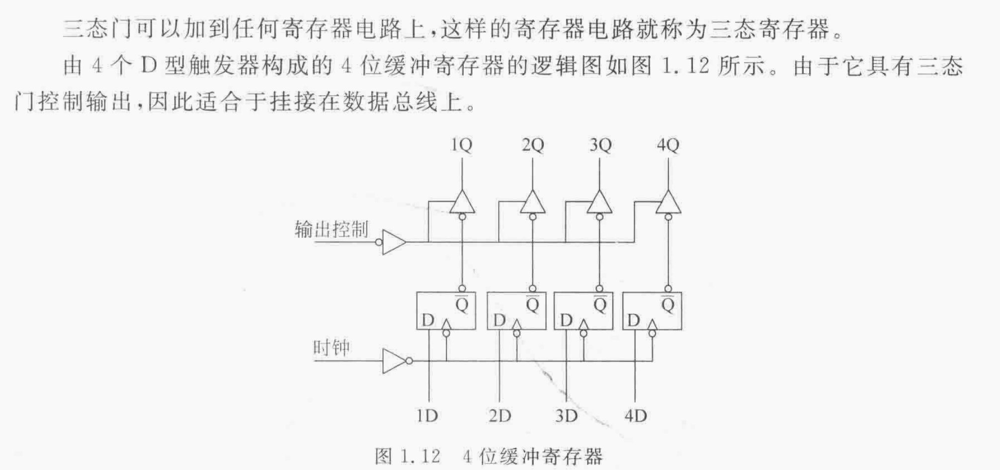

# 基本逻辑门电路

# 译码器
* 将信号用数字代码来表示，这个过程称为**编码**

* 将数字代码翻译成信号，这个过程称为**译码**，完成译码功能的电路或装置称为**译码器**

# 触发器
* 触发器是计算机记忆装置的基本单元，也是构成时序电路的基础。一个触发器存储一位二进制数。

pass
# 寄存器
* 缓冲寄存器
    pass

* 移位寄存器
    pass

* 计数器
    pass

* 累加器
    pass

# 三态电路

